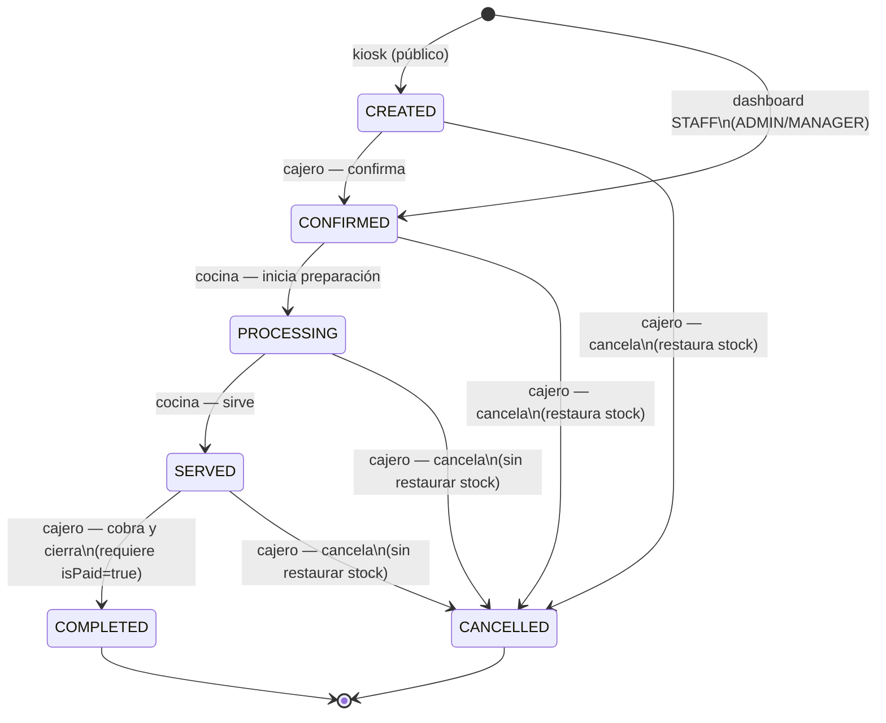

# ADR 0006 — Ciclo de vida del pedido: kiosk, dashboard y cocina

**Estado:** Aceptado
**Fecha:** 2026-06-13

## Contexto

Los pedidos entran por dos canales distintos (kiosk público y dashboard autenticado), se
preparan en cocina y se cobran/cierran en caja. Múltiples pantallas pueden actuar
concurrentemente sobre el mismo pedido. Se necesita una máquina de estados única y clara
que defina qué actor hace qué transición y bajo qué condiciones.

## Decisión

Una **máquina de estados única** en `order-state-machine.ts`, con dos actores:
`cashier` (caja/dashboard) y `kitchen` (pantalla de cocina/KDS).

### Diagrama de estados

### Canales de entrada

- **Kiosk** (`POST /v1/kiosk/:slug/orders`, `@Public()`): inicia el pedido en `CREATED`.
- **Dashboard/STAFF** (`POST /v1/orders`, `ADMIN | MANAGER`): inicia el pedido directamente
  en `CONFIRMED` (campo `orderSource: STAFF`).

Ambos canales exigen caja abierta (`409 NO_OPEN_CASH_REGISTER`), validan y decrementan stock
atómicamente, y asignan el `orderNumber` secuencial dentro de una `$transaction` con lock de
`CashShift`.

### Cocina (KDS)

- Autenticada con **`X-Kitchen-Token`** (token de dispositivo per-restaurante, no JWT).
  Ver ADR 0001 para el modelo de autenticación.
- Solo ve pedidos en `CONFIRMED` y `PROCESSING`; los datos comerciales (`totalAmount`,
  información de cliente) se ocultan en el serializer.
- Transiciones permitidas: `CONFIRMED → PROCESSING` y `PROCESSING → SERVED`.
- **Nunca** puede confirmar, completar ni cancelar un pedido.

### Dashboard / caja

- Confirma pedidos kiosk: `CREATED → CONFIRMED` (`PATCH /:id/confirm`).
- Cobra: `PATCH /:id/pay` (marca `isPaid=true`, no cambia el status).
- Completa: `SERVED → COMPLETED` — exige `isPaid=true`; si no, error `ORDER_NOT_PAID`.
- Cancela: ver sección de cancelación.
- Desmarcar pago: `PATCH /:id/unpay` (paso previo para cancelar un pedido ya pagado).

### Cancelación

Permitida desde `CREATED | CONFIRMED | PROCESSING | SERVED`, solo si `!isPaid`:
- `CREATED` o `CONFIRMED` (no entró a cocina): se **restaura el stock** de los items.
- `PROCESSING` o `SERVED` (ya en preparación): stock **no se restaura** (insumos consumidos).
- `COMPLETED` y pedidos con `isPaid=true` no se pueden cancelar. Invariante:
  nunca `CANCELLED && isPaid=true`.

### Concurrencia

Las transiciones de estado usan **concurrencia optimista**:
`UPDATE ... WHERE id=? AND status=?`. Si el status ya cambió, la fila afectada es 0 y la
operación falla con un error de dominio. No hay locks pessimistas ni colas.

## Consecuencias positivas

- La cocina no puede cobrar ni cerrar pedidos; el dinero cobrado nunca se pierde en el
  cierre de caja.
- El aislamiento por restaurante aplica en todos los canales (JWT para dashboard, token
  de dispositivo para cocina, slug validado para kiosk).
- Una sola máquina de estados facilita razonar sobre el flujo y escribir tests unitarios
  del estado independientemente de los controladores.

## Consecuencias negativas

- La transición `CREATED → CONFIRMED` requiere una acción explícita del cajero cuando el
  pedido viene del kiosk; no hay confirmación automática.
- Si el stock se agota entre la vista del kiosk y el submit, el pedido falla con error de
  stock; no hay reserva temporal de productos.

## Alternativas consideradas

- **Confirmación automática de pedidos kiosk** (rechazado para esta versión): se prefirió
  que el cajero valide el pedido antes de enviarlo a cocina, especialmente en restaurantes
  donde el kiosk puede recibir pedidos fraudulentos o erróneos.
- **Cola de mensajes (BullMQ / RabbitMQ) para las transiciones**: rechazado por complejidad
  innecesaria en la fase actual; la concurrencia optimista es suficiente para el volumen
  esperado.

## Referencias

- Implementación de la máquina de estados: `src/orders/order-state-machine.ts`.
- Módulo de órdenes (detalle completo): `src/orders/orders.module.info.md`.
- Módulo de cocina: `src/kitchen/kitchen.module.info.md`.
- Módulo de kiosk: `src/kiosk/kiosk.module.info.md`.
- Autenticación de cocina (X-Kitchen-Token): ADR 0001.
- Roles de dashboard (ADMIN/MANAGER): ADR 0005.
- Consolida los ADRs históricos `2026-03-09-auto-print-on-order.md` y
  `2026-03-09-kitchen-display.md`.
