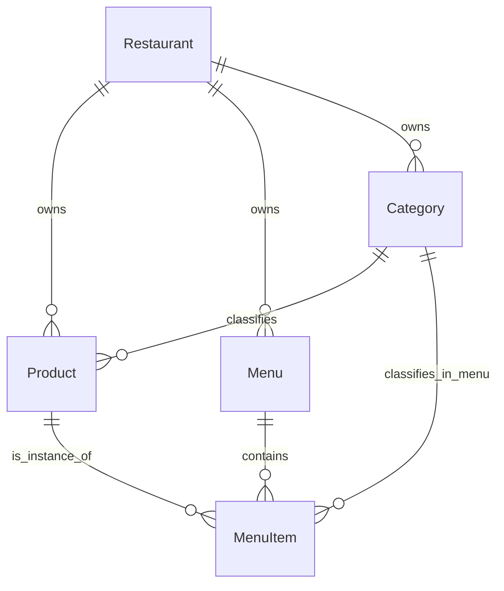

# Database Schema Documentation

This document describes the database structure for the Restaurant Management System.

## Tables Overview

### 1. Restaurant
The root entity representing a business unit.
*   **id**: Unique UUID.
*   **name**: Name of the restaurant.
*   **products**: One-to-many relation to `Product`.
*   **menus**: One-to-many relation to `Menu`.
*   **categories**: One-to-many relation to `Category`.

### 2. Product (Catalog)
Represents a sellable item in its abstract form (e.g., "Coca Cola", "Pizza Muzarella").
*   **id**: Unique UUID.
*   **name**: Name of the product.
*   **description**: Detailed description.
*   **price**: Base price (Decimal).
*   **stock**: Global physical inventory (Int).
*   **active**: Availability flag.
*   **sku**: Stock Keeping Unit code.
*   **imageUrl**: URL to product image.
*   **categoryId**: Foreign key to `Category` (Global classification).

### 3. Category (Global Classification)
Used for internal organization, reporting, and kitchen routing (e.g., "Kitchen", "Bar", "Desserts").
*   **id**: Unique UUID.
*   **name**: Internal category name.
*   **restaurantId**: Foreign key to `Restaurant`.

### 4. Menu (Collection)
Represents a specific letter or time-based offering (e.g., "Lunch Menu", "Weekend Specials").
*   **id**: Unique UUID.
*   **name**: Menu name.
*   **active**: Availability flag.
*   **restaurantId**: Foreign key to `Restaurant`.

### 5. MenuItem (Pivot & Configuration)
Links a `Product` to a `Menu`, defining how it appears and behaves in that specific context.
*   **id**: Unique UUID.
*   **menuId**: Link to the Menu.
*   **productId**: Link to the Product.
*   **categoryId**: Internal categorization link.
*   **sectionName**: **Visual Section Title** (e.g., "Para Empezar", "el ñandu"). This string allows flexible design grouping in the frontend without affecting global categories.
*   **price**: **Override Price** (Decimal). If set, this price overrides the base `Product.price` for this menu only (e.g., Happy Hour price).
*   **stock**: **Allocated Stock** (Int). If set, limits the quantity available for this menu (e.g., 20 units for lunch), independent of global stock.

## Relationships Diagram (Conceptual)

