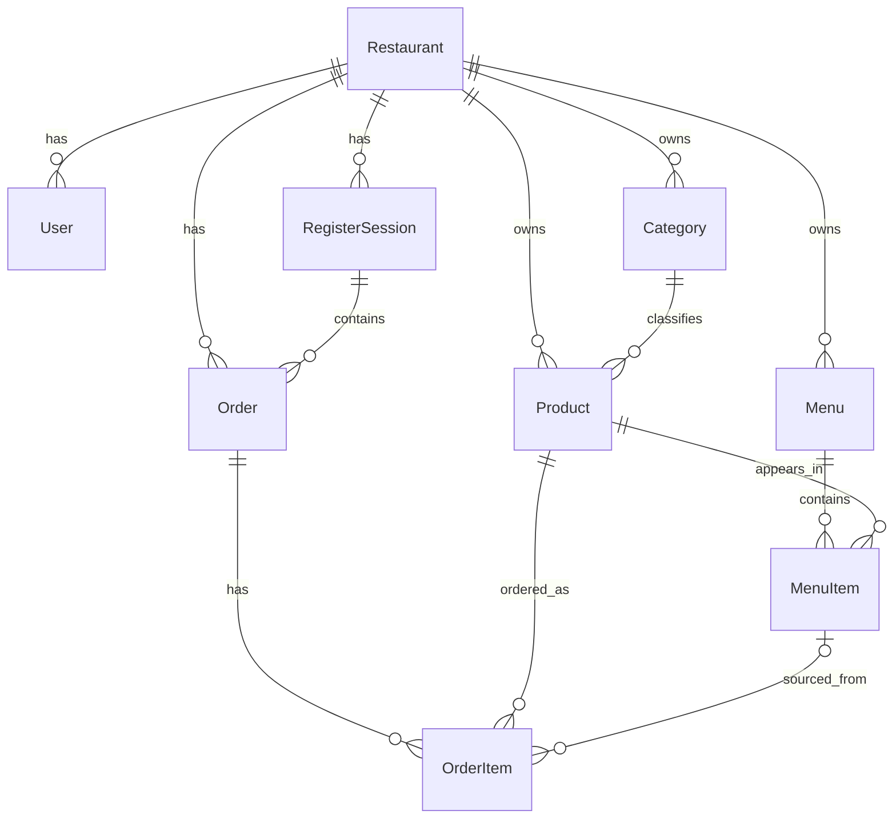

# Database Schema Documentation

This document describes the database structure for the Restaurant Management System.

## Tables Overview

### 1. Restaurant
The root entity representing a business unit.
*   **id**: Unique UUID.
*   **name**: Name of the restaurant.
*   **slug**: Unique URL-friendly identifier (auto-generated).
*   **users**: One-to-many relation to `User`.
*   **products**: One-to-many relation to `Product`.
*   **menus**: One-to-many relation to `Menu`.
*   **categories**: One-to-many relation to `Category`.
*   **orders**: One-to-many relation to `Order`.
*   **registerSessions**: One-to-many relation to `RegisterSession`.

### 2. User (System Users)
Represents a user of the system (e.g., Owner, Manager, Staff).
*   **id**: Unique UUID.
*   **email**: Unique email address.
*   **passwordHash**: Hashed password (nullable: set during activation or creation).
*   **role**: Role of the user (ADMIN, MANAGER, BASIC).
*   **isActive**: Account activation status.
*   **activationToken**: Token for account activation (nullable: cleared after activation).
*   **restaurantId**: Foreign key to `Restaurant` (required).
*   **deletedAt**: Soft delete timestamp (nullable).

### 3. RefreshToken
Stores JWT refresh tokens for authenticated sessions.
*   **id**: Unique UUID.
*   **token**: Unique token string.
*   **userId**: Foreign key to `User` (required).
*   **expiresAt**: Token expiration date.

### 4. Category (Global Classification)
Used for internal organization, reporting, and kitchen routing (e.g., "Cocina Caliente", "Bebidas", "Postres").
*   **id**: Unique UUID.
*   **name**: Internal category name.
*   **restaurantId**: Foreign key to `Restaurant` (required).

### 5. Product (Catalog)
Represents a sellable item in its abstract form (e.g., "Coca Cola", "Pizza Muzarella").
*   **id**: Unique UUID.
*   **name**: Name of the product.
*   **description**: Detailed description (nullable).
*   **price**: Base price (Decimal, default 0.00).
*   **stock**: Global physical inventory (Int, default 0).
*   **active**: Availability flag (default true).
*   **sku**: Stock Keeping Unit code (nullable).
*   **imageUrl**: URL to product image (nullable).
*   **restaurantId**: Foreign key to `Restaurant` (required).
*   **categoryId**: Foreign key to `Category` (required).

### 6. Menu (Collection)
Represents a specific letter or time-based offering (e.g., "Almuerzo Ejecutivo", "Carta Noche").
*   **id**: Unique UUID.
*   **name**: Menu name.
*   **active**: Availability flag (default true).
*   **startTime**: Start time string "HH:MM" (nullable: no time restriction).
*   **endTime**: End time string "HH:MM" (nullable: no time restriction).
*   **daysOfWeek**: Comma-separated days "MON,TUE,..." (nullable: available every day).
*   **restaurantId**: Foreign key to `Restaurant` (required).

### 7. MenuItem (Pivot & Configuration)
Links a `Product` to a `Menu`, defining how it appears and behaves in that specific context.
*   **id**: Unique UUID.
*   **menuId**: Foreign key to `Menu` (required, cascade delete).
*   **productId**: Foreign key to `Product` (required).
*   **price**: Override price (nullable: if null, uses Product.price).
*   **stock**: Allocated stock for this menu (nullable: if null, uses Product.stock without limit).
*   **sectionName**: Visual section title, e.g., "Para Empezar" (nullable).
*   **order**: Display order within the section (default 0).

### 8. Order
Represents a customer order within a register session.
*   **id**: Unique UUID.
*   **orderNumber**: Sequential order number within the session.
*   **status**: Order status (CREATED, PROCESSING, PAID, COMPLETED).
*   **paymentMethod**: Payment method (nullable: set when order is paid. Values: CARD, CASH, DIGITAL_WALLET).
*   **customerEmail**: Customer email for receipt (nullable).
*   **totalAmount**: Total order amount (Decimal).
*   **restaurantId**: Foreign key to `Restaurant` (required).
*   **registerSessionId**: Foreign key to `RegisterSession` (required).

### 9. OrderItem
Individual line item within an order.
*   **id**: Unique UUID.
*   **quantity**: Number of units ordered.
*   **unitPrice**: Price per unit at time of order.
*   **subtotal**: quantity * unitPrice.
*   **notes**: Special instructions (nullable).
*   **orderId**: Foreign key to `Order` (required, cascade delete).
*   **productId**: Foreign key to `Product` (required).
*   **menuItemId**: Foreign key to `MenuItem` (nullable: null when product is ordered directly without a menu).

### 10. RegisterSession
Represents a cash register session (open/close cycle).
*   **id**: Unique UUID.
*   **status**: Session status (OPEN, CLOSED).
*   **lastOrderNumber**: Last order number assigned in this session (default 0).
*   **totalSales**: Total sales amount (nullable: set on close).
*   **totalOrders**: Total order count (nullable: set on close).
*   **closedBy**: User identifier who closed the session (nullable: set on close).
*   **restaurantId**: Foreign key to `Restaurant` (required).
*   **openedAt**: Session open timestamp.
*   **closedAt**: Session close timestamp (nullable: set on close).

## Enums

| Enum | Values |
|------|--------|
| Role | ADMIN, MANAGER, BASIC |
| OrderStatus | CREATED, PROCESSING, PAID, COMPLETED |
| PaymentMethod | CARD, CASH, DIGITAL_WALLET |
| RegisterSessionStatus | OPEN, CLOSED |

## Relationships Diagram (Conceptual)

## Nullable Fields Reference

Fields that are nullable have a defined reason:

| Model | Field | Reason |
|-------|-------|--------|
| User | passwordHash | Set during activation, null for pending users |
| User | activationToken | Cleared after activation |
| User | deletedAt | Soft delete pattern |
| Product | description, sku, imageUrl | Optional product metadata |
| Menu | startTime, endTime, daysOfWeek | No time/day restriction when null |
| MenuItem | price, stock | Uses Product defaults when null (override pattern) |
| MenuItem | sectionName | No visual section grouping when null |
| Order | paymentMethod | Set when order is paid |
| Order | customerEmail | Anonymous orders allowed |
| OrderItem | notes | No special instructions |
| OrderItem | menuItemId | Product ordered directly, not from a menu |
| RegisterSession | totalSales, totalOrders, closedBy, closedAt | Set when session is closed |
