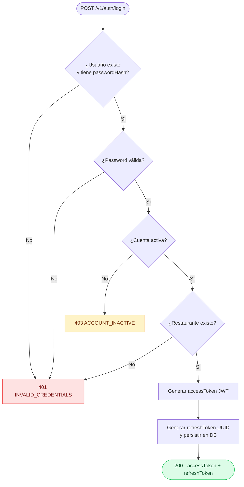
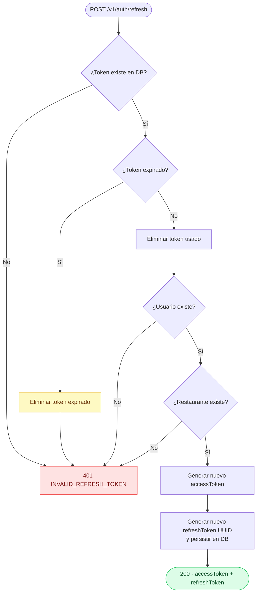
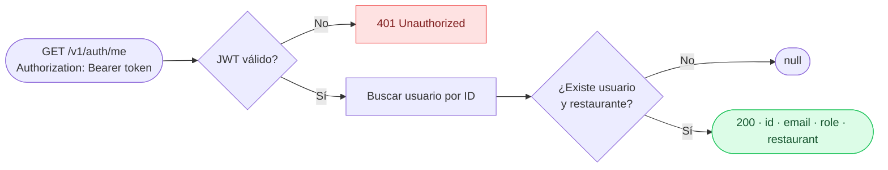
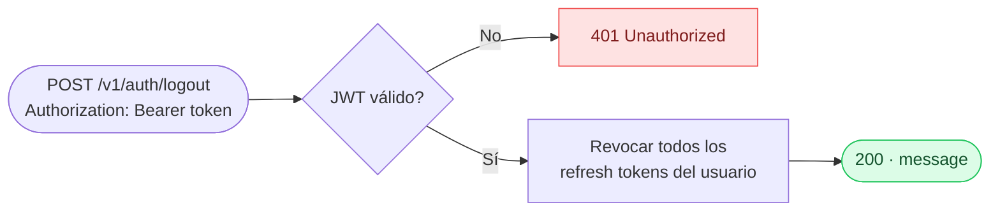

# Módulo: Auth

**Location:** `apps/api-core/src/auth`
**Autenticación requerida:** Mixta (ver tabla de endpoints)
**Versión:** v1

---

## Descripción

Módulo de autenticación basado en JWT con refresh token rotation. Gestiona login, renovación de tokens, perfil del usuario autenticado y logout. Los access tokens tienen vida corta; los refresh tokens se rotan en cada uso (un token consumido genera uno nuevo y el anterior se invalida).

---

## Endpoints

| Método | Ruta | Auth requerida | Descripción |
|--------|------|----------------|-------------|
| `POST` | `/v1/auth/login` | No | Autenticar usuario, obtener tokens |
| `POST` | `/v1/auth/refresh` | No | Rotar refresh token, obtener nuevos tokens |
| `GET` | `/v1/auth/me` | Sí (Bearer JWT) | Obtener perfil del usuario autenticado |
| `POST` | `/v1/auth/logout` | Sí (Bearer JWT) | Revocar todos los refresh tokens del usuario |

---

## Flujos

### Login



### Refresh Token Rotation



### Get Profile (`/me`)



### Logout



---

## Parámetros

### `POST /v1/auth/login`

| Campo | Tipo | Requerido | Descripción |
|-------|------|-----------|-------------|
| `email` | string (email) | Sí | Email del usuario |
| `password` | string | Sí | Contraseña, mínimo 8 caracteres |

### `POST /v1/auth/refresh`

| Campo | Tipo | Requerido | Descripción |
|-------|------|-----------|-------------|
| `refreshToken` | string | Sí | Refresh token obtenido en login o refresh previo |

---

## Respuestas

### Login / Refresh — HTTP 200

```json
{
  "accessToken": "eyJhbGciOiJIUzI1NiJ9...",
  "refreshToken": "550e8400-e29b-41d4-a716-446655440000"
}
```

### Me — HTTP 200

```json
{
  "id": "user-uuid",
  "email": "chef@restaurant.com",
  "role": "MANAGER",
  "restaurant": {
    "id": "restaurant-uuid",
    "name": "Mi Restaurante",
    "slug": "mi-restaurante"
  }
}
```

### Logout — HTTP 200

```json
{ "message": "Logged out successfully" }
```

---

## Códigos de error

| Código | Error code | Descripción |
|--------|-----------|-------------|
| 400 | — | Datos inválidos (email mal formado, password muy corta) |
| 401 | `INVALID_CREDENTIALS` | Email o contraseña incorrectos, usuario sin passwordHash |
| 401 | `INVALID_REFRESH_TOKEN` | Refresh token inválido, expirado o no encontrado |
| 403 | `ACCOUNT_INACTIVE` | La cuenta existe pero no ha sido activada |

---

## Mecanismo de seguridad

- **Access token:** JWT firmado con HS256, vida corta (configurable, por defecto 15m). No se persiste en DB.
- **Refresh token:** UUID aleatorio persistido en DB con fecha de expiración. Se rota en cada uso — al consumir un refresh token se elimina y se emite uno nuevo.
- **Logout:** Elimina **todos** los refresh tokens del usuario, invalidando todas las sesiones activas.
- **Cuenta inactiva:** Se distingue de credenciales incorrectas con un error 403 específico. El usuario debe activar su cuenta mediante el link enviado por email durante el onboarding.

---

## Dependencias de módulos

| Módulo | Uso |
|--------|-----|
| `UsersModule` | Buscar usuario por email o ID |
| `RestaurantsModule` | Verificar que el restaurante del usuario existe |
| `JwtModule` | Firmar y verificar access tokens |
| `PassportModule` | Integración con estrategia JWT (`passport-jwt`) |

---

## Notas de diseño

- **Refresh token rotation:** Cada refresh invalida el token anterior. Si un token robado se usa después de que el usuario legítimo lo renovó, el intento falla. No hay revocación reactiva automática, pero el logout invalida todas las sesiones.
- **Sin revocación de access tokens:** Los access tokens son stateless. Si un access token se compromete, es válido hasta su expiración. Mantener la vida del access token corta mitiga este riesgo.
- **Errores de credenciales genéricos:** Para evitar enumeración de usuarios, los errores de "usuario no encontrado" y "contraseña incorrecta" retornan el mismo código `INVALID_CREDENTIALS`. La cuenta inactiva sí se distingue porque el usuario debe saber que su cuenta existe y necesita activación.
