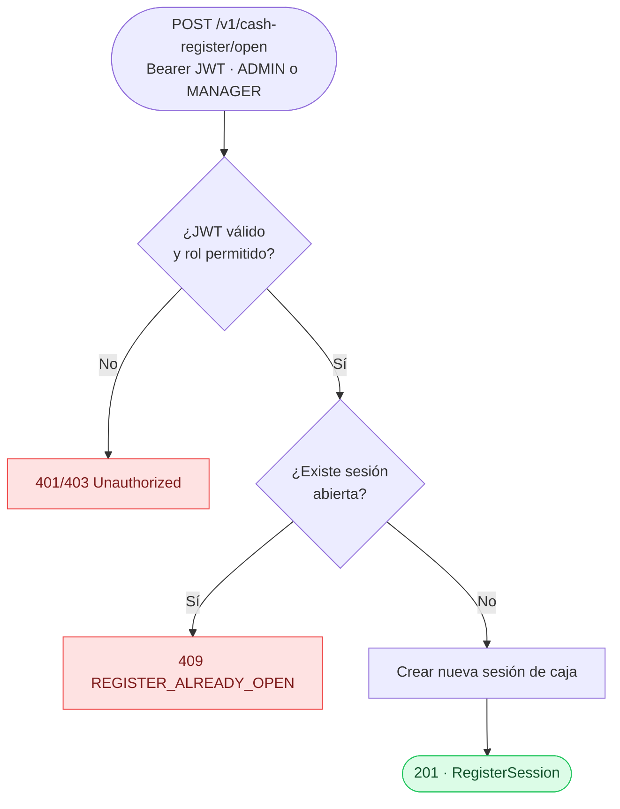
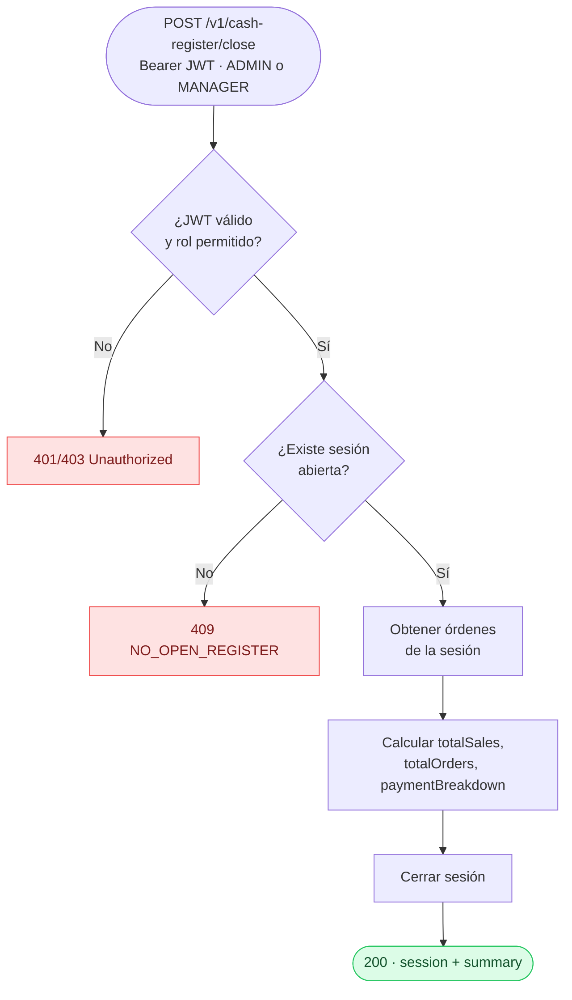
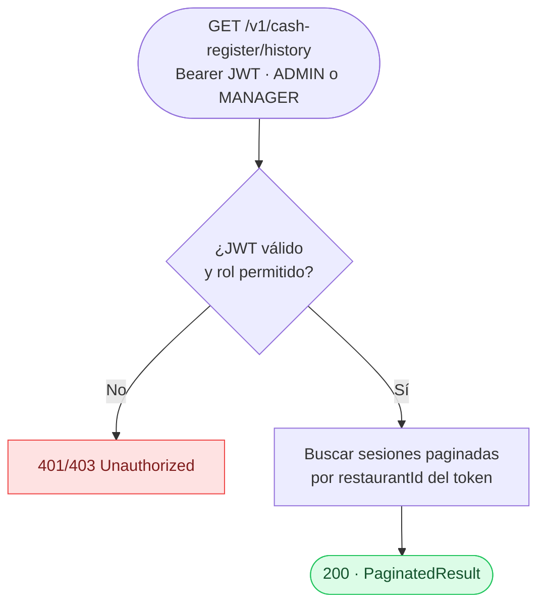
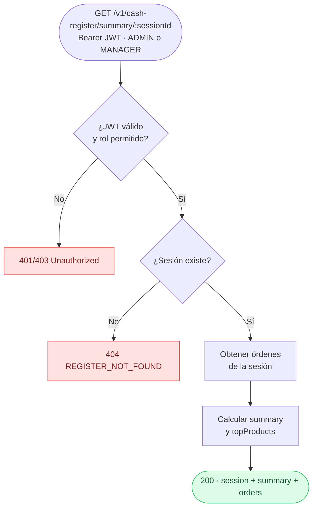

# Módulo: Cash Register

**Location:** `apps/api-core/src/cash-register`
**Autenticación requerida:** Sí (Bearer JWT)
**Roles permitidos:** ADMIN, MANAGER
**Versión:** v1

---

## Descripción

Módulo de gestión de la caja (sesión de caja) de un restaurante. Antes de que el restaurante pueda recibir pedidos, debe existir una sesión de caja abierta. Al cierre del turno, la sesión se cierra y se genera un resumen de ventas con desglose por método de pago. Solo los roles ADMIN y MANAGER pueden operar este módulo.

---

## Endpoints

| Método | Ruta | Auth | Roles | Descripción |
|--------|------|------|-------|-------------|
| `POST` | `/v1/cash-register/open` | Sí | ADMIN, MANAGER | Abrir una nueva sesión de caja |
| `POST` | `/v1/cash-register/close` | Sí | ADMIN, MANAGER | Cerrar la sesión abierta con resumen de ventas |
| `GET` | `/v1/cash-register/history` | Sí | ADMIN, MANAGER | Listar historial de sesiones (paginado) |
| `GET` | `/v1/cash-register/current` | Sí | ADMIN, MANAGER | Obtener la sesión abierta actual con conteo de órdenes |
| `GET` | `/v1/cash-register/summary/:sessionId` | Sí | ADMIN, MANAGER | Obtener resumen completo de una sesión cerrada |

---

## Flujos

### Abrir caja (`POST /v1/cash-register/open`)



### Cerrar caja (`POST /v1/cash-register/close`)



### Historial de sesiones (`GET /v1/cash-register/history`)



### Sesión actual (`GET /v1/cash-register/current`)

```mermaid
flowchart TD
    A([GET /v1/cash-register/current\nBearer JWT · ADMIN o MANAGER]) --> B{¿JWT válido\ny rol permitido?}
    B -- No --> ERR[401/403 Unauthorized]
    B -- Sí --> C[Buscar sesión abierta\ncon conteo de órdenes]
    C --> D{¿Existe sesión\nabierta?}
    D -- No --> E([200 · {}])
    D -- Sí --> F([200 · session con orderCount])

    style ERR fill:#fee2e2,stroke:#ef4444,color:#7f1d1d
    style E fill:#dcfce7,stroke:#22c55e,color:#14532d
    style F fill:#dcfce7,stroke:#22c55e,color:#14532d
```

### Resumen de sesión (`GET /v1/cash-register/summary/:sessionId`)



---

## Parámetros

### `GET /v1/cash-register/history`

| Parámetro | Tipo | Requerido | Descripción |
|-----------|------|-----------|-------------|
| `page` | number | No | Página (default: 1) |
| `limit` | number | No | Registros por página (default: `DEFAULT_PAGE_SIZE`) |

### `GET /v1/cash-register/summary/:sessionId`

| Parámetro | Tipo | Requerido | Descripción |
|-----------|------|-----------|-------------|
| `sessionId` | string (UUID) | Sí | ID de la sesión a consultar |

---

## Respuestas

### Open — HTTP 201

```json
{
  "id": "session-uuid",
  "restaurantId": "restaurant-uuid",
  "openedAt": "2026-03-08T08:00:00.000Z",
  "closedAt": null,
  "totalSales": null,
  "totalOrders": null,
  "closedBy": null
}
```

### Close — HTTP 200

```json
{
  "session": {
    "id": "session-uuid",
    "restaurantId": "restaurant-uuid",
    "openedAt": "2026-03-08T08:00:00.000Z",
    "closedAt": "2026-03-08T23:00:00.000Z",
    "totalSales": 1500.00,
    "totalOrders": 42,
    "closedBy": "user-uuid"
  },
  "summary": {
    "totalOrders": 42,
    "totalSales": 1500.00,
    "paymentBreakdown": {
      "CASH": { "count": 30, "total": 1000.00 },
      "CARD": { "count": 12, "total": 500.00 }
    }
  }
}
```

### History — HTTP 200

```json
{
  "data": [
    {
      "id": "session-uuid",
      "restaurantId": "restaurant-uuid",
      "openedAt": "2026-03-08T08:00:00.000Z",
      "closedAt": "2026-03-08T23:00:00.000Z",
      "totalSales": 1500.00,
      "totalOrders": 42
    }
  ],
  "meta": {
    "total": 10,
    "page": 1,
    "limit": 10,
    "totalPages": 1
  }
}
```

### Current — HTTP 200

Cuando hay sesión abierta:

```json
{
  "id": "session-uuid",
  "restaurantId": "restaurant-uuid",
  "openedAt": "2026-03-08T08:00:00.000Z",
  "closedAt": null,
  "_count": { "orders": 15 }
}
```

Cuando no hay sesión abierta:

```json
{}
```

### Summary — HTTP 200

```json
{
  "session": {
    "id": "session-uuid",
    "restaurantId": "restaurant-uuid",
    "openedAt": "2026-03-08T08:00:00.000Z",
    "closedAt": "2026-03-08T23:00:00.000Z",
    "totalSales": 1500.00,
    "totalOrders": 42
  },
  "summary": {
    "totalOrders": 42,
    "totalSales": 1500.00,
    "completedOrders": 40,
    "cancelledOrders": 2,
    "paymentBreakdown": {
      "CASH": { "count": 30, "total": 1000.00 },
      "CARD": { "count": 12, "total": 500.00 }
    },
    "topProducts": [
      { "id": "product-uuid", "name": "Tacos de Bistec", "quantity": 80, "total": 960.00 }
    ]
  },
  "orders": []
}
```

> `topProducts` incluye hasta 10 productos, ordenados por cantidad vendida. Las órdenes canceladas se excluyen del cálculo de productos.

---

## Códigos de error

| Código | Error code | Descripción |
|--------|-----------|-------------|
| 401 | — | JWT ausente o inválido |
| 403 | — | Rol insuficiente (rol distinto de ADMIN o MANAGER) |
| 404 | `REGISTER_NOT_FOUND` | La sesión con el ID especificado no existe |
| 409 | `REGISTER_ALREADY_OPEN` | Ya existe una sesión de caja abierta para este restaurante |
| 409 | `NO_OPEN_REGISTER` | No hay ninguna sesión de caja abierta para cerrar |

---

## Aislamiento por restaurantId

Todas las operaciones extraen el `restaurantId` del JWT del usuario autenticado:

- **Abrir / Cerrar:** opera únicamente sobre la sesión abierta del restaurante del usuario.
- **Historial:** devuelve solo las sesiones del restaurante del token.
- **Sesión actual:** busca la sesión abierta del restaurante del token.
- **Resumen:** no filtra por `restaurantId` en la ruta, pero la sesión ya pertenece a un restaurante específico almacenado en DB.

---

## Dependencias de módulos

| Módulo | Uso |
|--------|-----|
| `CashRegisterSessionRepository` | Acceso a DB para crear, cerrar y consultar sesiones |
| `OrderRepository` | Obtener las órdenes vinculadas a una sesión para calcular resúmenes |
| `AuthModule` | Guards JWT y Roles para proteger todos los endpoints |

---

## Notas de diseño

- **Una sola sesión abierta por restaurante:** el sistema impide abrir una segunda sesión si ya hay una activa. Debe cerrarse la sesión actual antes de abrir una nueva.
- **Resumen calculado al cierre:** `totalSales`, `totalOrders` y `paymentBreakdown` se calculan en tiempo real al cerrar y se persisten en la sesión. El endpoint `summary` recalcula estos valores dinámicamente desde las órdenes, priorizando los valores persistidos si existen.
- **`topProducts` solo en summary:** el resumen de sesión incluye los 10 productos más vendidos (por cantidad), excluyendo las órdenes canceladas. Este cálculo no se ejecuta en el cierre para mantener el endpoint `/close` liviano.
- **Sesión actual devuelve `{}`:** si no hay sesión abierta, `GET /current` retorna un objeto vacío en lugar de 404, simplificando la lógica del cliente para verificar si la caja está abierta.
- **Paginación por defecto:** `getSessionHistory` usa `DEFAULT_PAGE_SIZE` del config global para consistencia con el resto de la API.
