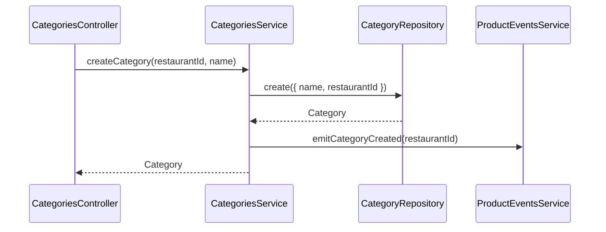

# Categories Module

Manages product categories for a restaurant. All products belong to a category. A default category is auto-created on onboarding.

## Authentication
All endpoints require JWT Bearer token.

## Roles
| Operation | Allowed Roles |
|---|---|
| GET | ADMIN, MANAGER, BASIC |
| POST, PATCH, DELETE | ADMIN, MANAGER |

## Endpoints
| Method | Path | Body | Response | Roles |
|---|---|---|---|---|
| GET | /v1/categories | — | PaginatedResult\<Category\> | ADMIN, MANAGER, BASIC |
| POST | /v1/categories | CreateCategoryDto | Category | ADMIN, MANAGER |
| PATCH | /v1/categories/:id | UpdateCategoryDto | Category | ADMIN, MANAGER |
| DELETE | /v1/categories/:id | — | Category | ADMIN, MANAGER |

## Create Category Flow

