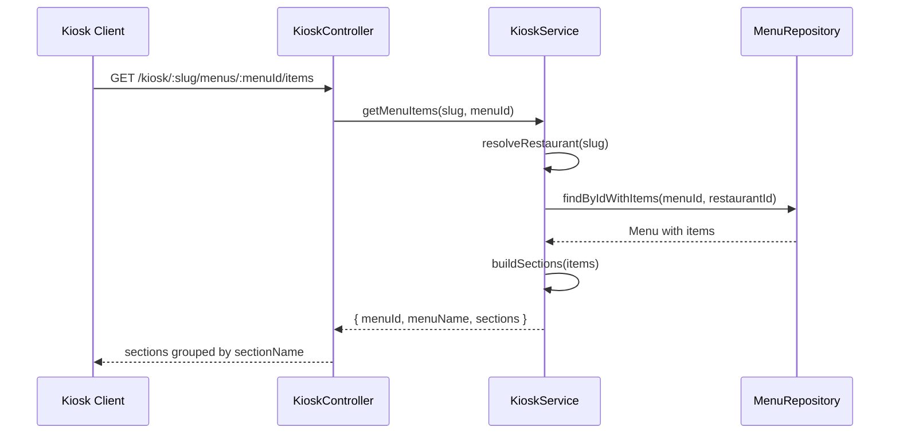
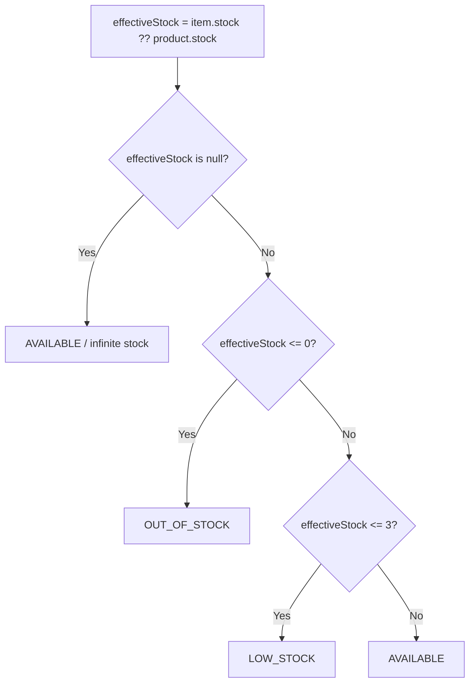

# Kiosk Module

Public-facing API for the self-service kiosk. Most endpoints are unauthenticated and identified by restaurant slug.

## Authentication
No JWT required. Restaurant identified via `slug` URL parameter.

## Endpoints
| Method | Path | Body | Response |
|---|---|---|---|
| GET | /v1/kiosk/:slug/menus | — | Menu[] (active, filtered by day/time) |
| GET | /v1/kiosk/:slug/menus/:menuId/items | — | { menuId, menuName, sections } |
| GET | /v1/kiosk/:slug/status | — | { registerOpen: boolean } |
| POST | /v1/kiosk/:slug/orders | CreateOrderDto | Order |

## Get Menu Items Flow

## Stock Status Logic

