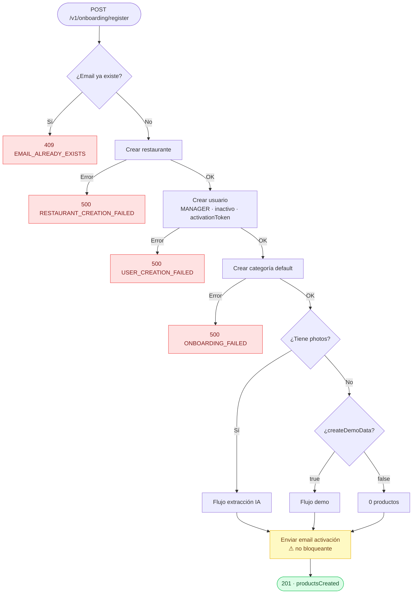
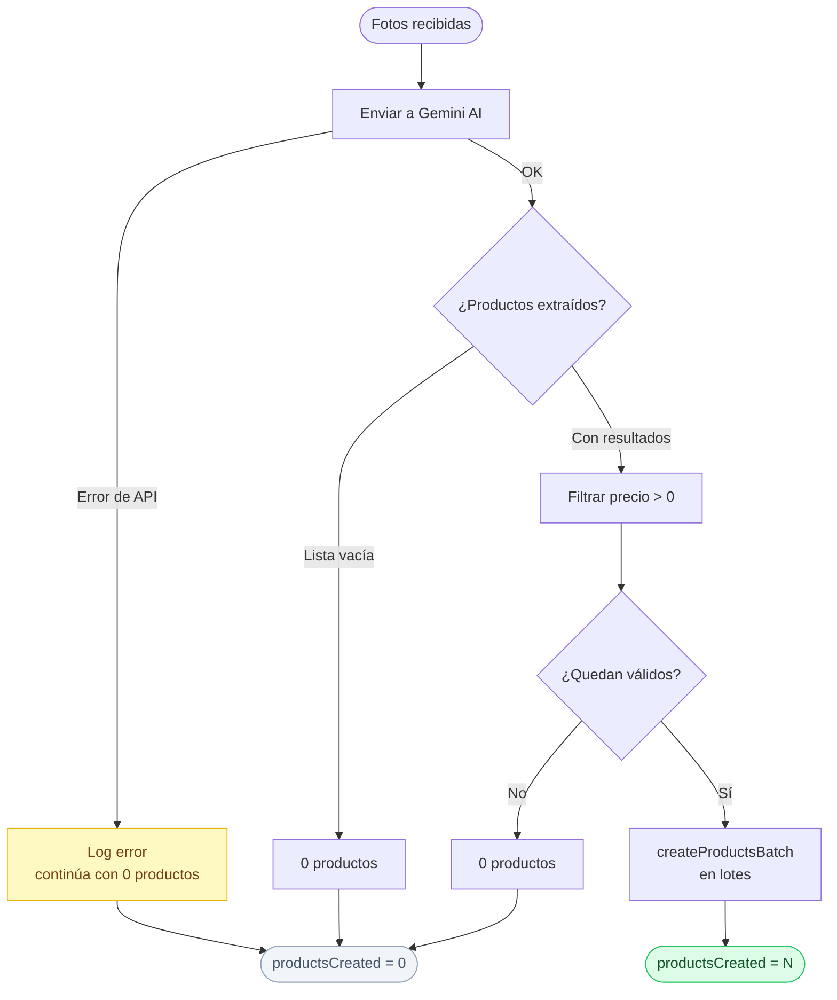
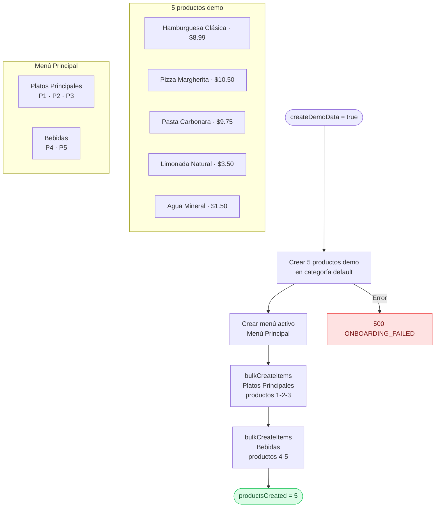
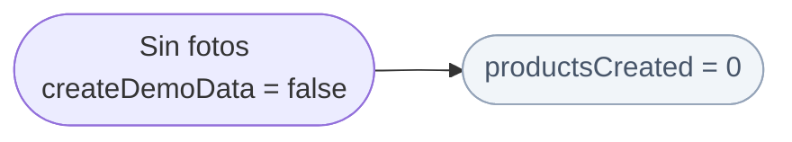

# Módulo: Onboarding

**Location:** `apps/api-core/src/onboarding`
**Autenticación requerida:** No (público)
**Versión:** v1

---

## Descripción

Módulo encargado de registrar un nuevo restaurante por primera vez. Crea el restaurante, el usuario administrador (rol `MANAGER`, inactivo), la categoría por defecto y opcionalmente los productos iniciales. Envía el email de activación al finalizar todo el proceso.

---

## Endpoint

### `POST /v1/onboarding/register`

**Content-Type:** `multipart/form-data`

#### Parámetros

| Campo | Tipo | Requerido | Descripción |
|-------|------|-----------|-------------|
| `email` | string (email) | Sí | Email del usuario. Se enviará el link de activación. |
| `restaurantName` | string | Sí | Nombre del restaurante. Máx. 60 caracteres. Solo letras, acentos, espacios, guión medio y guión bajo. |
| `createDemoData` | boolean | No | Si `true`, crea 5 productos demo y un menú activo con secciones. |
| `photos` | File[] (PNG/JPG) | No | Fotos del menú para extracción de productos via IA. Máx. 3 archivos, máx. 5MB c/u. |

#### Validaciones del DTO

- `email`: formato email válido, requerido.
- `restaurantName`: requerido, máx. 60 caracteres, regex `/^[a-zA-ZÀ-ÿ \-_]+$/` (letras, acentos, espacios, guión medio, guión bajo).
- `createDemoData`: booleano opcional. En `multipart/form-data` acepta el string `"true"` o `"false"` y lo convierte automáticamente.
- `photos`: validados por `ParseFilePipe` antes de llegar al servicio. Si el archivo no es PNG o JPG, o supera el tamaño máximo, se rechaza la petición con `400` antes de ejecutar ningún flujo de negocio.

---

## Flujo principal



> El email se envía únicamente cuando todas las operaciones de base de datos han finalizado exitosamente.

---

## Sub-flujos de productos

### Con `photos` (extracción IA)



La falla en la extracción de fotos **no detiene el onboarding**. El restaurante y el usuario quedan creados.

### Con `createDemoData: true` (demo)



### Sin fotos y sin `createDemoData`



---

## Respuesta

**HTTP 201 Created**

```json
{
  "productsCreated": 5
}
```

Solo se expone `productsCreated`. No se retorna el ID del restaurante, ID del usuario, tokens ni información sensible.

---

## Códigos de error

| Código | Error code | Descripción |
|--------|-----------|-------------|
| 400 | — | Datos inválidos, tipo de archivo incorrecto o tamaño excedido |
| 409 | `EMAIL_ALREADY_EXISTS` | El email ya está registrado |
| 500 | `RESTAURANT_CREATION_FAILED` | Error al crear el restaurante |
| 500 | `USER_CREATION_FAILED` | Error al crear el usuario |
| 500 | `ONBOARDING_FAILED` | Error inesperado en el proceso |

---

## Dependencias de módulos

| Módulo | Uso |
|--------|-----|
| `RestaurantsModule` | Crear el restaurante |
| `UsersModule` | Validar email y crear usuario |
| `ProductsModule` | Crear categoría default y productos |
| `MenusModule` | Crear menú y menu items (flujo demo) |
| `AiModule` | Extraer productos desde imágenes (Gemini) |
| `EmailModule` | Enviar email de activación |

---

## Notas de diseño

- **Transaccionalidad parcial:** No existe una transacción global porque el envío de email es una operación externa. Las operaciones de base de datos son secuenciales. Si una falla, las anteriores quedan confirmadas (sin rollback automático). Para un MVP esto es aceptable; en versiones futuras se puede evaluar una estrategia de compensación o saga.
- **Extracción de fotos no bloqueante:** Una falla en Gemini no debe impedir que el restaurante quede registrado. Se loguea el error y el flujo continúa.
- **Email al final:** El email se envía después de todas las operaciones de DB para garantizar que el usuario solo recibe el link si el registro fue exitoso.
- **Respuesta minimalista:** El controller tiene su propio tipo `OnboardingResponse` que serializa únicamente los campos necesarios para el frontend.
