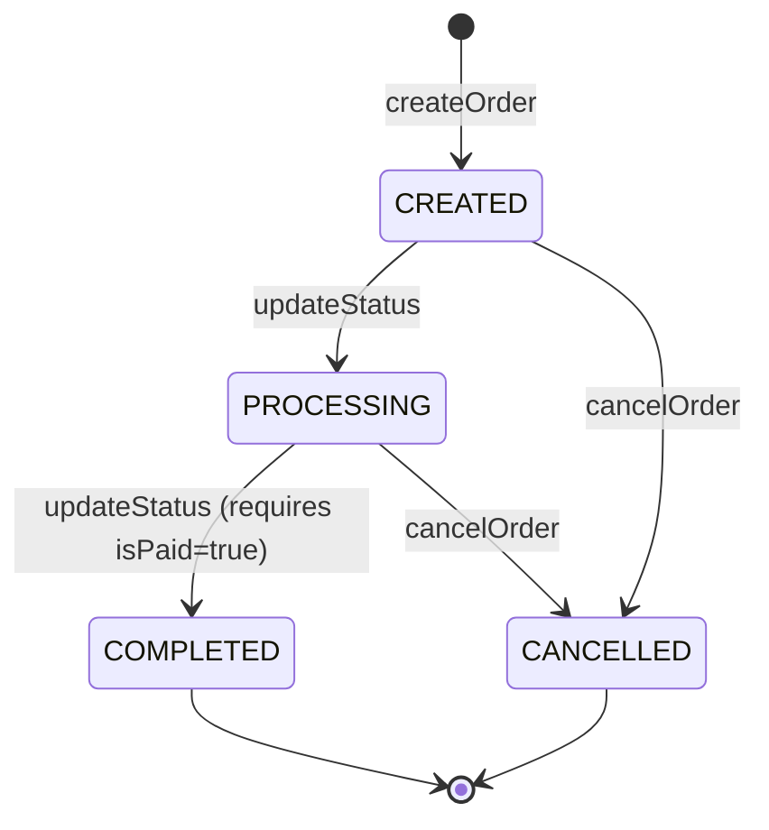
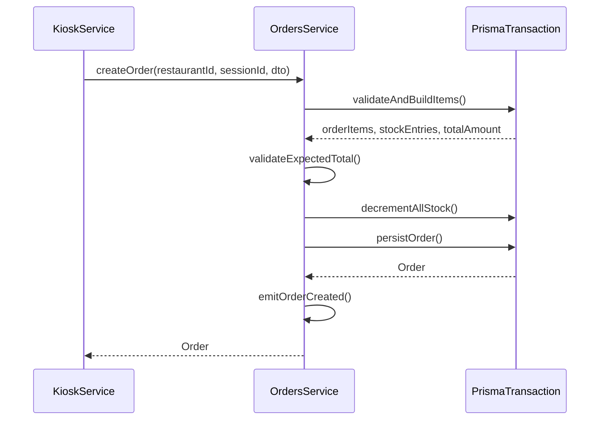

# Orders Module

Manages customer orders. Orders are created through the Kiosk module and managed via the dashboard.

## Authentication
All endpoints require JWT Bearer token.

## Roles
| Operation | Allowed Roles |
|---|---|
| GET | ADMIN, MANAGER, BASIC |
| PATCH (status, pay, cancel) | ADMIN, MANAGER |

## Endpoints
| Method | Path | Body | Response | Roles |
|---|---|---|---|---|
| GET | /v1/orders | — | Order[] | ADMIN, MANAGER, BASIC |
| GET | /v1/orders/:id | — | Order | ADMIN, MANAGER, BASIC |
| PATCH | /v1/orders/:id/status | UpdateOrderStatusDto | Order | ADMIN, MANAGER |
| PATCH | /v1/orders/:id/pay | — | Order | ADMIN, MANAGER |
| PATCH | /v1/orders/:id/cancel | CancelOrderDto | Order | ADMIN, MANAGER |

## Order Status Transitions

## Create Order Flow

