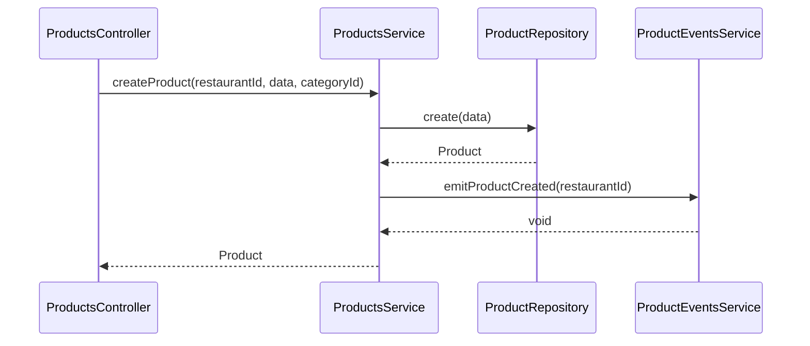
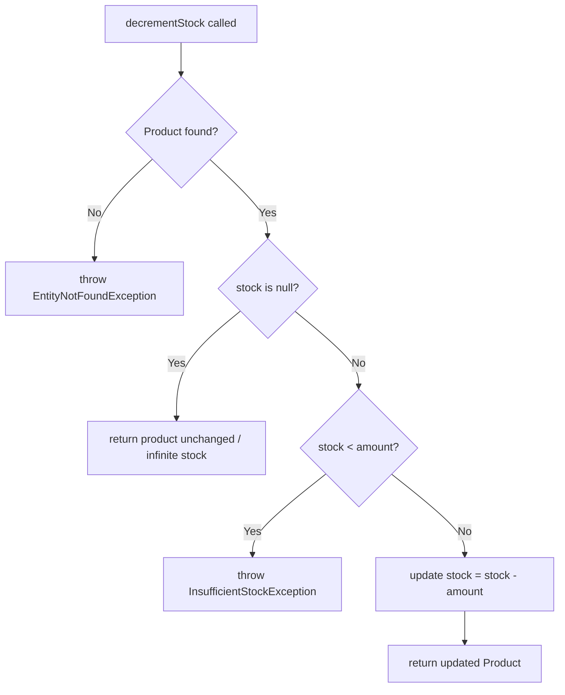

# Products Module

Manages products for a restaurant. Products belong to a category and can have finite or infinite stock.

## Authentication
All endpoints require JWT Bearer token.

## Roles
| Operation | Allowed Roles |
|---|---|
| GET | ADMIN, MANAGER, BASIC |
| POST, PATCH, DELETE | ADMIN, MANAGER |

## Endpoints
| Method | Path | Body | Response | Roles |
|---|---|---|---|---|
| GET | /v1/products | — | PaginatedResult\<Product\> | ADMIN, MANAGER, BASIC |
| GET | /v1/products/:id | — | Product | ADMIN, MANAGER, BASIC |
| POST | /v1/products | CreateProductDto | Product | ADMIN, MANAGER |
| PATCH | /v1/products/:id | UpdateProductDto | Product | ADMIN, MANAGER |
| DELETE | /v1/products/:id | — | Product | ADMIN, MANAGER |

## Create Product Flow

## Decrement Stock Flow

