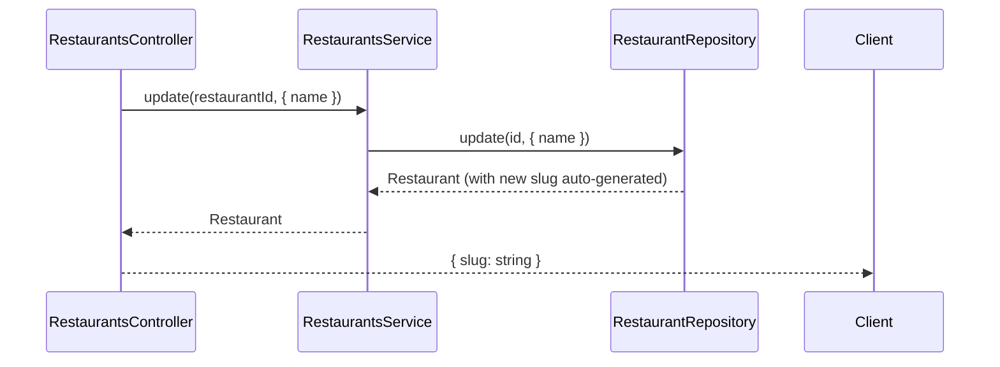

# Restaurants Module

Manages restaurant data. The restaurant is the top-level tenant — all other entities belong to a restaurant.

## Authentication
All endpoints require JWT Bearer token with ADMIN role.

## Roles
| Operation | Allowed Roles |
|---|---|
| PATCH /name | ADMIN only |

## Endpoints
| Method | Path | Body | Response | Roles |
|---|---|---|---|---|
| PATCH | /v1/restaurants/name | RenameRestaurantDto | { slug: string } | ADMIN |

## Rename Restaurant Flow

## Notes
- The slug is auto-generated from the name on update
- Slug is used by the Kiosk to identify the restaurant without authentication
