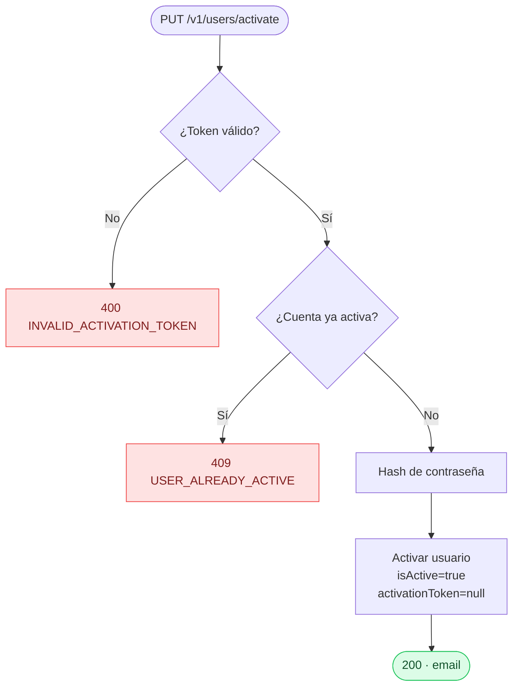
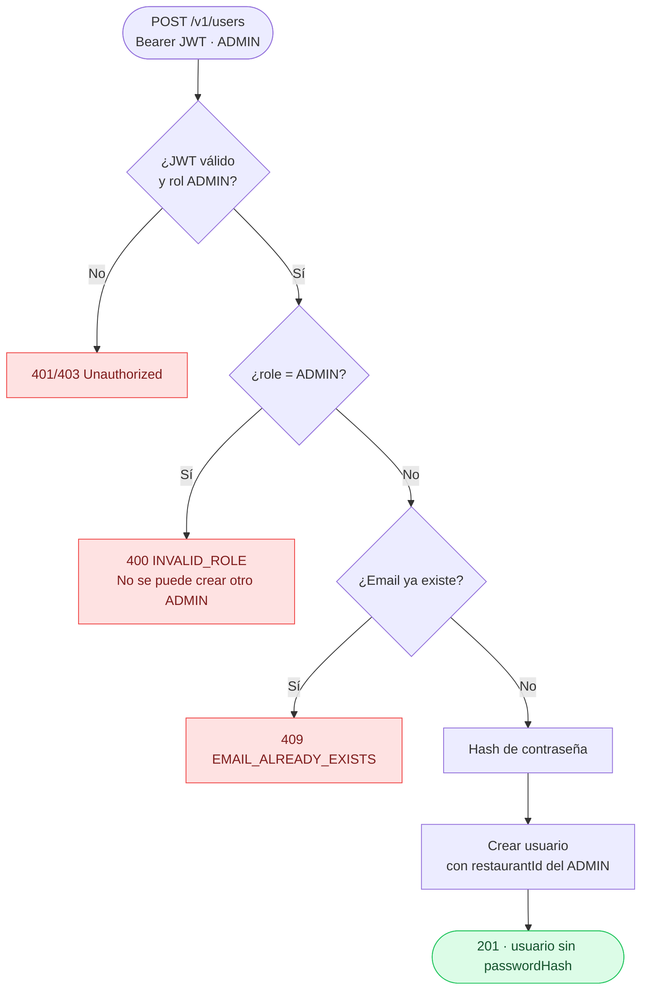
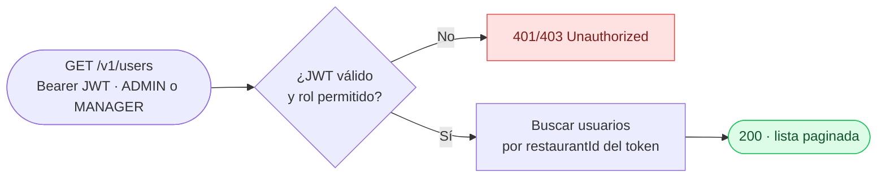
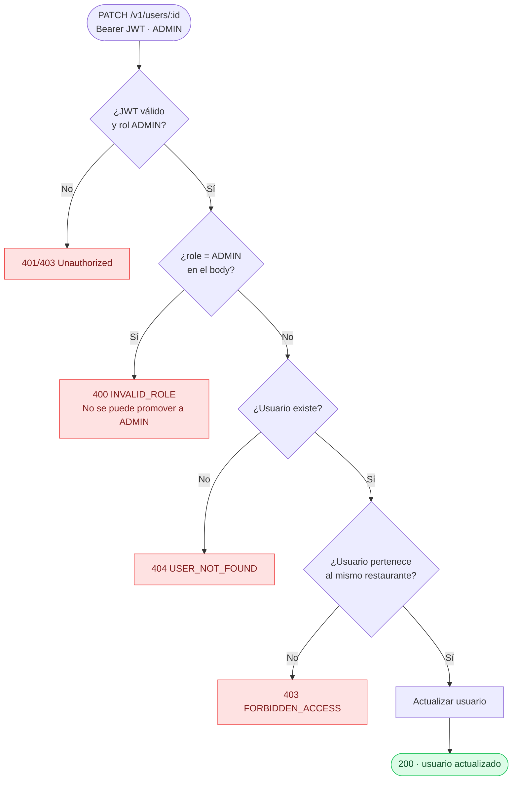
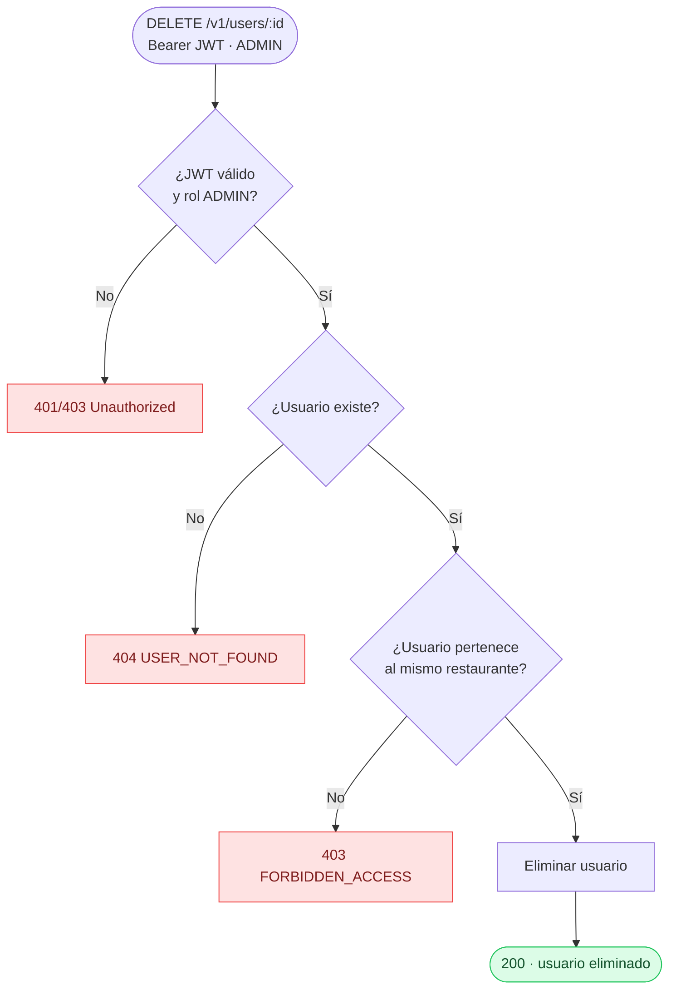

# Módulo: Users

**Location:** `apps/api-core/src/users`
**Autenticación requerida:** Mixta (ver tabla de endpoints)
**Versión:** v1

---

## Descripción

Módulo de gestión de usuarios. Permite activar cuentas (público), listar usuarios (ADMIN y MANAGER), y crear/editar/eliminar usuarios (solo ADMIN). Todas las operaciones autenticadas están aisladas por `restaurantId` — un usuario no puede operar sobre usuarios de otro restaurante.

---

## Endpoints

| Método | Ruta | Auth | Roles | Descripción |
|--------|------|------|-------|-------------|
| `PUT` | `/v1/users/activate` | No | — | Activar cuenta con token de activación |
| `POST` | `/v1/users` | Sí | ADMIN | Crear nuevo usuario (no puede asignar rol ADMIN) |
| `GET` | `/v1/users` | Sí | ADMIN, MANAGER | Listar usuarios del restaurante (paginado) |
| `PATCH` | `/v1/users/:id` | Sí | ADMIN | Editar usuario (no puede promover a ADMIN) |
| `DELETE` | `/v1/users/:id` | Sí | ADMIN | Eliminar usuario |

---

## Flujos

### Activar cuenta (`PUT /v1/users/activate`)



### Crear usuario (`POST /v1/users`)



### Listar usuarios (`GET /v1/users`)



### Editar usuario (`PATCH /v1/users/:id`)



### Eliminar usuario (`DELETE /v1/users/:id`)



---

## Parámetros

### `PUT /v1/users/activate`

| Campo | Tipo | Requerido | Descripción |
|-------|------|-----------|-------------|
| `token` | string | Sí | Token de activación recibido por email |
| `password` | string | Sí | Nueva contraseña |

### `POST /v1/users`

| Campo | Tipo | Requerido | Descripción |
|-------|------|-----------|-------------|
| `email` | string (email) | Sí | Email del nuevo usuario |
| `password` | string | Sí | Contraseña inicial |
| `role` | enum (MANAGER, BASIC) | Sí | Rol del usuario. No puede ser ADMIN |

### `GET /v1/users`

| Parámetro | Tipo | Requerido | Descripción |
|-----------|------|-----------|-------------|
| `page` | number | No | Página (default: 1) |
| `limit` | number | No | Registros por página (default: `DEFAULT_PAGE_SIZE`) |

### `PATCH /v1/users/:id`

| Campo | Tipo | Requerido | Descripción |
|-------|------|-----------|-------------|
| `email` | string (email) | No | Nuevo email |
| `role` | enum (MANAGER, BASIC) | No | Nuevo rol. No puede ser ADMIN |
| `isActive` | boolean | No | Estado de la cuenta |

---

## Respuestas

### Activate — HTTP 200

```json
{ "email": "chef@restaurant.com" }
```

### Create / Update — HTTP 201 / 200

```json
{
  "id": "user-uuid",
  "email": "staff@restaurant.com",
  "role": "MANAGER",
  "isActive": true,
  "restaurantId": "restaurant-uuid"
}
```

> `passwordHash` nunca se incluye en la respuesta.

### List — HTTP 200

```json
{
  "data": [
    { "id": "...", "email": "...", "role": "MANAGER", "isActive": true }
  ],
  "meta": {
    "total": 5,
    "page": 1,
    "limit": 10,
    "totalPages": 1
  }
}
```

### Delete — HTTP 200

Devuelve el usuario eliminado (sin `passwordHash`).

---

## Códigos de error

| Código | Error code | Descripción |
|--------|-----------|-------------|
| 400 | `INVALID_ACTIVATION_TOKEN` | Token de activación inválido o expirado |
| 400 | `INVALID_ROLE` | Se intentó asignar el rol ADMIN desde el dashboard |
| 401 | — | JWT ausente o inválido |
| 403 | — | Rol insuficiente (MANAGER intentando crear/editar/eliminar) |
| 403 | `FORBIDDEN_ACCESS` | El usuario objetivo pertenece a otro restaurante |
| 404 | `USER_NOT_FOUND` | Usuario no encontrado |
| 409 | `EMAIL_ALREADY_EXISTS` | El email ya está registrado |
| 409 | `USER_ALREADY_ACTIVE` | La cuenta ya fue activada previamente |

---

## Aislamiento por restaurantId

Todas las operaciones autenticadas extraen el `restaurantId` del JWT del usuario autenticado:

- **Crear:** el nuevo usuario queda vinculado al `restaurantId` del ADMIN que lo crea.
- **Listar:** solo devuelve usuarios del mismo restaurante.
- **Editar / Eliminar:** verifica que el usuario objetivo pertenezca al mismo restaurante antes de operar. Si no, lanza `403 FORBIDDEN_ACCESS`.

Este mecanismo garantiza que un ADMIN de un restaurante no pueda operar sobre usuarios de otro cliente.

---

## Restricciones de seguridad

- **El rol ADMIN no puede asignarse desde el dashboard.** Solo se crea durante el onboarding inicial. Ver `apps/api-core/docs/pending/verification-to-create-or-delete-admin.md` para la propuesta de implementación futura.
- **El passwordHash nunca se expone** en respuestas de API.
- **Activación pública:** el endpoint `PUT /v1/users/activate` no requiere JWT porque el usuario aún no tiene credenciales activas.

---

## Dependencias de módulos

| Módulo | Uso |
|--------|-----|
| `UserRepository` | Acceso a DB para CRUD de usuarios |
| `AuthModule` | Guards JWT y Roles para proteger endpoints |
| `OnboardingModule` | Crea el usuario ADMIN inicial (único punto válido) |

---

## Notas de diseño

- **Sin transacción en operaciones simples:** `createUser`, `updateUser`, `deleteUser` son operaciones atómicas de una sola entidad. No requieren transacción.
- **Activación desacoplada del onboarding:** `activateUser` es un flujo independiente que ocurre cuando el usuario hace clic en el email. No depende del flujo de onboarding en ejecución.
- **Paginación por defecto:** `findByRestaurantIdPaginated` usa `DEFAULT_PAGE_SIZE` del config global para consistencia.
