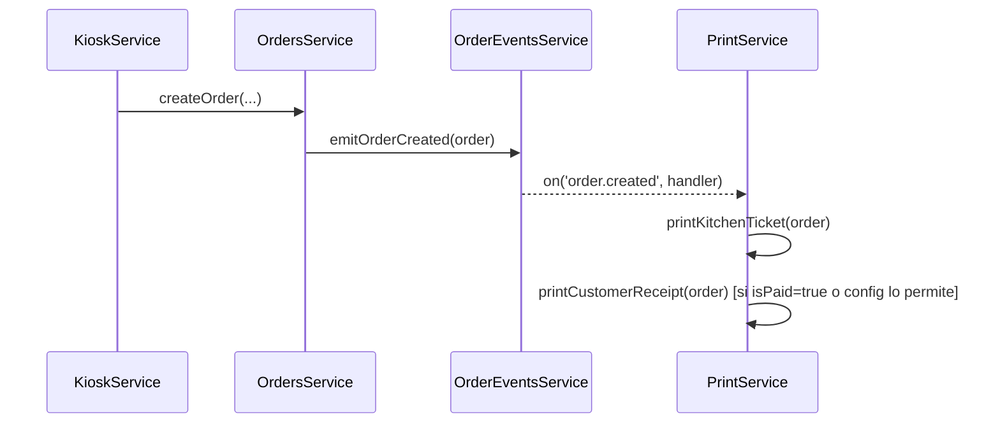

# Pendiente: Impresión automática de tickets al crear una orden

**Fecha:** 2026-03-09
**Área:** `apps/api-core/src/print/`, `apps/api-core/src/orders/`
**Prioridad:** Media

---

## Contexto

Al crear una orden, el sistema debe imprimir automáticamente dos tipos de tickets:

1. **Ticket de cliente**: recibo con items, precios y total. Lo recibe el cliente al pagar o al hacer el pedido.
2. **Ticket de cocina**: lista de items con notas, sin precios. Va directo a la cocina para preparar.

Esto permite operar **sin pantalla de cocina** — la cocina trabaja con tickets físicos, lo cual es suficiente para restaurantes pequeños (validado en práctica en Japón).

---

## Estado actual del módulo Print

- `PrintService.generateReceipt(orderId)` — genera el receipt completo con precios.
- `PrintService.printReceipt(orderId)` — imprime el receipt (actualmente un stub con `Logger`).
- El trigger de impresión es **manual** via `POST /v1/print/receipt/:orderId/print`.
- No existe integración con el flujo de creación de órdenes.
- No existe el concepto de **ticket de cocina** (sin precios).

---

## Solución Propuesta: Evento al crear orden → PrintService

El flujo de creación de órdenes ya emite eventos via `OrderEventsService`. Se debe agregar un listener en `PrintService` que reaccione a `order.created`.

### Flujo



### Nuevo interface: KitchenTicket

```ts
// apps/api-core/src/print/interfaces/kitchen-ticket.interface.ts
export interface KitchenTicket {
  orderNumber: number;
  sessionLabel?: string;  // ej: "Mesa 3" o "Tótem" — futuro
  createdAt: string;
  items: Array<{
    productName: string;
    quantity: number;
    notes?: string;
  }>;
  // SIN precios — la cocina no necesita esta info
}
```

### Cambios en PrintService

Agregar métodos:
- `generateKitchenTicket(orderId): Promise<KitchenTicket>` — solo items y notas.
- `printKitchenTicket(orderId): Promise<{ success: boolean }>` — stub inicial con Logger.
- `handleOrderCreated(order): Promise<void>` — listener del evento, llama a `printKitchenTicket` y opcionalmente a `printReceipt`.

### Listener del evento

```ts
// En PrintService
@OnEvent('order.created')
async handleOrderCreated(order: Order): Promise<void> {
  await this.printKitchenTicket(order.id);
  // El ticket de cliente se imprime al pagar (order.isPaid=true),
  // o inmediatamente si así se configura en el futuro.
}
```

---

## Cuándo imprimir el ticket de cliente

| Escenario | Cuándo imprimir |
|-----------|----------------|
| Pago en caja al retirar | Al marcar `isPaid = true` (`PATCH /orders/:id/pay`) |
| Pago en el tótem (futuro) | Al crear la orden, si `isPaid = true` desde el inicio |
| Siempre al crear | Configurable via `PRINT_CUSTOMER_ON_CREATE=true` (env var) |

**Recomendación inicial**: imprimir ticket de cocina siempre al crear, y ticket de cliente al pagar.

---

## Integración con impresora física (futuro)

El stub actual usa `Logger`. La implementación real de impresión física debe ser intercambiable. Opciones:

- **ESC/POS** (protocolo estándar para impresoras térmicas): librería `node-escpos` o similar.
- **Impresión por red**: impresoras térmicas IP (muy comunes, bajo costo).
- **Impresión por USB**: menos común en Node.js, más compleja.

La interfaz `printKitchenTicket` / `printReceipt` ya está bien abstraída — solo se reemplaza el cuerpo del método sin cambiar el contrato.

### Variable de entorno futura

```
PRINTER_ENABLED=true          # activa impresión física (default: false = stub)
PRINTER_TYPE=network          # network | usb | escpos-serial
PRINTER_HOST=192.168.1.100    # para impresoras de red
PRINTER_PORT=9100
```

---

## Tareas de implementación

1. Crear `KitchenTicket` interface.
2. Agregar `generateKitchenTicket(orderId)` en `PrintService`.
3. Agregar `printKitchenTicket(orderId)` (stub + Logger, misma estructura que `printReceipt`).
4. Agregar listener `@OnEvent('order.created')` en `PrintService`.
5. Verificar que `PrintModule` importa `EventEmitterModule` o que el listener esté correctamente registrado.
6. Agregar endpoint `POST /v1/print/kitchen/:orderId/print` para reimpresión manual desde el dashboard.
7. Tests unitarios del listener y los nuevos métodos.

---

## Referencias

- `apps/api-core/src/print/print.service.ts` — servicio actual
- `apps/api-core/src/print/interfaces/receipt.interface.ts` — interface de referencia
- `apps/api-core/src/orders/` — servicio de órdenes y eventos
- `apps/api-core/docs/modules/orders.md` — flujo de creación de órdenes
