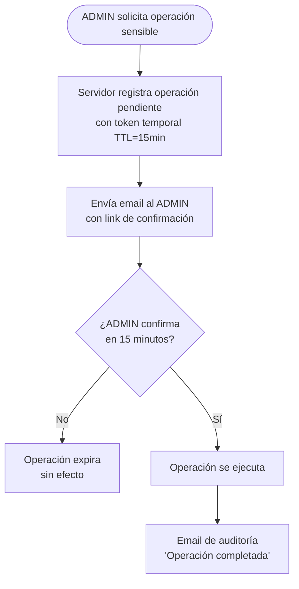

# Pendiente: Verificación por email para operaciones sensibles de ADMIN

**Fecha:** 2026-03-08
**Área:** Módulo de usuarios (`apps/api-core/src/auth`, `apps/api-core/src/users`)
**Prioridad:** Media-Alta

---

## Problema

Actualmente existe una asimetría de seguridad en la gestión de usuarios:

1. **Crear un ADMIN** solo ocurre durante el onboarding (`createOnboardingUser` → `createAdminUser` vía CLI). Este flujo está fuera del dashboard y no es accesible por un ADMIN autenticado.

2. **Desde el dashboard**, el endpoint `POST /v1/users` permite al ADMIN crear usuarios con cualquier rol **excepto ADMIN** (bloqueado en `createUser`). Sin embargo, operaciones como eliminar usuarios o cambiar roles siguen siendo silenciosas — no existe ningún mecanismo de confirmación ni auditoría.

### Escenario de riesgo

Si la cuenta ADMIN de un restaurante es comprometida (por ejemplo, mediante session hijacking después de un access token robado), el atacante puede:

- Crear nuevos usuarios con cualquier rol (MANAGER, WAITER, etc.)
- Modificar roles de usuarios existentes
- Eliminar usuarios del restaurante

Estas son operaciones **irreversibles** (especialmente el borrado) y de **alto impacto** que no tienen ninguna barrera adicional más allá del JWT válido.

---

## Solución propuesta

Implementar un flujo de **verificación por email para operaciones sensibles**:

### Operaciones a proteger

| Operación | Endpoint | Propuesta |
|-----------|----------|-----------|
| Crear usuario con rol elevado | `POST /v1/users` | Email de confirmación al ADMIN |
| Eliminar usuario | `DELETE /v1/users/:id` | Email de confirmación al ADMIN |
| Cambio de rol | `PATCH /v1/users/:id` con `role` | Email de confirmación al ADMIN |
| Crear ADMIN (futuro) | — | Requiere confirmación por email + aprobación manual |

### Flujo sugerido

### Consideraciones de implementación

- **Token de confirmación:** UUID aleatorio con TTL corto (15 min), almacenado en DB con estado `pending | confirmed | expired`.
- **Tabla nueva:** `PendingOperation { id, type, payload, adminEmail, token, expiresAt, status }`.
- **Email doble:** confirmación para ejecutar + notificación después de ejecutar (para detectar operaciones no autorizadas).
- **Idempotencia:** Si el mismo ADMIN solicita la misma operación dos veces, la primera queda pendiente y no se duplica.
- **Auditoría:** Loggear todas las operaciones sensibles completadas con timestamp, adminId, y resultado.

---

## Estado actual (workaround)

Como medida temporal hasta implementar lo anterior:

- **`createUser`** bloquea `role = ADMIN` — solo onboarding puede crear admins.
- **`updateUser`** bloquea `role = ADMIN` — no se puede promover un usuario a ADMIN desde el dashboard.
- El resto de operaciones destructivas (delete, role change a no-ADMIN) siguen sin confirmación adicional.

---

## Referencias

- `apps/api-core/src/users/users.service.ts` — guards `InvalidRoleException` en `createUser` y `updateUser`
- `apps/api-core/src/users/users.controller.ts` — `@Roles(Role.ADMIN)` en POST, PATCH, DELETE
- `apps/api-core/src/onboarding/onboarding.service.ts` — único punto donde se crea un ADMIN legítimamente
