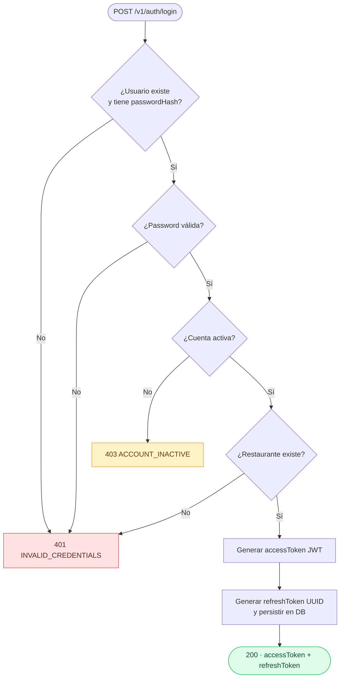
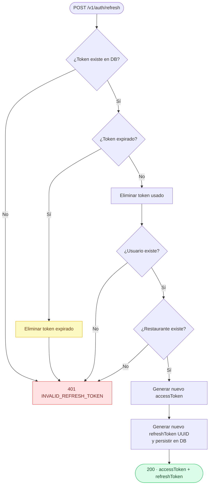
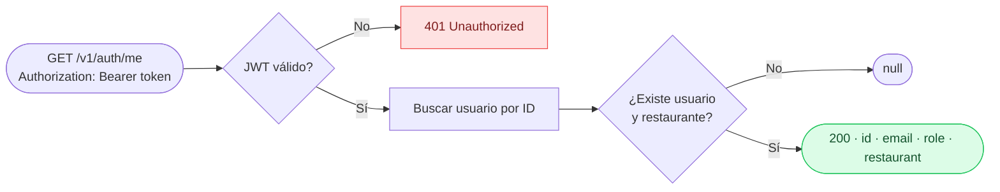
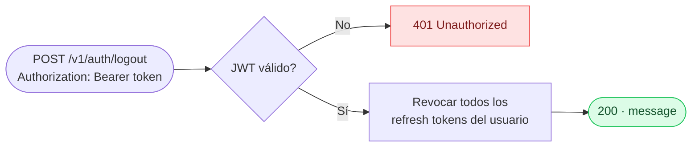

# Auth Module: Tests, Types & Documentation Implementation Plan

> **For Claude:** REQUIRED SUB-SKILL: Use superpowers:executing-plans to implement this plan task-by-task.

**Goal:** Fix inactive account error handling, add explicit types to controller, write unit tests for auth service and controller with 80%+ coverage, and document the auth module.

**Architecture:** Three isolated changes (service fix, controller types, tests) + one new doc file. No new files except the spec files and doc. All tests mock dependencies at the boundary — no DB, no real JWT. Tests follow the same pattern as `onboarding.service.spec.ts`.

**Tech Stack:** NestJS, Jest, `@nestjs/testing`, bcryptjs, passport-jwt, Prisma (mocked).

---

### Task 1: Fix inactive account exception in auth.service.ts

**Files:**
- Modify: `apps/api-core/src/auth/auth.service.ts:45-48`

**Context:** `InactiveAccountException` already exists in `exceptions/auth.exceptions.ts` (HTTP 403, code `ACCOUNT_INACTIVE`) but the service throws `InvalidCredentialsException` (HTTP 401) for inactive accounts. The fix is one line.

**Step 1: Apply the change**

In `auth.service.ts`, replace lines 45-48:
```ts
// BEFORE
if (!user.isActive) {
  this.logger.warn(`Login attempt on inactive account: ${email}`);
  throw new InvalidCredentialsException();
}

// AFTER
if (!user.isActive) {
  this.logger.warn(`Login attempt on inactive account: ${email}`);
  throw new InactiveAccountException();
}
```

Also add `InactiveAccountException` to the import on line 13:
```ts
import {
  InvalidCredentialsException,
  InactiveAccountException,
  InvalidRefreshTokenException,
} from './exceptions/auth.exceptions';
```

**Step 2: Verify no TypeScript errors**

```bash
cd apps/api-core && npx tsc --noEmit
```
Expected: no errors.

**Step 3: Commit**

```bash
git add apps/api-core/src/auth/auth.service.ts
git commit -m "fix: throw InactiveAccountException (403) instead of InvalidCredentialsException for inactive accounts"
```

---

### Task 2: Add explicit return types to auth.controller.ts

**Files:**
- Modify: `apps/api-core/src/auth/auth.controller.ts`

**Context:** Controller methods currently infer return types. Adding explicit interfaces documents the contract and prevents silent regressions if the service shape changes.

**Step 1: Rewrite the controller with typed interfaces**

Replace the entire file with:

```ts
import { Controller, Post, Get, Body, UseGuards } from '@nestjs/common';

import { AuthService } from './auth.service';
import { LoginDto, RefreshTokenDto } from './dto';
import { JwtAuthGuard } from './guards/jwt-auth.guard';
import { CurrentUser } from './decorators/current-user.decorator';

export interface AuthTokensResponse {
  accessToken: string;
  refreshToken: string;
}

export interface ProfileResponse {
  id: string;
  email: string;
  role: string;
  restaurant: {
    id: string;
    name: string;
    slug: string;
  };
}

export interface LogoutResponse {
  message: string;
}

@Controller('v1/auth')
export class AuthController {
  constructor(private readonly authService: AuthService) {}

  @Post('login')
  async login(@Body() dto: LoginDto): Promise<AuthTokensResponse> {
    return this.authService.login(dto.email, dto.password);
  }

  @Post('refresh')
  async refresh(@Body() dto: RefreshTokenDto): Promise<AuthTokensResponse> {
    return this.authService.refreshTokens(dto.refreshToken);
  }

  @Get('me')
  @UseGuards(JwtAuthGuard)
  async me(@CurrentUser() user: { id: string }): Promise<ProfileResponse | null> {
    return this.authService.getProfile(user.id);
  }

  @Post('logout')
  @UseGuards(JwtAuthGuard)
  async logout(@CurrentUser() user: { id: string }): Promise<LogoutResponse> {
    await this.authService.revokeAllTokens(user.id);
    return { message: 'Logged out successfully' };
  }
}
```

**Step 2: Verify no TypeScript errors**

```bash
cd apps/api-core && npx tsc --noEmit
```
Expected: no errors. If TS complains that `authService.login()` doesn't match `AuthTokensResponse`, update `auth.service.ts` to add explicit return types too:
```ts
async login(email: string, password: string): Promise<AuthTokensResponse>
async refreshTokens(token: string): Promise<AuthTokensResponse>
async getProfile(userId: string): Promise<ProfileResponse | null>
```
Import `AuthTokensResponse` and `ProfileResponse` from the controller or move them to a shared types file.

**Step 3: Commit**

```bash
git add apps/api-core/src/auth/auth.controller.ts
git commit -m "feat: add explicit return types to AuthController methods"
```

---

### Task 3: Write unit tests for AuthService

**Files:**
- Create: `apps/api-core/src/auth/auth.service.spec.ts`

**Context:** Follow the exact same pattern as `apps/api-core/src/onboarding/onboarding.service.spec.ts`. All dependencies are mocked with `jest.fn()`. No real JWT signing — mock `JwtService.sign` to return a fixed string.

**Step 1: Create the spec file**

```ts
import { Test, TestingModule } from '@nestjs/testing';
import { JwtService } from '@nestjs/jwt';
import { getConfigToken } from '@nestjs/config';
import { Role } from '@prisma/client';

import * as bcrypt from 'bcryptjs';

import { AuthService } from './auth.service';
import { UsersService } from '../users/users.service';
import { RestaurantsService } from '../restaurants/restaurants.service';
import { RefreshTokenRepository } from './refresh-token.repository';
import { authConfig } from './auth.config';
import {
  InvalidCredentialsException,
  InactiveAccountException,
  InvalidRefreshTokenException,
} from './exceptions/auth.exceptions';

// ─── Fixtures ───────────────────────────────────────────────────────────────

const mockUser = {
  id: 'user-uuid-1',
  email: 'chef@restaurant.com',
  passwordHash: '$2b$10$hashedpassword',
  role: Role.MANAGER,
  isActive: true,
  activationToken: null,
  restaurantId: 'restaurant-uuid-1',
  createdAt: new Date(),
  updatedAt: new Date(),
};

const mockRestaurant = {
  id: 'restaurant-uuid-1',
  name: 'Test Restaurant',
  slug: 'test-restaurant',
  createdAt: new Date(),
  updatedAt: new Date(),
};

const mockRefreshToken = {
  id: 'token-uuid-1',
  token: 'valid-refresh-token',
  userId: 'user-uuid-1',
  expiresAt: new Date(Date.now() + 1000 * 60 * 60 * 24 * 7), // 7 days from now
  createdAt: new Date(),
};

// ─── Mocks ───────────────────────────────────────────────────────────────────

const mockUsersService = {
  findByEmail: jest.fn(),
  findById: jest.fn(),
};

const mockRestaurantsService = {
  findById: jest.fn(),
};

const mockRefreshTokenRepository = {
  create: jest.fn(),
  findByToken: jest.fn(),
  deleteByToken: jest.fn(),
  deleteAllByUserId: jest.fn(),
};

const mockJwtService = {
  sign: jest.fn().mockReturnValue('signed-jwt-token'),
};

const mockAuthConfig = {
  jwtSecret: 'test-secret',
  jwtAccessExpiration: '15m',
  jwtRefreshExpiration: '7d',
};

// ─── Suite ───────────────────────────────────────────────────────────────────

describe('AuthService', () => {
  let service: AuthService;

  beforeEach(async () => {
    jest.clearAllMocks();

    const module: TestingModule = await Test.createTestingModule({
      providers: [
        AuthService,
        { provide: JwtService, useValue: mockJwtService },
        { provide: UsersService, useValue: mockUsersService },
        { provide: RestaurantsService, useValue: mockRestaurantsService },
        { provide: RefreshTokenRepository, useValue: mockRefreshTokenRepository },
        { provide: getConfigToken(authConfig.KEY), useValue: mockAuthConfig },
      ],
    }).compile();

    service = module.get<AuthService>(AuthService);
  });

  // ── login ──────────────────────────────────────────────────────────────────

  describe('login', () => {
    it('throws InvalidCredentialsException when user is not found', async () => {
      mockUsersService.findByEmail.mockResolvedValue(null);

      await expect(service.login('unknown@test.com', 'password')).rejects.toThrow(
        InvalidCredentialsException,
      );
    });

    it('throws InvalidCredentialsException when user has no passwordHash', async () => {
      mockUsersService.findByEmail.mockResolvedValue({ ...mockUser, passwordHash: null });

      await expect(service.login(mockUser.email, 'password')).rejects.toThrow(
        InvalidCredentialsException,
      );
    });

    it('throws InvalidCredentialsException when password is wrong', async () => {
      mockUsersService.findByEmail.mockResolvedValue(mockUser);
      jest.spyOn(bcrypt, 'compare').mockResolvedValue(false as never);

      await expect(service.login(mockUser.email, 'wrong-password')).rejects.toThrow(
        InvalidCredentialsException,
      );
    });

    it('throws InactiveAccountException when account is not active', async () => {
      mockUsersService.findByEmail.mockResolvedValue({ ...mockUser, isActive: false });
      jest.spyOn(bcrypt, 'compare').mockResolvedValue(true as never);

      await expect(service.login(mockUser.email, 'password')).rejects.toThrow(
        InactiveAccountException,
      );
    });

    it('throws InvalidCredentialsException when restaurant is not found', async () => {
      mockUsersService.findByEmail.mockResolvedValue(mockUser);
      jest.spyOn(bcrypt, 'compare').mockResolvedValue(true as never);
      mockRestaurantsService.findById.mockResolvedValue(null);

      await expect(service.login(mockUser.email, 'password')).rejects.toThrow(
        InvalidCredentialsException,
      );
    });

    it('returns accessToken and refreshToken on successful login', async () => {
      mockUsersService.findByEmail.mockResolvedValue(mockUser);
      jest.spyOn(bcrypt, 'compare').mockResolvedValue(true as never);
      mockRestaurantsService.findById.mockResolvedValue(mockRestaurant);
      mockRefreshTokenRepository.create.mockResolvedValue(mockRefreshToken);

      const result = await service.login(mockUser.email, 'correct-password');

      expect(result).toEqual({
        accessToken: 'signed-jwt-token',
        refreshToken: expect.any(String),
      });
      expect(mockJwtService.sign).toHaveBeenCalledWith(
        expect.objectContaining({ sub: mockUser.id, email: mockUser.email }),
        expect.objectContaining({ secret: mockAuthConfig.jwtSecret }),
      );
    });
  });

  // ── refreshTokens ──────────────────────────────────────────────────────────

  describe('refreshTokens', () => {
    it('throws InvalidRefreshTokenException when token does not exist', async () => {
      mockRefreshTokenRepository.findByToken.mockResolvedValue(null);

      await expect(service.refreshTokens('nonexistent-token')).rejects.toThrow(
        InvalidRefreshTokenException,
      );
    });

    it('throws InvalidRefreshTokenException and deletes token when expired', async () => {
      const expiredToken = { ...mockRefreshToken, expiresAt: new Date(Date.now() - 1000) };
      mockRefreshTokenRepository.findByToken.mockResolvedValue(expiredToken);

      await expect(service.refreshTokens(expiredToken.token)).rejects.toThrow(
        InvalidRefreshTokenException,
      );
      expect(mockRefreshTokenRepository.deleteByToken).toHaveBeenCalledWith(expiredToken.token);
    });

    it('throws InvalidRefreshTokenException when user is not found', async () => {
      mockRefreshTokenRepository.findByToken.mockResolvedValue(mockRefreshToken);
      mockUsersService.findById.mockResolvedValue(null);

      await expect(service.refreshTokens(mockRefreshToken.token)).rejects.toThrow(
        InvalidRefreshTokenException,
      );
    });

    it('throws InvalidRefreshTokenException when restaurant is not found', async () => {
      mockRefreshTokenRepository.findByToken.mockResolvedValue(mockRefreshToken);
      mockUsersService.findById.mockResolvedValue(mockUser);
      mockRestaurantsService.findById.mockResolvedValue(null);

      await expect(service.refreshTokens(mockRefreshToken.token)).rejects.toThrow(
        InvalidRefreshTokenException,
      );
    });

    it('deletes used token and returns new pair (rotation)', async () => {
      mockRefreshTokenRepository.findByToken.mockResolvedValue(mockRefreshToken);
      mockUsersService.findById.mockResolvedValue(mockUser);
      mockRestaurantsService.findById.mockResolvedValue(mockRestaurant);
      mockRefreshTokenRepository.create.mockResolvedValue(mockRefreshToken);

      const result = await service.refreshTokens(mockRefreshToken.token);

      expect(mockRefreshTokenRepository.deleteByToken).toHaveBeenCalledWith(mockRefreshToken.token);
      expect(result).toEqual({
        accessToken: 'signed-jwt-token',
        refreshToken: expect.any(String),
      });
    });
  });

  // ── getProfile ─────────────────────────────────────────────────────────────

  describe('getProfile', () => {
    it('returns null when user is not found', async () => {
      mockUsersService.findById.mockResolvedValue(null);

      const result = await service.getProfile('nonexistent-id');

      expect(result).toBeNull();
    });

    it('returns null when restaurant is not found', async () => {
      mockUsersService.findById.mockResolvedValue(mockUser);
      mockRestaurantsService.findById.mockResolvedValue(null);

      const result = await service.getProfile(mockUser.id);

      expect(result).toBeNull();
    });

    it('returns user profile with restaurant on success', async () => {
      mockUsersService.findById.mockResolvedValue(mockUser);
      mockRestaurantsService.findById.mockResolvedValue(mockRestaurant);

      const result = await service.getProfile(mockUser.id);

      expect(result).toEqual({
        id: mockUser.id,
        email: mockUser.email,
        role: mockUser.role,
        restaurant: {
          id: mockRestaurant.id,
          name: mockRestaurant.name,
          slug: mockRestaurant.slug,
        },
      });
    });
  });

  // ── revokeAllTokens ────────────────────────────────────────────────────────

  describe('revokeAllTokens', () => {
    it('calls deleteAllByUserId and resolves', async () => {
      mockRefreshTokenRepository.deleteAllByUserId.mockResolvedValue(undefined);

      await expect(service.revokeAllTokens(mockUser.id)).resolves.toBeUndefined();
      expect(mockRefreshTokenRepository.deleteAllByUserId).toHaveBeenCalledWith(mockUser.id);
    });
  });

  // ── parseExpiration (via generateRefreshToken) ─────────────────────────────

  describe('parseExpiration (via login)', () => {
    beforeEach(() => {
      mockUsersService.findByEmail.mockResolvedValue(mockUser);
      jest.spyOn(bcrypt, 'compare').mockResolvedValue(true as never);
      mockRestaurantsService.findById.mockResolvedValue(mockRestaurant);
      mockRefreshTokenRepository.create.mockResolvedValue(mockRefreshToken);
    });

    it.each([
      ['30s', 30 * 1000],
      ['15m', 15 * 60 * 1000],
      ['2h', 2 * 60 * 60 * 1000],
      ['7d', 7 * 24 * 60 * 60 * 1000],
    ])('parses %s correctly', async (expiration, expectedMs) => {
      // Override config for this test
      (service as any).configService = { ...mockAuthConfig, jwtRefreshExpiration: expiration };

      const now = Date.now();
      await service.login(mockUser.email, 'password');

      const createCall = mockRefreshTokenRepository.create.mock.calls[0][0];
      const actualMs = createCall.expiresAt.getTime() - now;

      expect(actualMs).toBeGreaterThanOrEqual(expectedMs - 100);
      expect(actualMs).toBeLessThanOrEqual(expectedMs + 500);
    });

    it('defaults to 7 days for invalid format', async () => {
      (service as any).configService = { ...mockAuthConfig, jwtRefreshExpiration: 'invalid' };

      const now = Date.now();
      await service.login(mockUser.email, 'password');

      const createCall = mockRefreshTokenRepository.create.mock.calls[0][0];
      const actualMs = createCall.expiresAt.getTime() - now;
      const sevenDaysMs = 7 * 24 * 60 * 60 * 1000;

      expect(actualMs).toBeGreaterThanOrEqual(sevenDaysMs - 100);
      expect(actualMs).toBeLessThanOrEqual(sevenDaysMs + 500);
    });
  });
});
```

**Step 2: Run tests and confirm they pass**

```bash
cd apps/api-core && npx jest auth/auth.service.spec.ts --no-coverage
```
Expected: all tests pass.

**Step 3: Check coverage**

```bash
cd apps/api-core && npx jest auth/auth.service.spec.ts --coverage --collectCoverageFrom="src/auth/auth.service.ts"
```
Expected: statements ≥ 80%.

**Step 4: Commit**

```bash
git add apps/api-core/src/auth/auth.service.spec.ts
git commit -m "test: add unit tests for AuthService covering all flows"
```

---

### Task 4: Write unit tests for AuthController

**Files:**
- Create: `apps/api-core/src/auth/auth.controller.spec.ts`

**Context:** Controller tests verify delegation to the service and that the return value is passed through unchanged. Guards are NOT tested here (they belong in integration tests). The `JwtAuthGuard` is overridden with a passthrough.

**Step 1: Create the spec file**

```ts
import { Test, TestingModule } from '@nestjs/testing';

import { AuthController } from './auth.controller';
import { AuthService } from './auth.service';

const mockTokens = { accessToken: 'access-token', refreshToken: 'refresh-token' };
const mockProfile = {
  id: 'user-uuid-1',
  email: 'chef@restaurant.com',
  role: 'MANAGER',
  restaurant: { id: 'rest-uuid-1', name: 'Test Restaurant', slug: 'test-restaurant' },
};

const mockAuthService = {
  login: jest.fn(),
  refreshTokens: jest.fn(),
  getProfile: jest.fn(),
  revokeAllTokens: jest.fn(),
};

describe('AuthController', () => {
  let controller: AuthController;

  beforeEach(async () => {
    jest.clearAllMocks();

    const module: TestingModule = await Test.createTestingModule({
      controllers: [AuthController],
      providers: [{ provide: AuthService, useValue: mockAuthService }],
    }).compile();

    controller = module.get<AuthController>(AuthController);
  });

  describe('login', () => {
    it('delegates to authService.login and returns tokens', async () => {
      mockAuthService.login.mockResolvedValue(mockTokens);

      const result = await controller.login({ email: 'chef@restaurant.com', password: 'pass1234' });

      expect(mockAuthService.login).toHaveBeenCalledWith('chef@restaurant.com', 'pass1234');
      expect(result).toEqual(mockTokens);
    });
  });

  describe('refresh', () => {
    it('delegates to authService.refreshTokens and returns new tokens', async () => {
      mockAuthService.refreshTokens.mockResolvedValue(mockTokens);

      const result = await controller.refresh({ refreshToken: 'old-refresh-token' });

      expect(mockAuthService.refreshTokens).toHaveBeenCalledWith('old-refresh-token');
      expect(result).toEqual(mockTokens);
    });
  });

  describe('me', () => {
    it('delegates to authService.getProfile and returns profile', async () => {
      mockAuthService.getProfile.mockResolvedValue(mockProfile);

      const result = await controller.me({ id: 'user-uuid-1' });

      expect(mockAuthService.getProfile).toHaveBeenCalledWith('user-uuid-1');
      expect(result).toEqual(mockProfile);
    });

    it('returns null when profile is not found', async () => {
      mockAuthService.getProfile.mockResolvedValue(null);

      const result = await controller.me({ id: 'nonexistent-id' });

      expect(result).toBeNull();
    });
  });

  describe('logout', () => {
    it('calls revokeAllTokens and returns success message', async () => {
      mockAuthService.revokeAllTokens.mockResolvedValue(undefined);

      const result = await controller.logout({ id: 'user-uuid-1' });

      expect(mockAuthService.revokeAllTokens).toHaveBeenCalledWith('user-uuid-1');
      expect(result).toEqual({ message: 'Logged out successfully' });
    });
  });
});
```

**Step 2: Run tests**

```bash
cd apps/api-core && npx jest auth/auth.controller.spec.ts --no-coverage
```
Expected: all 6 tests pass.

**Step 3: Run full auth coverage report**

```bash
cd apps/api-core && npx jest "auth/(auth.service|auth.controller).spec.ts" --coverage \
  --collectCoverageFrom="src/auth/(auth.service|auth.controller).ts"
```
Expected: service ≥ 80%, controller ~100%.

**Step 4: Commit**

```bash
git add apps/api-core/src/auth/auth.controller.spec.ts
git commit -m "test: add unit tests for AuthController"
```

---

### Task 5: Write auth module documentation

**Files:**
- Create: `apps/api-core/docs/modules/auth.md`

**Step 1: Create the documentation file**

```markdown
# Módulo: Auth

**Location:** `apps/api-core/src/auth`
**Autenticación requerida:** Mixta (ver tabla de endpoints)
**Versión:** v1

---

## Descripción

Módulo de autenticación basado en JWT con refresh token rotation. Gestiona login, renovación de tokens, perfil del usuario autenticado y logout. Los access tokens tienen vida corta; los refresh tokens se rotan en cada uso (un token consumido genera uno nuevo y el anterior se invalida).

---

## Endpoints

| Método | Ruta | Auth requerida | Descripción |
|--------|------|----------------|-------------|
| `POST` | `/v1/auth/login` | No | Autenticar usuario, obtener tokens |
| `POST` | `/v1/auth/refresh` | No | Rotar refresh token, obtener nuevos tokens |
| `GET` | `/v1/auth/me` | Sí (Bearer JWT) | Obtener perfil del usuario autenticado |
| `POST` | `/v1/auth/logout` | Sí (Bearer JWT) | Revocar todos los refresh tokens del usuario |

---

## Flujos

### Login



### Refresh Token Rotation



### Get Profile (`/me`)



### Logout



---

## Parámetros

### `POST /v1/auth/login`

| Campo | Tipo | Requerido | Descripción |
|-------|------|-----------|-------------|
| `email` | string (email) | Sí | Email del usuario |
| `password` | string | Sí | Contraseña, mínimo 8 caracteres |

### `POST /v1/auth/refresh`

| Campo | Tipo | Requerido | Descripción |
|-------|------|-----------|-------------|
| `refreshToken` | string | Sí | Refresh token obtenido en login o refresh previo |

---

## Respuestas

### Login / Refresh — HTTP 200

```json
{
  "accessToken": "eyJhbGciOiJIUzI1NiJ9...",
  "refreshToken": "550e8400-e29b-41d4-a716-446655440000"
}
```

### Me — HTTP 200

```json
{
  "id": "user-uuid",
  "email": "chef@restaurant.com",
  "role": "MANAGER",
  "restaurant": {
    "id": "restaurant-uuid",
    "name": "Mi Restaurante",
    "slug": "mi-restaurante"
  }
}
```

### Logout — HTTP 200

```json
{ "message": "Logged out successfully" }
```

---

## Códigos de error

| Código | Error code | Descripción |
|--------|-----------|-------------|
| 400 | — | Datos inválidos (email mal formado, password muy corta) |
| 401 | `INVALID_CREDENTIALS` | Email o contraseña incorrectos, usuario sin passwordHash |
| 401 | `INVALID_REFRESH_TOKEN` | Refresh token inválido, expirado o no encontrado |
| 403 | `ACCOUNT_INACTIVE` | La cuenta existe pero no ha sido activada |

---

## Mecanismo de seguridad

- **Access token:** JWT firmado con HS256, vida corta (configurable, por defecto 15m). No se persiste en DB.
- **Refresh token:** UUID aleatorio persistido en DB con fecha de expiración. Se rota en cada uso — al consumir un refresh token se elimina y se emite uno nuevo.
- **Logout:** Elimina **todos** los refresh tokens del usuario, invalidando todas las sesiones activas.
- **Cuenta inactiva:** Se distingue de credenciales incorrectas con un error 403 específico. El usuario debe activar su cuenta mediante el link enviado por email durante el onboarding.

---

## Dependencias de módulos

| Módulo | Uso |
|--------|-----|
| `UsersModule` | Buscar usuario por email o ID |
| `RestaurantsModule` | Verificar que el restaurante del usuario existe |
| `JwtModule` | Firmar y verificar access tokens |
| `PassportModule` | Integración con estrategia JWT (`passport-jwt`) |

---

## Notas de diseño

- **Refresh token rotation:** Cada refresh invalida el token anterior. Si un token robado se usa después de que el usuario legítimo lo renovó, el intento falla. No hay revocación reactiva automática, pero el logout invalida todas las sesiones.
- **Sin revocación de access tokens:** Los access tokens son stateless. Si un access token se compromete, es válido hasta su expiración. Mantener la vida del access token corta mitiga este riesgo.
- **Errores de credenciales genéricos:** Para evitar enumeración de usuarios, los errores de "usuario no encontrado" y "contraseña incorrecta" retornan el mismo código `INVALID_CREDENTIALS`. La cuenta inactiva sí se distingue porque el usuario debe saber que su cuenta existe y necesita activación.
```

**Step 2: Commit**

```bash
git add apps/api-core/docs/modules/auth.md
git commit -m "docs: add auth module documentation with mermaid flows"
```

---

## Summary of all changes

| File | Action |
|------|--------|
| `src/auth/auth.service.ts` | Fix: `InactiveAccountException` instead of `InvalidCredentialsException` |
| `src/auth/auth.controller.ts` | Add: explicit interfaces + return types |
| `src/auth/auth.service.spec.ts` | Create: 17 unit tests covering all flows |
| `src/auth/auth.controller.spec.ts` | Create: 6 unit tests |
| `docs/modules/auth.md` | Create: full module documentation |
