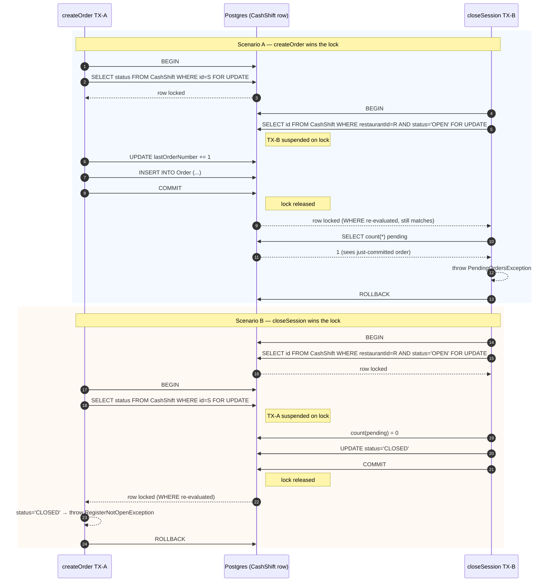

# Orders + CashShift + Kitchen Token Hardening — Implementation Plan

> **For agentic workers:** REQUIRED SUB-SKILL: Use superpowers:subagent-driven-development (recommended) or superpowers:executing-plans to implement this plan task-by-task. Steps use checkbox (`- [ ]`) syntax for tracking.

**Goal:** Fix 5 audit findings (H-05, H-06, H-09, H-13, H-14) — three race conditions in order/cash-shift transitions and one auth hardening on the kitchen token — in 2 semantic commits, without changing API contracts beyond what's documented.

**Architecture:** Race conditions are fixed by combining Prisma `$transaction` with two locking patterns: (a) pessimistic row-level `FOR UPDATE` via parameterized `$queryRaw` for cross-table coordination (`CashShift` ↔ `Order`), and (b) optimistic concurrency via `updateMany` with a status guard for single-row state transitions. Kitchen token is hardened by hashing the token at rest (sha256 hex), comparing in constant time (`crypto.timingSafeEqual`), and accepting an `X-Kitchen-Token` header in addition to query string.

**Tech Stack:** NestJS · Prisma · PostgreSQL · Jest (unit + e2e) · `crypto` (Node built-in) · ESLint flat config.

**Spec:** `apps/api-core/docs/superpowers/specs/2026-05-27-orders-cashshift-kitchen-token-hardening-design.md`

**Audit findings:** `apps/api-core/docs/superpowers/specs/2026-05-24-orders-cash-kitchen-audit-findings.md`

**Test execution rule:** All test commands run inside Docker per project convention:
- Unit: `docker compose exec res-api-core pnpm test --testPathPattern <pattern>`
- E2e: `docker compose exec res-api-core pnpm test:e2e --testPathPattern <pattern>`
- Full: `docker compose exec res-api-core pnpm test` and `docker compose exec res-api-core pnpm test:e2e`

**Commit policy:** 2 semantic commits — Commit 1 (race conditions, Tasks 1-15) and Commit 2 (kitchen token, Tasks 16-26). Within each commit, work is staged; only the last task of each commit invokes `git commit`. Do NOT commit between tasks.

---

## File Structure

### New files

| Path | Responsibility |
|---|---|
| `apps/api-core/src/kitchen/kitchen-token.service.ts` | `KitchenTokenService` — generate / hash / verifyHash. |
| `apps/api-core/src/kitchen/kitchen-token.service.spec.ts` | Unit tests for `KitchenTokenService`. |
| `apps/api-core/prisma/migrations/20260527_rotate_kitchen_token_to_hash/migration.sql` | Drop `kitchenToken` column, add `kitchenTokenHash`. |
| `apps/api-core/test/orders/raceConditions.e2e-spec.ts` | E2e for H-05/H-13 concurrency. |
| `apps/api-core/test/cash-register/closeSessionRace.e2e-spec.ts` | E2e for H-09 concurrency. |

### Modified files

| Path | Change |
|---|---|
| `apps/api-core/src/orders/order.repository.ts` | Add `transitionStatusIfMatches`, `transitionStatusIfMatchesAndUnpaid`, `unmarkAsPaidIfPaid`. Delete dead `markAsPaid`. |
| `apps/api-core/src/orders/orders.service.ts` | Rewrite `markAsPaid`, `unmarkAsPaid`, `kitchenAdvanceStatus`, `createOrder` to use new helpers + lock. |
| `apps/api-core/src/orders/orders.service.spec.ts` | Add unit tests for new code paths. |
| `apps/api-core/src/orders/orders.module.info.md` | Add "Order status transitions" section with mermaid. |
| `apps/api-core/src/cash-shift/cash-shift.repository.ts` | Add `lockOpenShift`, `lockShiftById`. |
| `apps/api-core/src/cash-register/cash-register.service.ts` | Rewrite `closeSession` to use `lockOpenShift`. |
| `apps/api-core/src/cash-register/cash-register.service.spec.ts` | Adjust mocks for the new lock helper. |
| `apps/api-core/src/cash-register/cash-register.module.info.md` | Add "Concurrency model" section with mermaid. |
| `apps/api-core/src/kitchen/guards/kitchen-token.guard.ts` | Rewrite — header + hash + timing-safe compare. |
| `apps/api-core/src/kitchen/kitchen.service.ts` | `generateToken` writes hash; `getTokenInfo` no longer exposes plain. |
| `apps/api-core/src/kitchen/kitchen.service.spec.ts` | Adapt tests to new shape. |
| `apps/api-core/src/kitchen/kitchen.module.ts` | Register `KitchenTokenService` as provider. |
| `apps/api-core/src/kitchen/kitchen.module.info.md` | Add "Token authentication" section. |
| `apps/api-core/prisma/schema.postgresql.prisma` | Drop `kitchenToken`, add `kitchenTokenHash`. |
| `apps/api-core/eslint.config.mjs` | Add `no-restricted-syntax` rule against `$queryRawUnsafe`. |
| `apps/ui/src/pages/dash/kitchen.astro` | Adapt to new `getTokenInfo` shape (no `kitchenUrl`). Show URL only after regenerate. |

### Audit doc (post-implementation)

| Path | Change |
|---|---|
| `apps/api-core/docs/superpowers/specs/2026-05-24-orders-cash-kitchen-audit-findings.md` | Mark H-05, H-06, H-09, H-13, H-14 as ✅ Implementado (with merge date) referencing this plan/spec. Mark H-04 as ⏳ Deferred. Update Progreso table. |

---

# COMMIT 1 — Race conditions (Tasks 1-15)

## Task 1: Add `transitionStatusIfMatches` to OrderRepository

**Files:**
- Modify: `apps/api-core/src/orders/order.repository.ts`
- Modify: `apps/api-core/src/orders/orders.service.spec.ts` (the unit test for the repo function lives in a sibling spec; see step 1)

Note: this codebase tests repository behavior via the service unit tests + e2e. A dedicated `order.repository.spec.ts` does not currently exist. We test this helper via the service tests in Task 6, and via e2e in Task 11. This task only adds the repo method.

- [ ] **Step 1: Add method to `OrderRepository`**

Add at the end of `apps/api-core/src/orders/order.repository.ts`:

```ts
/**
 * Atomically transitions an order's status, but only if the row's current
 * status still matches `expectedStatus`. Returns the number of rows updated
 * (0 if another transaction changed the status first, 1 on success).
 *
 * This is the optimistic-concurrency primitive used by kitchen flows. Under
 * READ COMMITTED, `updateMany` implicitly acquires FOR NO KEY UPDATE on each
 * matching row for the duration of the surrounding transaction; concurrent
 * transactions that target the same row block, then re-evaluate their WHERE
 * clause against the post-commit state — yielding count = 0 if the status
 * has already advanced.
 *
 * Used by:
 *   - OrdersService.kitchenAdvanceStatus — prevents double-advance from
 *     multi-screen KDS, and prevents kitchen from overwriting a concurrent
 *     cashier cancellation. See audit finding H-13.
 *
 * @param tx              - active Prisma transaction client
 * @param id              - order UUID
 * @param restaurantId    - tenant guard (defense in depth)
 * @param expectedStatus  - the status the caller observed before deciding to
 *                          transition; the UPDATE is a no-op if the row has
 *                          since drifted away from this value
 * @param newStatus       - the status to transition to
 * @returns 1 if the transition committed, 0 if the status changed concurrently
 */
async transitionStatusIfMatches(
  tx: Prisma.TransactionClient,
  id: string,
  restaurantId: string,
  expectedStatus: OrderStatus,
  newStatus: OrderStatus,
): Promise<number> {
  const result = await tx.order.updateMany({
    where: { id, restaurantId, status: expectedStatus },
    data: { status: newStatus },
  });
  return result.count;
}
```

Make sure `OrderStatus` and `Prisma` are imported (they should already be).

- [ ] **Step 2: Typecheck + lint**

Run: `docker compose exec res-api-core pnpm run lint 2>&1 | tail -20`
Expected: no errors related to the new method. Pre-existing warnings unrelated are acceptable.

Run: `docker compose exec res-api-core pnpm exec tsc --noEmit 2>&1 | tail -10`
Expected: no errors.

## Task 2: Add `transitionStatusIfMatchesAndUnpaid` to OrderRepository

**Files:**
- Modify: `apps/api-core/src/orders/order.repository.ts`

- [ ] **Step 1: Add method**

Add to `OrderRepository`:

```ts
/**
 * Variant of `transitionStatusIfMatches` for the markAsPaid flow.
 * Atomically transitions status, sets isPaid=true and paymentMethod, but
 * only if the row's status matches `expectedStatus` AND isPaid is currently
 * false. The latter guard makes the operation idempotent under concurrent
 * payment attempts.
 *
 * See audit finding H-05.
 *
 * @returns 1 if the transition committed, 0 if status drifted or already paid
 */
async transitionStatusIfMatchesAndUnpaid(
  tx: Prisma.TransactionClient,
  id: string,
  restaurantId: string,
  expectedStatus: OrderStatus,
  newStatus: OrderStatus,
  paymentMethod: string | undefined,
): Promise<number> {
  const result = await tx.order.updateMany({
    where: { id, restaurantId, status: expectedStatus, isPaid: false },
    data: {
      status: newStatus,
      isPaid: true,
      paymentMethod,
      paidAt: new Date(),
    },
  });
  return result.count;
}
```

- [ ] **Step 2: Typecheck**

Run: `docker compose exec res-api-core pnpm exec tsc --noEmit 2>&1 | tail -10`
Expected: no errors.

## Task 3: Add `unmarkAsPaidIfPaid` to OrderRepository

**Files:**
- Modify: `apps/api-core/src/orders/order.repository.ts`

- [ ] **Step 1: Add method**

```ts
/**
 * Companion to the unmarkAsPaid flow. Atomically clears isPaid only if the
 * row is currently paid; no-op if already unpaid (idempotent).
 *
 * See audit finding H-06.
 *
 * @returns 1 if cleared, 0 if already unpaid
 */
async unmarkAsPaidIfPaid(
  tx: Prisma.TransactionClient,
  id: string,
  restaurantId: string,
): Promise<number> {
  const result = await tx.order.updateMany({
    where: { id, restaurantId, isPaid: true },
    data: { isPaid: false, paymentMethod: null, paidAt: null },
  });
  return result.count;
}
```

- [ ] **Step 2: Typecheck**

Run: `docker compose exec res-api-core pnpm exec tsc --noEmit 2>&1 | tail -10`
Expected: no errors.

## Task 4: Add `lockOpenShift` to CashShiftRepository

**Files:**
- Modify: `apps/api-core/src/cash-shift/cash-shift.repository.ts`

- [ ] **Step 1: Add method**

Add to `CashShiftRepository`:

```ts
/**
 * Acquires a pessimistic row-level lock on the OPEN cash shift for a restaurant.
 *
 * Must run inside a Prisma transaction. The lock is held until the surrounding
 * transaction commits or rolls back. Concurrent writers that target the same
 * row block on this lock; when released, they re-evaluate their WHERE clause
 * against the post-commit state (Postgres EvalPlanQual under READ COMMITTED).
 *
 * This is the coordination point that prevents the write-skew race between
 * CashRegisterService.closeSession and OrdersService.createOrder. See audit
 * finding H-09 and cash-register.module.info.md for the full sequence diagram.
 *
 * Security: the query uses Prisma's tagged-template `$queryRaw`, so the
 * restaurantId value is parameterized by the driver. It is never concatenated
 * into the SQL string. Do not change this method to use `$queryRawUnsafe`.
 *
 * @param tx           - active Prisma transaction client (not the root prisma)
 * @param restaurantId - UUID of the restaurant whose OPEN shift to lock
 * @returns the locked shift id, or null when no OPEN shift exists
 */
async lockOpenShift(
  tx: Prisma.TransactionClient,
  restaurantId: string,
): Promise<string | null> {
  const rows = await tx.$queryRaw<{ id: string }[]>`
    SELECT id
    FROM "CashShift"
    WHERE "restaurantId" = ${restaurantId}
      AND status = 'OPEN'
    FOR UPDATE
  `;
  return rows[0]?.id ?? null;
}
```

Make sure `Prisma` and `CashShiftStatus` are imported as needed.

- [ ] **Step 2: Typecheck**

Run: `docker compose exec res-api-core pnpm exec tsc --noEmit 2>&1 | tail -10`
Expected: no errors.

## Task 5: Add `lockShiftById` to CashShiftRepository

**Files:**
- Modify: `apps/api-core/src/cash-shift/cash-shift.repository.ts`

- [ ] **Step 1: Add method**

```ts
/**
 * Acquires a pessimistic row-level lock on a specific cash shift by id and
 * returns its current status. Used by writers that already know which shift
 * they intend to mutate (e.g. createOrder, which receives shiftId from an
 * earlier resolver/guard).
 *
 * Must run inside a Prisma transaction. See lockOpenShift for the semantics
 * of FOR UPDATE under READ COMMITTED.
 *
 * Security: parameterized via Prisma's tagged-template `$queryRaw`. The
 * shiftId value is bound by the driver, not concatenated into SQL. Do not
 * change to `$queryRawUnsafe`.
 *
 * @param tx      - active Prisma transaction client
 * @param shiftId - UUID of the shift to lock
 * @returns the locked shift status, or null if no shift exists with that id
 */
async lockShiftById(
  tx: Prisma.TransactionClient,
  shiftId: string,
): Promise<CashShiftStatus | null> {
  const rows = await tx.$queryRaw<{ status: CashShiftStatus }[]>`
    SELECT status
    FROM "CashShift"
    WHERE id = ${shiftId}
    FOR UPDATE
  `;
  return rows[0]?.status ?? null;
}
```

- [ ] **Step 2: Typecheck**

Run: `docker compose exec res-api-core pnpm exec tsc --noEmit 2>&1 | tail -10`
Expected: no errors.

## Task 6: Refactor `OrdersService.kitchenAdvanceStatus` (H-13)

**Files:**
- Modify: `apps/api-core/src/orders/orders.service.ts:166-182`
- Modify: `apps/api-core/src/orders/orders.service.spec.ts`

- [ ] **Step 1: Write failing test for race detection**

Add to `apps/api-core/src/orders/orders.service.spec.ts` (inside the existing `kitchenAdvanceStatus` describe; create one if missing):

```ts
describe('kitchenAdvanceStatus race detection', () => {
  it('throws InvalidStatusTransitionException when updateMany count=0', async () => {
    // setup: prisma.$transaction yields a tx with a stubbed findFirst and
    // transitionStatusIfMatches returning 0 (status drifted)
    const order = { id: 'o1', restaurantId: 'r1', status: 'PROCESSING' };
    jest.spyOn(prisma, '$transaction').mockImplementation(async (cb: any) =>
      cb({
        order: { findFirst: jest.fn().mockResolvedValue(order) },
      }),
    );
    jest.spyOn(orderRepository, 'transitionStatusIfMatches').mockResolvedValue(0);

    await expect(
      service.kitchenAdvanceStatus('o1', 'r1', OrderStatus.SERVED),
    ).rejects.toThrow(InvalidStatusTransitionException);
  });
});
```

- [ ] **Step 2: Run test, expect failure**

Run: `docker compose exec res-api-core pnpm test --testPathPattern orders.service.spec`
Expected: FAIL — current implementation doesn't call `transitionStatusIfMatches`.

- [ ] **Step 3: Rewrite the method**

Replace `kitchenAdvanceStatus` in `apps/api-core/src/orders/orders.service.ts` with:

```ts
async kitchenAdvanceStatus(id: string, restaurantId: string, newStatus: OrderStatus) {
  const updated = await this.prisma.$transaction(async (tx) => {
    const order = await tx.order.findFirst({ where: { id, restaurantId } });
    if (!order) throw new OrderNotFoundException(id);
    if (order.status === OrderStatus.CANCELLED) throw new OrderAlreadyCancelledException(id);

    const currentIdx = STATUS_ORDER.indexOf(order.status);
    const targetIdx = STATUS_ORDER.indexOf(newStatus);
    const KITCHEN_MAX_IDX = STATUS_ORDER.indexOf(OrderStatus.SERVED);
    if (targetIdx === -1 || targetIdx !== currentIdx + 1 || targetIdx > KITCHEN_MAX_IDX) {
      throw new InvalidStatusTransitionException(order.status, newStatus);
    }

    const count = await this.orderRepository.transitionStatusIfMatches(
      tx, id, restaurantId, order.status, newStatus,
    );
    if (count === 0) {
      throw new InvalidStatusTransitionException(order.status, newStatus);
    }

    return tx.order.findFirstOrThrow({ where: { id, restaurantId } });
  });

  this.orderEventsService.emitOrderUpdated(restaurantId, updated);
  return updated;
}
```

- [ ] **Step 4: Run test, expect pass**

Run: `docker compose exec res-api-core pnpm test --testPathPattern orders.service.spec`
Expected: PASS (including the new race-detection test).

- [ ] **Step 5: Run kitchen advance e2e to ensure no regression**

Run: `docker compose exec res-api-core pnpm test:e2e --testPathPattern advanceStatus`
Expected: all green.

## Task 7: Refactor `OrdersService.markAsPaid` (H-05)

**Files:**
- Modify: `apps/api-core/src/orders/orders.service.ts:184-198`
- Modify: `apps/api-core/src/orders/orders.service.spec.ts`

- [ ] **Step 1: Write failing tests**

Add to `orders.service.spec.ts`:

```ts
describe('markAsPaid', () => {
  it('is idempotent when order is already paid', async () => {
    const paidOrder = { id: 'o1', restaurantId: 'r1', status: 'COMPLETED', isPaid: true };
    jest.spyOn(prisma, '$transaction').mockImplementation(async (cb: any) =>
      cb({
        order: {
          findFirst: jest.fn().mockResolvedValue(paidOrder),
          findFirstOrThrow: jest.fn().mockResolvedValue(paidOrder),
        },
      }),
    );

    const result = await service.markAsPaid('o1', 'r1', 'CASH');
    expect(result).toEqual(paidOrder);
  });

  it('throws InvalidStatusTransitionException when transitionStatusIfMatchesAndUnpaid count=0', async () => {
    const order = { id: 'o1', restaurantId: 'r1', status: 'CREATED', isPaid: false };
    jest.spyOn(prisma, '$transaction').mockImplementation(async (cb: any) =>
      cb({
        order: { findFirst: jest.fn().mockResolvedValue(order) },
      }),
    );
    jest.spyOn(orderRepository, 'transitionStatusIfMatchesAndUnpaid').mockResolvedValue(0);

    await expect(service.markAsPaid('o1', 'r1', 'CASH')).rejects.toThrow(
      InvalidStatusTransitionException,
    );
  });

  it('rejects cancelled order', async () => {
    const order = { id: 'o1', restaurantId: 'r1', status: 'CANCELLED', isPaid: false };
    jest.spyOn(prisma, '$transaction').mockImplementation(async (cb: any) =>
      cb({ order: { findFirst: jest.fn().mockResolvedValue(order) } }),
    );

    await expect(service.markAsPaid('o1', 'r1', 'CASH')).rejects.toThrow(
      OrderAlreadyCancelledException,
    );
  });
});
```

- [ ] **Step 2: Run tests, expect failure**

Run: `docker compose exec res-api-core pnpm test --testPathPattern orders.service.spec`
Expected: 3 new tests FAIL.

- [ ] **Step 3: Rewrite the method**

Replace `markAsPaid` in `orders.service.ts`:

```ts
async markAsPaid(id: string, restaurantId: string, paymentMethod?: string) {
  const updated = await this.prisma.$transaction(async (tx) => {
    const order = await tx.order.findFirst({ where: { id, restaurantId } });
    if (!order) throw new OrderNotFoundException(id);
    if (order.status === OrderStatus.CANCELLED) throw new OrderAlreadyCancelledException(id);
    if (order.isPaid) return order; // idempotent

    const nextStatus =
      order.status === OrderStatus.CREATED ? OrderStatus.CONFIRMED :
      order.status === OrderStatus.SERVED  ? OrderStatus.COMPLETED :
      order.status;

    const count = await this.orderRepository.transitionStatusIfMatchesAndUnpaid(
      tx, id, restaurantId, order.status, nextStatus, paymentMethod,
    );
    if (count === 0) {
      throw new InvalidStatusTransitionException(order.status, nextStatus);
    }

    return tx.order.findFirstOrThrow({ where: { id, restaurantId } });
  });

  this.orderEventsService.emitOrderUpdated(restaurantId, updated);
  return updated;
}
```

- [ ] **Step 4: Run tests, expect pass**

Run: `docker compose exec res-api-core pnpm test --testPathPattern orders.service.spec`
Expected: PASS.

- [ ] **Step 5: Run mark-as-paid e2e**

Run: `docker compose exec res-api-core pnpm test:e2e --testPathPattern markOrderAsPaid`
Expected: all green.

## Task 8: Refactor `OrdersService.unmarkAsPaid` (H-06)

**Files:**
- Modify: `apps/api-core/src/orders/orders.service.ts:210-215`
- Modify: `apps/api-core/src/orders/orders.service.spec.ts`

- [ ] **Step 1: Write failing tests**

```ts
describe('unmarkAsPaid', () => {
  it('rejects COMPLETED orders', async () => {
    const order = { id: 'o1', restaurantId: 'r1', status: 'COMPLETED', isPaid: true };
    jest.spyOn(prisma, '$transaction').mockImplementation(async (cb: any) =>
      cb({ order: { findFirst: jest.fn().mockResolvedValue(order) } }),
    );
    await expect(service.unmarkAsPaid('o1', 'r1')).rejects.toThrow(
      InvalidStatusTransitionException,
    );
  });

  it('is idempotent when order is not paid', async () => {
    const order = { id: 'o1', restaurantId: 'r1', status: 'CONFIRMED', isPaid: false };
    jest.spyOn(prisma, '$transaction').mockImplementation(async (cb: any) =>
      cb({
        order: {
          findFirst: jest.fn().mockResolvedValue(order),
          findFirstOrThrow: jest.fn().mockResolvedValue(order),
        },
      }),
    );

    const result = await service.unmarkAsPaid('o1', 'r1');
    expect(result).toEqual(order);
  });
});
```

- [ ] **Step 2: Run tests, expect failure**

Run: `docker compose exec res-api-core pnpm test --testPathPattern orders.service.spec`
Expected: 2 new tests FAIL.

- [ ] **Step 3: Rewrite the method**

Replace `unmarkAsPaid` in `orders.service.ts`:

```ts
async unmarkAsPaid(id: string, restaurantId: string) {
  const updated = await this.prisma.$transaction(async (tx) => {
    const order = await tx.order.findFirst({ where: { id, restaurantId } });
    if (!order) throw new OrderNotFoundException(id);
    if (order.status === OrderStatus.COMPLETED) {
      throw new InvalidStatusTransitionException(order.status, order.status);
    }
    if (!order.isPaid) return order; // idempotent

    const count = await this.orderRepository.unmarkAsPaidIfPaid(tx, id, restaurantId);
    if (count === 0) {
      throw new InvalidStatusTransitionException(order.status, order.status);
    }

    return tx.order.findFirstOrThrow({ where: { id, restaurantId } });
  });

  this.orderEventsService.emitOrderUpdated(restaurantId, updated);
  return updated;
}
```

- [ ] **Step 4: Run tests, expect pass**

Run: `docker compose exec res-api-core pnpm test --testPathPattern orders.service.spec`
Expected: PASS.

## Task 9: Refactor `CashRegisterService.closeSession` (H-09)

**Files:**
- Modify: `apps/api-core/src/cash-register/cash-register.service.ts:40-82`
- Modify: `apps/api-core/src/cash-register/cash-register.service.spec.ts`

- [ ] **Step 1: Write failing test**

Add to `cash-register.service.spec.ts` (or create describe block if needed):

```ts
describe('closeSession lock', () => {
  it('calls lockOpenShift inside the transaction before counting pending orders', async () => {
    const lockSpy = jest.spyOn(cashShiftRepository, 'lockOpenShift').mockResolvedValue('s1');
    const txMock = {
      order: {
        count: jest.fn().mockResolvedValue(0),
        aggregate: jest.fn().mockResolvedValue({ _sum: { totalAmount: 0n }, _count: { id: 0 } }),
      },
      cashShift: {
        update: jest.fn().mockResolvedValue({ id: 's1', status: 'CLOSED' }),
        findFirst: jest.fn().mockResolvedValue({ id: 's1', status: 'OPEN' }),
      },
    };
    jest.spyOn(prisma, '$transaction').mockImplementation(async (cb: any) => cb(txMock));
    jest.spyOn(statsService, 'getSummary').mockResolvedValue({} as any);

    await service.closeSession('r1', 'u1');
    expect(lockSpy).toHaveBeenCalledWith(txMock, 'r1');
  });

  it('throws NoOpenCashRegisterException when lockOpenShift returns null', async () => {
    jest.spyOn(cashShiftRepository, 'lockOpenShift').mockResolvedValue(null);
    jest.spyOn(prisma, '$transaction').mockImplementation(async (cb: any) => cb({} as any));

    await expect(service.closeSession('r1', 'u1')).rejects.toThrow(NoOpenCashRegisterException);
  });
});
```

- [ ] **Step 2: Run tests, expect failure**

Run: `docker compose exec res-api-core pnpm test --testPathPattern cash-register.service.spec`
Expected: 2 new tests FAIL.

- [ ] **Step 3: Rewrite the method**

Replace `closeSession` in `cash-register.service.ts`:

```ts
async closeSession(restaurantId: string, closedBy?: string) {
  const closedSession = await this.prisma.$transaction(async (tx) => {
    const sessionId = await this.registerSessionRepository.lockOpenShift(tx, restaurantId);
    if (!sessionId) throw new NoOpenCashRegisterException();

    const pendingCount = await tx.order.count({
      where: {
        cashShiftId: sessionId,
        status: {
          in: [
            OrderStatus.CREATED,
            OrderStatus.CONFIRMED,
            OrderStatus.PROCESSING,
            OrderStatus.SERVED,
          ],
        },
      },
    });
    if (pendingCount > 0) throw new PendingOrdersException(pendingCount);

    const agg = await tx.order.aggregate({
      where: { cashShiftId: sessionId, status: OrderStatus.COMPLETED },
      _sum: { totalAmount: true },
      _count: { id: true },
    });

    return tx.cashShift.update({
      where: { id: sessionId },
      data: {
        status: CashShiftStatus.CLOSED,
        closedAt: new Date(),
        closedBy,
        totalSales: agg._sum.totalAmount ?? 0n,
        totalOrders: agg._count.id,
      },
    });
  });

  const summary = await this.statsService.getSummary(closedSession.id);
  return { session: closedSession, summary };
}
```

- [ ] **Step 4: Run tests, expect pass**

Run: `docker compose exec res-api-core pnpm test --testPathPattern cash-register.service.spec`
Expected: PASS.

- [ ] **Step 5: Run closeSession e2e**

Run: `docker compose exec res-api-core pnpm test:e2e --testPathPattern closeSession`
Expected: all green.

## Task 10: Refactor `OrdersService.createOrder` to use `lockShiftById` (H-09)

**Files:**
- Modify: `apps/api-core/src/orders/orders.service.ts:63-85`
- Modify: `apps/api-core/src/orders/orders.service.spec.ts`

- [ ] **Step 1: Write failing test**

Add to `orders.service.spec.ts`:

```ts
describe('createOrder lock', () => {
  it('throws RegisterNotOpenException when lockShiftById returns null', async () => {
    jest.spyOn(cashShiftRepository, 'lockShiftById').mockResolvedValue(null);
    jest.spyOn(prisma, '$transaction').mockImplementation(async (cb: any) => cb({} as any));

    await expect(
      service.createOrder('r1', 's1', { items: [] } as any),
    ).rejects.toThrow(RegisterNotOpenException);
  });

  it('throws RegisterNotOpenException when locked shift status is CLOSED', async () => {
    jest.spyOn(cashShiftRepository, 'lockShiftById').mockResolvedValue('CLOSED' as any);
    jest.spyOn(prisma, '$transaction').mockImplementation(async (cb: any) => cb({} as any));

    await expect(
      service.createOrder('r1', 's1', { items: [] } as any),
    ).rejects.toThrow(RegisterNotOpenException);
  });
});
```

- [ ] **Step 2: Run tests, expect failure**

Run: `docker compose exec res-api-core pnpm test --testPathPattern orders.service.spec`
Expected: 2 new tests FAIL.

- [ ] **Step 3: Rewrite the method**

Replace `createOrder` in `orders.service.ts` (keep helpers `validateAndBuildItems`, `decrementAllStock`, etc. unchanged):

```ts
async createOrder(restaurantId: string, cashShiftId: string, dto: CreateOrderDto) {
  const order = await this.prisma.$transaction(async (tx) => {
    const status = await this.cashShiftRepository.lockShiftById(tx, cashShiftId);
    if (status === null || status !== CashShiftStatus.OPEN) {
      throw new RegisterNotOpenException();
    }

    const { lastOrderNumber } = await tx.cashShift.update({
      where: { id: cashShiftId },
      data: { lastOrderNumber: { increment: 1 } },
      select: { lastOrderNumber: true },
    });

    const { orderItems, stockEntries, totalAmount } =
      await this.validateAndBuildItems(restaurantId, dto, tx);
    this.validateExpectedTotal(totalAmount, dto.expectedTotal);
    await this.decrementAllStock(stockEntries, tx);

    return this.persistOrder(
      { restaurantId, cashShiftId, totalAmount, dto, orderItems, orderNumber: lastOrderNumber },
      tx,
    );
  });

  this.orderEventsService.emitOrderCreated(restaurantId, order);

  void this.printService.printKitchenTicket(order.id).catch((err) =>
    this.logger.warn(`Kitchen print failed for order #${order.orderNumber}: ${err.message}`),
  );

  return { order };
}
```

Make sure `CashShiftStatus` is imported from `@prisma/client`.

- [ ] **Step 4: Run tests, expect pass**

Run: `docker compose exec res-api-core pnpm test --testPathPattern orders.service.spec`
Expected: PASS.

- [ ] **Step 5: Run createOrderFromDashboard e2e**

Run: `docker compose exec res-api-core pnpm test:e2e --testPathPattern createOrderFromDashboard`
Expected: all green. If a test breaks because it relied on the old `cashShift.update` happening first, adjust the test setup to include `lockShiftById` returning OPEN.

## Task 11: Add e2e tests for race conditions

**Files:**
- Create: `apps/api-core/test/orders/raceConditions.e2e-spec.ts`
- Create: `apps/api-core/test/cash-register/closeSessionRace.e2e-spec.ts`

- [ ] **Step 1: Create `raceConditions.e2e-spec.ts`**

```ts
import { Test } from '@nestjs/testing';
import { AppModule } from '../../src/app.module';
import { INestApplication } from '@nestjs/common';
import { OrdersService } from '../../src/orders/orders.service';
import { CashRegisterService } from '../../src/cash-register/cash-register.service';
import { OrderStatus } from '@prisma/client';
import { createTestRestaurantWithOpenShift, createTestOrder } from './orders.helpers';
import { InvalidStatusTransitionException } from '../../src/orders/exceptions/orders.exceptions';

describe('Order race conditions (H-05, H-13)', () => {
  let app: INestApplication;
  let ordersService: OrdersService;

  beforeAll(async () => {
    const mod = await Test.createTestingModule({ imports: [AppModule] }).compile();
    app = mod.createNestApplication();
    await app.init();
    ordersService = mod.get(OrdersService);
  });

  afterAll(async () => {
    await app.close();
  });

  it('H-13: double kitchenAdvanceStatus from two screens — exactly one wins', async () => {
    const { restaurantId, shiftId } = await createTestRestaurantWithOpenShift();
    const order = await createTestOrder(restaurantId, shiftId, { status: OrderStatus.PROCESSING });

    const [resA, resB] = await Promise.allSettled([
      ordersService.kitchenAdvanceStatus(order.id, restaurantId, OrderStatus.SERVED),
      ordersService.kitchenAdvanceStatus(order.id, restaurantId, OrderStatus.SERVED),
    ]);

    const fulfilled = [resA, resB].filter((r) => r.status === 'fulfilled');
    const rejected = [resA, resB].filter((r) => r.status === 'rejected');
    expect(fulfilled).toHaveLength(1);
    expect(rejected).toHaveLength(1);
    expect((rejected[0] as PromiseRejectedResult).reason).toBeInstanceOf(InvalidStatusTransitionException);
  });

  it('H-13: cancel vs advance — cashier wins, kitchen sees InvalidStatusTransition', async () => {
    const { restaurantId, shiftId } = await createTestRestaurantWithOpenShift();
    const order = await createTestOrder(restaurantId, shiftId, { status: OrderStatus.PROCESSING });

    const [cancelRes, advanceRes] = await Promise.allSettled([
      ordersService.cancelOrder(order.id, restaurantId, 'cliente se fue'),
      ordersService.kitchenAdvanceStatus(order.id, restaurantId, OrderStatus.SERVED),
    ]);

    // At least one must fail; final state is deterministic per Postgres lock order.
    // Either (a) cancel commits first → advance throws InvalidStatusTransition, or
    // (b) advance commits first → cancel throws CannotCancelPaidOrderException is N/A
    //     here (not paid); it would throw InvalidStatusTransition because
    //     status=SERVED cannot go to CANCELLED.
    const failed = [cancelRes, advanceRes].filter((r) => r.status === 'rejected');
    expect(failed.length).toBeGreaterThanOrEqual(1);
  });

  it('H-05: double markAsPaid is idempotent (no throw, both return paid order)', async () => {
    const { restaurantId, shiftId } = await createTestRestaurantWithOpenShift();
    const order = await createTestOrder(restaurantId, shiftId, { status: OrderStatus.SERVED });

    const [r1, r2] = await Promise.all([
      ordersService.markAsPaid(order.id, restaurantId, 'CASH'),
      ordersService.markAsPaid(order.id, restaurantId, 'CASH'),
    ]);

    expect(r1.isPaid).toBe(true);
    expect(r2.isPaid).toBe(true);
  });
});
```

- [ ] **Step 2: Verify or extend `orders.helpers.ts` exposes `createTestRestaurantWithOpenShift` and `createTestOrder`**

Run: `grep -n 'createTestRestaurantWithOpenShift\|createTestOrder' apps/api-core/test/orders/orders.helpers.ts`

If either helper does not exist, add it. Read the file first; pattern-match to existing helpers. If the file does not use this naming, adapt the new spec to use whatever helpers ARE exported. The intent of the helpers is: insert a restaurant + user + cash-shift in OPEN state + a product + an order, all in BD, return their ids.

- [ ] **Step 3: Create `closeSessionRace.e2e-spec.ts`**

```ts
import { Test } from '@nestjs/testing';
import { INestApplication } from '@nestjs/common';
import { AppModule } from '../../src/app.module';
import { CashRegisterService } from '../../src/cash-register/cash-register.service';
import { OrdersService } from '../../src/orders/orders.service';
import {
  PendingOrdersException,
  NoOpenCashRegisterException,
} from '../../src/cash-register/exceptions/cash-register.exceptions';
import { RegisterNotOpenException } from '../../src/orders/exceptions/orders.exceptions';
import { createTestRestaurantWithOpenShift, getTestProductId } from '../orders/orders.helpers';

describe('closeSession vs createOrder race (H-09)', () => {
  let app: INestApplication;
  let cashRegisterService: CashRegisterService;
  let ordersService: OrdersService;

  beforeAll(async () => {
    const mod = await Test.createTestingModule({ imports: [AppModule] }).compile();
    app = mod.createNestApplication();
    await app.init();
    cashRegisterService = mod.get(CashRegisterService);
    ordersService = mod.get(OrdersService);
  });

  afterAll(async () => {
    await app.close();
  });

  it('createOrder commits first → close throws PendingOrdersException', async () => {
    const { restaurantId, shiftId, userId } = await createTestRestaurantWithOpenShift();
    const productId = await getTestProductId(restaurantId);

    const createPromise = ordersService.createOrder(restaurantId, shiftId, {
      items: [{ productId, quantity: 1, notes: 'race A' }],
    } as any);

    // Small delay so createOrder is in flight when closeSession starts. The lock
    // contention is real either way; the delay just makes the scenario
    // observable from the test's point of view.
    await new Promise((r) => setTimeout(r, 20));

    const closePromise = cashRegisterService.closeSession(restaurantId, userId);

    const [createRes, closeRes] = await Promise.allSettled([createPromise, closePromise]);

    if (createRes.status === 'fulfilled') {
      // createOrder won the lock: close must observe the new pending order
      expect(closeRes.status).toBe('rejected');
      expect((closeRes as PromiseRejectedResult).reason).toBeInstanceOf(PendingOrdersException);
    } else {
      // close won the lock: createOrder must throw RegisterNotOpen
      expect(createRes.status).toBe('rejected');
      expect((createRes as PromiseRejectedResult).reason).toBeInstanceOf(RegisterNotOpenException);
    }
  });
});
```

Note: e2e race tests are inherently non-deterministic on which TX wins, but the contract (no orphan order) is deterministic. The test asserts that exactly one of the two outcomes occurred — never both succeed.

- [ ] **Step 4: Run new e2e tests**

Run: `docker compose exec res-api-core pnpm test:e2e --testPathPattern 'raceConditions|closeSessionRace'`
Expected: all green. If flaky (lock contention timing dependent), add a small retry wrapper inside the test, but do NOT mask real failures.

## Task 12: Delete dead code `OrderRepository.markAsPaid`

**Files:**
- Modify: `apps/api-core/src/orders/order.repository.ts`

- [ ] **Step 1: Verify no remaining callers**

Run: `grep -rn 'orderRepository.markAsPaid\|orderRepo.markAsPaid' apps/api-core/src/ apps/api-core/test/`
Expected: zero matches. (The new `markAsPaid` in the service uses `transitionStatusIfMatchesAndUnpaid` instead.)

- [ ] **Step 2: Delete the method**

Open `apps/api-core/src/orders/order.repository.ts`, find `markAsPaid`, delete the whole method.

- [ ] **Step 3: Typecheck + full unit run**

Run: `docker compose exec res-api-core pnpm exec tsc --noEmit 2>&1 | tail -10`
Expected: no errors.

Run: `docker compose exec res-api-core pnpm test`
Expected: all green.

## Task 13: Update `cash-register.module.info.md` with Concurrency model section

**Files:**
- Modify: `apps/api-core/src/cash-register/cash-register.module.info.md`

- [ ] **Step 1: Append section**

Append at the end of the file:

````md
## Concurrency model — cashShift row lock (audit H-09)

Both `closeSession` and `createOrder` acquire a pessimistic `FOR UPDATE` lock
on the target `cashShift` row at the start of their `$transaction`. The row
acts as the coordination point: any transition that depends on
`status = 'OPEN'` must take the lock first. This prevents the write-skew race
where a new order could be created in a shift that was concurrently being
closed.



Implementation lives in `CashShiftRepository.lockOpenShift` and
`CashShiftRepository.lockShiftById`. Both use Prisma's tagged-template
`$queryRaw`, which parameterizes the interpolated value via the driver and is
safe against SQL injection. Do not change either to `$queryRawUnsafe` (the
ESLint config flags this).
````

## Task 14: Update `orders.module.info.md` with Order status transitions section

**Files:**
- Modify: `apps/api-core/src/orders/orders.module.info.md`

- [ ] **Step 1: Append section**

Append at the end of the file:

````md
## Concurrency model — order status transitions (audit H-05, H-13)

State transitions on `Order` (kitchen advance, mark-as-paid, etc.) use
optimistic concurrency. Each writer reads the current status, validates the
transition, then issues an `UPDATE ... WHERE id = ? AND status = ?` via the
repository helpers `transitionStatusIfMatches` /
`transitionStatusIfMatchesAndUnpaid`. If the status drifted between read and
write, the UPDATE matches 0 rows and the writer throws
`InvalidStatusTransitionException`.

```mermaid
sequenceDiagram
    autonumber
    participant K1 as Kitchen screen A
    participant DB as Postgres (Order row)
    participant K2 as Kitchen screen B
    participant C as Cashier (cancel)

    rect rgba(120, 180, 255, 0.08)
    note over K1,K2: Double-advance race — both screens press "Listo"
    K1->>DB: SELECT status FROM Order WHERE id=O → PROCESSING
    K2->>DB: SELECT status FROM Order WHERE id=O → PROCESSING
    K1->>DB: UPDATE ... WHERE id=O AND status='PROCESSING' SET status='SERVED'
    DB-->>K1: 1 row updated, lock held
    K2->>DB: UPDATE ... WHERE id=O AND status='PROCESSING' SET status='SERVED'
    Note right of DB: TX-K2 suspended on lock
    K1->>DB: COMMIT
    DB-->>K2: re-evaluates WHERE; status now 'SERVED', no match
    K2-->>K2: count = 0 → throw InvalidStatusTransitionException
    end

    rect rgba(255, 180, 120, 0.08)
    note over K1,C: Kitchen vs cashier — cancel during kitchen advance
    K1->>DB: SELECT status FROM Order WHERE id=O → PROCESSING
    C->>DB: UPDATE ... WHERE id=O SET status='CANCELLED'
    DB-->>C: 1 row updated, lock held
    C->>DB: COMMIT
    K1->>DB: UPDATE ... WHERE id=O AND status='PROCESSING' SET status='SERVED'
    DB-->>K1: 0 rows (status is now CANCELLED)
    K1-->>K1: throw InvalidStatusTransitionException
    Note over K1: cashier's CANCELLED is preserved
    end
```

**Why optimistic concurrency suffices here (vs the FOR UPDATE used for
cashShift):** the decision criterion is the row's own status. Unlike
`closeSession`, there is no cross-table aggregation between read and write, so
the implicit lock that `UPDATE` acquires is enough to serialize the
conflicting writers. Each loser observes `count = 0` and fails cleanly with
`InvalidStatusTransitionException`. See `cash-register.module.info.md` for
the cross-table coordination pattern.
````

## Task 15: Add ESLint rule against `$queryRawUnsafe`

**Files:**
- Modify: `apps/api-core/eslint.config.mjs`

- [ ] **Step 1: Add rule**

In `apps/api-core/eslint.config.mjs`, extend the `rules` block:

```js
{
  rules: {
    '@typescript-eslint/no-explicit-any': 'error',
    '@typescript-eslint/no-floating-promises': 'warn',
    '@typescript-eslint/no-unsafe-argument': 'warn',
    'prettier/prettier': ['error', { endOfLine: 'auto' }],
    'no-restricted-syntax': [
      'error',
      {
        selector: "MemberExpression[property.name='$queryRawUnsafe']",
        message:
          'Use $queryRaw with tagged template literals. $queryRawUnsafe is vulnerable to SQL injection.',
      },
    ],
  },
},
```

- [ ] **Step 2: Run lint to verify rule is active and no existing violations**

Run: `docker compose exec res-api-core pnpm run lint 2>&1 | tail -20`
Expected: no errors related to the new rule. If any pre-existing `$queryRawUnsafe` usage exists in the codebase, fix it (replace with `$queryRaw` tagged template) before proceeding.

## Task 16: Final tests + Commit 1

- [ ] **Step 1: Full unit test pass**

Run: `docker compose exec res-api-core pnpm test`
Expected: all green.

- [ ] **Step 2: Full e2e test pass**

Run: `docker compose exec res-api-core pnpm test:e2e`
Expected: all green. Known pre-existing failure: kiosk e2e setup stack overflow (documented in audit H-01 caveat). Acceptable if only that suite fails.

- [ ] **Step 3: Stage and review diff**

Run: `git status` and `git diff --stat`
Expected files staged (use `git add` for each):

```
apps/api-core/src/orders/orders.service.ts
apps/api-core/src/orders/order.repository.ts
apps/api-core/src/orders/orders.service.spec.ts
apps/api-core/src/orders/orders.module.info.md
apps/api-core/src/cash-register/cash-register.service.ts
apps/api-core/src/cash-register/cash-register.service.spec.ts
apps/api-core/src/cash-register/cash-register.module.info.md
apps/api-core/src/cash-shift/cash-shift.repository.ts
apps/api-core/test/orders/raceConditions.e2e-spec.ts
apps/api-core/test/cash-register/closeSessionRace.e2e-spec.ts
apps/api-core/test/orders/orders.helpers.ts  # only if extended in Task 11
apps/api-core/eslint.config.mjs
```

Stage explicitly:

```bash
git add apps/api-core/src/orders/orders.service.ts \
        apps/api-core/src/orders/order.repository.ts \
        apps/api-core/src/orders/orders.service.spec.ts \
        apps/api-core/src/orders/orders.module.info.md \
        apps/api-core/src/cash-register/cash-register.service.ts \
        apps/api-core/src/cash-register/cash-register.service.spec.ts \
        apps/api-core/src/cash-register/cash-register.module.info.md \
        apps/api-core/src/cash-shift/cash-shift.repository.ts \
        apps/api-core/test/orders/raceConditions.e2e-spec.ts \
        apps/api-core/test/cash-register/closeSessionRace.e2e-spec.ts \
        apps/api-core/eslint.config.mjs
```

If `orders.helpers.ts` was extended in Task 11:
```bash
git add apps/api-core/test/orders/orders.helpers.ts
```

- [ ] **Step 4: Commit**

```bash
git commit -m "$(cat <<'EOF'
fix(api): race conditions en order y cash-shift transitions (H-05, H-06, H-09, H-13)

- markAsPaid: $transaction + optimistic lock via updateMany. Cambio de status
  y isPaid en una sola query. Idempotente si la orden ya está pagada.
- unmarkAsPaid: rechaza si la orden está COMPLETED. Misma TX + optimistic lock.
- closeSession + createOrder: coordinación via FOR UPDATE row-lock sobre
  CashShift, encapsulado en CashShiftRepository.lockOpenShift y lockShiftById.
  Cierra write-skew previo (orden CREATED en turno CLOSED).
- kitchenAdvanceStatus: $transaction + optimistic lock via
  OrderRepository.transitionStatusIfMatches. Cierra double-advance race y
  cancel vs advance race.
- ESLint: prohíbe $queryRawUnsafe en todo el proyecto.

Diagramas de secuencia en cash-register.module.info.md y orders.module.info.md.
Ref: docs/superpowers/specs/2026-05-27-orders-cashshift-kitchen-token-hardening-design.md

Co-Authored-By: Claude Opus 4.7 <noreply@anthropic.com>
EOF
)"
```

- [ ] **Step 5: Verify commit**

Run: `git log -1 --stat`
Expected: commit shows all staged files. No accidental files included.

---

# COMMIT 2 — Kitchen token hardening (Tasks 17-26)

## Task 17: Create `KitchenTokenService` with unit tests

**Files:**
- Create: `apps/api-core/src/kitchen/kitchen-token.service.ts`
- Create: `apps/api-core/src/kitchen/kitchen-token.service.spec.ts`

- [ ] **Step 1: Write failing tests**

Create `apps/api-core/src/kitchen/kitchen-token.service.spec.ts`:

```ts
import { KitchenTokenService } from './kitchen-token.service';

describe('KitchenTokenService', () => {
  let service: KitchenTokenService;

  beforeEach(() => {
    service = new KitchenTokenService();
  });

  describe('generate', () => {
    it('returns a 43-char URL-safe base64 plainToken', () => {
      const { plainToken } = service.generate();
      expect(plainToken).toHaveLength(43);
      expect(plainToken).toMatch(/^[A-Za-z0-9_-]{43}$/);
    });

    it('returns a 64-char hex tokenHash that matches hash(plainToken)', () => {
      const { plainToken, tokenHash } = service.generate();
      expect(tokenHash).toHaveLength(64);
      expect(tokenHash).toMatch(/^[a-f0-9]{64}$/);
      expect(service.hash(plainToken)).toEqual(tokenHash);
    });

    it('produces distinct tokens on consecutive calls', () => {
      const a = service.generate();
      const b = service.generate();
      expect(a.plainToken).not.toEqual(b.plainToken);
      expect(a.tokenHash).not.toEqual(b.tokenHash);
    });
  });

  describe('hash', () => {
    it('is deterministic', () => {
      expect(service.hash('abc')).toEqual(service.hash('abc'));
    });

    it('produces different hashes for different inputs', () => {
      expect(service.hash('abc')).not.toEqual(service.hash('abd'));
    });
  });

  describe('verifyHash', () => {
    it('returns true for equal hashes', () => {
      const h = service.hash('token');
      expect(service.verifyHash(h, h)).toBe(true);
    });

    it('returns false for different hashes of same length', () => {
      const a = service.hash('tokenA');
      const b = service.hash('tokenB');
      expect(service.verifyHash(a, b)).toBe(false);
    });

    it('returns false (without throwing) for buffers of different lengths', () => {
      expect(service.verifyHash('short', 'a'.repeat(64))).toBe(false);
    });

    it('returns true for two empty strings (edge case, equal length 0)', () => {
      expect(service.verifyHash('', '')).toBe(true);
    });
  });
});
```

- [ ] **Step 2: Run tests, expect failure**

Run: `docker compose exec res-api-core pnpm test --testPathPattern kitchen-token.service.spec`
Expected: FAIL — service does not exist.

- [ ] **Step 3: Create the service**

Create `apps/api-core/src/kitchen/kitchen-token.service.ts`:

```ts
import { Injectable } from '@nestjs/common';
import * as crypto from 'crypto';

/**
 * Encapsulates the cryptographic primitives for kitchen-token authentication.
 *
 * The plain token is shown to the admin exactly once at generation time and is
 * never persisted; the database only ever stores the sha256 hash. If the admin
 * loses the plain token, the only recovery is regeneration, which invalidates
 * all currently connected kitchen screens for that restaurant.
 *
 * Token format: 32 random bytes encoded as URL-safe base64 without padding
 * (43 chars from [A-Za-z0-9_-]). URL-safe encoding lets the token travel via
 * header or query string without further escaping.
 */
@Injectable()
export class KitchenTokenService {
  /**
   * Generates a new kitchen token. Returns both the plain string — which the
   * caller must surface to the admin exactly once — and the hex-encoded
   * sha256 hash that should be persisted to RestaurantSettings.kitchenTokenHash.
   */
  generate(): { plainToken: string; tokenHash: string } {
    const plainToken = crypto.randomBytes(32).toString('base64url');
    const tokenHash = this.hash(plainToken);
    return { plainToken, tokenHash };
  }

  /**
   * Computes the sha256 hash of a plain token, encoded as lowercase hex.
   *
   * Hex (not base64) is chosen for the stored form because both inputs to
   * `timingSafeEqual` in verifyHash must be byte buffers of equal length;
   * hex strings are always 64 chars for sha256 regardless of input, which
   * makes the length-equality precondition trivially satisfied.
   */
  hash(plainToken: string): string {
    return crypto.createHash('sha256').update(plainToken, 'utf8').digest('hex');
  }

  /**
   * Constant-time comparison of two hex-encoded sha256 hashes. Returns false
   * immediately when buffer lengths differ (defensive; valid hashes are always
   * 64 chars). Otherwise compares all bytes via `crypto.timingSafeEqual` so
   * the response time does not leak which byte mismatched first — closing the
   * iterative byte-guessing oracle that `===` would create.
   */
  verifyHash(storedHash: string, candidateHash: string): boolean {
    if (storedHash.length !== candidateHash.length) return false;
    const stored = Buffer.from(storedHash, 'utf8');
    const candidate = Buffer.from(candidateHash, 'utf8');
    return crypto.timingSafeEqual(stored, candidate);
  }
}
```

- [ ] **Step 4: Run tests, expect pass**

Run: `docker compose exec res-api-core pnpm test --testPathPattern kitchen-token.service.spec`
Expected: PASS.

## Task 18: Register `KitchenTokenService` in `kitchen.module.ts`

**Files:**
- Modify: `apps/api-core/src/kitchen/kitchen.module.ts`

- [ ] **Step 1: Read current module file**

Run: `cat apps/api-core/src/kitchen/kitchen.module.ts`
Note the existing `providers` and `exports` arrays.

- [ ] **Step 2: Add KitchenTokenService to providers**

Add the import:
```ts
import { KitchenTokenService } from './kitchen-token.service';
```

Add `KitchenTokenService` to the `providers` array. If the module exports anything, also add to `exports` only if other modules need it (the guard imports it directly from its own module; no need to export).

- [ ] **Step 3: Typecheck**

Run: `docker compose exec res-api-core pnpm exec tsc --noEmit 2>&1 | tail -10`
Expected: no errors.

## Task 19: Schema migration — rotate kitchenToken to kitchenTokenHash

**Files:**
- Modify: `apps/api-core/prisma/schema.postgresql.prisma`
- Create: `apps/api-core/prisma/migrations/20260527XXXXXX_rotate_kitchen_token_to_hash/migration.sql`

- [ ] **Step 1: Update schema**

In `apps/api-core/prisma/schema.postgresql.prisma`, locate `model RestaurantSettings`. Replace the `kitchenToken` line with `kitchenTokenHash`:

```prisma
// kitchenToken          String?    @db.Text  ← REMOVE
kitchenTokenHash         String?    @db.Text
kitchenTokenExpiresAt    DateTime?
```

If a separate `prisma/schema.prisma` exists (legacy SQLite), confirm it is no longer referenced. Per project: SQLite is no longer used. Only edit the postgresql schema.

- [ ] **Step 2: Generate the migration**

Run: `docker compose exec res-api-core pnpm exec prisma migrate dev --name rotate_kitchen_token_to_hash --create-only --schema=prisma/schema.postgresql.prisma`
Expected: migration folder created under `prisma/migrations/<timestamp>_rotate_kitchen_token_to_hash/`.

- [ ] **Step 3: Verify migration SQL**

Read the generated `migration.sql`. It should contain:
```sql
ALTER TABLE "RestaurantSettings" DROP COLUMN "kitchenToken";
ALTER TABLE "RestaurantSettings" ADD COLUMN "kitchenTokenHash" TEXT;
```
The order of DROP/ADD does not matter functionally. Add a comment at the top:
```sql
-- Tokens existentes quedan invalidados (confirmado: no hay clientes en producción).
-- Cada admin debe regenerar desde /dash/kitchen para obtener el nuevo plain token
-- y reconectar sus pantallas.
```

- [ ] **Step 4: Apply migration**

Run: `docker compose exec res-api-core pnpm exec prisma migrate dev --schema=prisma/schema.postgresql.prisma`
Expected: migration applied; Prisma client regenerated.

- [ ] **Step 5: Verify typecheck after Prisma regen**

Run: `docker compose exec res-api-core pnpm exec tsc --noEmit 2>&1 | tail -10`
Expected: errors about `kitchenToken` no longer existing in places that read it (kitchen-token.guard.ts, kitchen.service.ts). These are intentional — they will be fixed in Tasks 20-22.

## Task 20: Rewrite `KitchenTokenGuard`

**Files:**
- Modify: `apps/api-core/src/kitchen/guards/kitchen-token.guard.ts`

- [ ] **Step 1: Write failing tests**

Create or extend `apps/api-core/src/kitchen/guards/kitchen-token.guard.spec.ts`:

```ts
import { ExecutionContext, UnauthorizedException } from '@nestjs/common';
import { KitchenTokenGuard, KITCHEN_RESTAURANT_KEY } from './kitchen-token.guard';
import { KitchenTokenService } from '../kitchen-token.service';
import { RestaurantsService } from '../../restaurants/restaurants.service';

function buildContext(req: any): ExecutionContext {
  return {
    switchToHttp: () => ({ getRequest: () => req }),
  } as any;
}

describe('KitchenTokenGuard', () => {
  let guard: KitchenTokenGuard;
  let restaurantsService: { findBySlugWithSettings: jest.Mock };
  let tokenService: KitchenTokenService;

  beforeEach(() => {
    restaurantsService = { findBySlugWithSettings: jest.fn() };
    tokenService = new KitchenTokenService();
    guard = new KitchenTokenGuard(restaurantsService as any, tokenService);
  });

  it('accepts a valid token via X-Kitchen-Token header', async () => {
    const { plainToken, tokenHash } = tokenService.generate();
    restaurantsService.findBySlugWithSettings.mockResolvedValue({
      id: 'r1',
      settings: { kitchenTokenHash: tokenHash, kitchenTokenExpiresAt: null },
    });
    const req: any = { params: { slug: 'mi-rest' }, query: {}, headers: { 'x-kitchen-token': plainToken } };

    expect(await guard.canActivate(buildContext(req))).toBe(true);
    expect(req[KITCHEN_RESTAURANT_KEY]).toBeTruthy();
  });

  it('accepts a valid token via query string (legacy)', async () => {
    const { plainToken, tokenHash } = tokenService.generate();
    restaurantsService.findBySlugWithSettings.mockResolvedValue({
      id: 'r1',
      settings: { kitchenTokenHash: tokenHash, kitchenTokenExpiresAt: null },
    });
    const req: any = { params: { slug: 'mi-rest' }, query: { token: plainToken }, headers: {} };

    expect(await guard.canActivate(buildContext(req))).toBe(true);
  });

  it('header takes precedence over query', async () => {
    const { plainToken: correct, tokenHash } = tokenService.generate();
    restaurantsService.findBySlugWithSettings.mockResolvedValue({
      id: 'r1',
      settings: { kitchenTokenHash: tokenHash, kitchenTokenExpiresAt: null },
    });
    const req: any = {
      params: { slug: 'mi-rest' },
      query: { token: 'wrong' },
      headers: { 'x-kitchen-token': correct },
    };

    expect(await guard.canActivate(buildContext(req))).toBe(true);
  });

  it('rejects when no token in header or query', async () => {
    const req: any = { params: { slug: 'mi-rest' }, query: {}, headers: {} };
    await expect(guard.canActivate(buildContext(req))).rejects.toThrow(UnauthorizedException);
  });

  it('rejects when slug missing', async () => {
    const req: any = { params: {}, query: { token: 'x' }, headers: {} };
    await expect(guard.canActivate(buildContext(req))).rejects.toThrow(UnauthorizedException);
  });

  it('rejects token longer than MAX_TOKEN_LENGTH without calling restaurantsService', async () => {
    const req: any = {
      params: { slug: 'mi-rest' },
      query: { token: 'a'.repeat(2000) },
      headers: {},
    };
    await expect(guard.canActivate(buildContext(req))).rejects.toThrow(UnauthorizedException);
    expect(restaurantsService.findBySlugWithSettings).not.toHaveBeenCalled();
  });

  it('rejects when restaurant has no kitchenTokenHash', async () => {
    restaurantsService.findBySlugWithSettings.mockResolvedValue({
      id: 'r1',
      settings: { kitchenTokenHash: null },
    });
    const req: any = { params: { slug: 'mi-rest' }, query: { token: 'x' }, headers: {} };
    await expect(guard.canActivate(buildContext(req))).rejects.toThrow(UnauthorizedException);
  });

  it('rejects mismatching token', async () => {
    const { tokenHash } = tokenService.generate();
    restaurantsService.findBySlugWithSettings.mockResolvedValue({
      id: 'r1',
      settings: { kitchenTokenHash: tokenHash, kitchenTokenExpiresAt: null },
    });
    const req: any = { params: { slug: 'mi-rest' }, query: { token: 'wrong-token' }, headers: {} };
    await expect(guard.canActivate(buildContext(req))).rejects.toThrow(UnauthorizedException);
  });

  it('rejects expired token', async () => {
    const { plainToken, tokenHash } = tokenService.generate();
    restaurantsService.findBySlugWithSettings.mockResolvedValue({
      id: 'r1',
      settings: {
        kitchenTokenHash: tokenHash,
        kitchenTokenExpiresAt: new Date(Date.now() - 1000),
      },
    });
    const req: any = { params: { slug: 'mi-rest' }, query: { token: plainToken }, headers: {} };
    await expect(guard.canActivate(buildContext(req))).rejects.toThrow(UnauthorizedException);
  });
});
```

- [ ] **Step 2: Run tests, expect failure**

Run: `docker compose exec res-api-core pnpm test --testPathPattern kitchen-token.guard.spec`
Expected: FAIL — current guard reads `kitchenToken` (plain), not `kitchenTokenHash`.

- [ ] **Step 3: Rewrite the guard**

Replace contents of `apps/api-core/src/kitchen/guards/kitchen-token.guard.ts`:

```ts
import {
  CanActivate, ExecutionContext, Injectable, UnauthorizedException,
} from '@nestjs/common';
import { Request } from 'express';
import { RestaurantsService } from '../../restaurants/restaurants.service';
import { KitchenTokenService } from '../kitchen-token.service';

export const KITCHEN_RESTAURANT_KEY = 'kitchenRestaurant';

/** Defensive cap before hashing attacker-supplied input. Valid tokens are 43 chars. */
const MAX_TOKEN_LENGTH = 128;

@Injectable()
export class KitchenTokenGuard implements CanActivate {
  constructor(
    private readonly restaurantsService: RestaurantsService,
    private readonly tokenService: KitchenTokenService,
  ) {}

  async canActivate(context: ExecutionContext): Promise<boolean> {
    const req = context.switchToHttp().getRequest<Request>();
    const slug = req.params['slug'] as string;
    const token = this.extractToken(req);

    if (!slug || !token) throw new UnauthorizedException('Kitchen token required');
    if (token.length > MAX_TOKEN_LENGTH) {
      throw new UnauthorizedException('Invalid kitchen token');
    }

    const restaurant = await this.restaurantsService.findBySlugWithSettings(slug);
    const storedHash = restaurant?.settings?.kitchenTokenHash;
    if (!restaurant || !storedHash) {
      throw new UnauthorizedException('Invalid kitchen token');
    }

    const candidateHash = this.tokenService.hash(token);
    if (!this.tokenService.verifyHash(storedHash, candidateHash)) {
      throw new UnauthorizedException('Invalid kitchen token');
    }

    const expiresAt = restaurant.settings?.kitchenTokenExpiresAt;
    if (expiresAt && expiresAt < new Date()) {
      throw new UnauthorizedException('Kitchen token expired');
    }

    (req as any)[KITCHEN_RESTAURANT_KEY] = restaurant;
    return true;
  }

  /**
   * Extracts the kitchen token from the request. Prefers the `X-Kitchen-Token`
   * header — new clients should send it there so the token never appears in
   * URL, Referer, browser history, or upstream proxy logs. Falls back to the
   * legacy `?token=` query for backwards compatibility with browser
   * EventSource calls, which cannot send custom headers. The query path will
   * be removed when H-04 introduces the sse-ticket mechanism.
   */
  private extractToken(req: Request): string | undefined {
    const header = req.headers['x-kitchen-token'];
    if (typeof header === 'string' && header.length > 0) return header;
    const query = req.query['token'];
    if (typeof query === 'string' && query.length > 0) return query;
    return undefined;
  }
}
```

- [ ] **Step 4: Run tests, expect pass**

Run: `docker compose exec res-api-core pnpm test --testPathPattern kitchen-token.guard.spec`
Expected: PASS.

## Task 21: Update `KitchenService.generateToken` and `getTokenInfo`

**Files:**
- Modify: `apps/api-core/src/kitchen/kitchen.service.ts:38-80`
- Modify: `apps/api-core/src/kitchen/kitchen.service.spec.ts`

- [ ] **Step 1: Inject KitchenTokenService**

In `apps/api-core/src/kitchen/kitchen.service.ts`, add to constructor:

```ts
import { KitchenTokenService } from './kitchen-token.service';

@Injectable()
export class KitchenService {
  constructor(
    private readonly restaurantsService: RestaurantsService,
    private readonly ordersService: OrdersService,
    private readonly orderRepository: OrderRepository,
    private readonly sseService: SseService,
    private readonly timezoneService: TimezoneService,
    private readonly tokenService: KitchenTokenService,  // NEW
  ) {}
  // ...
}
```

Remove the unused `randomBytes` import (line 4) since the service no longer generates the token directly.

- [ ] **Step 2: Write failing tests**

Add to `apps/api-core/src/kitchen/kitchen.service.spec.ts`:

```ts
describe('generateToken (H-14)', () => {
  it('persists tokenHash (not plain) to settings and returns plain to caller', async () => {
    const upsertSpy = jest.spyOn(restaurantsService, 'upsertSettings').mockResolvedValue({} as any);
    jest.spyOn(restaurantsService, 'findById').mockResolvedValue({ id: 'r1', slug: 'mi-rest' } as any);
    const expiresAt = new Date(Date.now() + 7 * 86_400_000).toISOString();

    const result = await service.generateToken('r1', expiresAt);

    expect(result.token).toMatch(/^[A-Za-z0-9_-]{43}$/);  // plain token
    expect(upsertSpy).toHaveBeenCalledWith('r1', expect.objectContaining({
      kitchenTokenHash: expect.stringMatching(/^[a-f0-9]{64}$/),
      kitchenTokenExpiresAt: expect.any(Date),
    }));
    // upsert should NOT include kitchenToken (plain)
    const payload = upsertSpy.mock.calls[0][1] as Record<string, unknown>;
    expect(payload).not.toHaveProperty('kitchenToken');
  });
});

describe('getTokenInfo (H-14)', () => {
  it('returns hasToken=true without exposing plain when kitchenTokenHash is set and not expired', async () => {
    jest.spyOn(restaurantsService, 'findByIdWithSettings').mockResolvedValue({
      id: 'r1',
      slug: 'mi-rest',
      settings: {
        kitchenTokenHash: 'abc',
        kitchenTokenExpiresAt: new Date(Date.now() + 86_400_000),
      },
    } as any);

    const result = await service.getTokenInfo('r1');
    expect(result).toEqual({
      hasToken: true,
      expiresAt: expect.any(Date),
    });
    expect(result).not.toHaveProperty('kitchenUrl');
  });

  it('returns hasToken=false when no hash exists', async () => {
    jest.spyOn(restaurantsService, 'findByIdWithSettings').mockResolvedValue({
      id: 'r1',
      slug: 'mi-rest',
      settings: { kitchenTokenHash: null },
    } as any);

    const result = await service.getTokenInfo('r1');
    expect(result).toEqual({ hasToken: false, expiresAt: null });
  });
});
```

Adjust existing tests of `getTokenInfo` if they expected `kitchenUrl` in the response — they must be updated to the new contract.

- [ ] **Step 3: Run tests, expect failure**

Run: `docker compose exec res-api-core pnpm test --testPathPattern kitchen.service.spec`
Expected: new tests FAIL, plus existing `getTokenInfo` tests may break (intentional — adjust them).

- [ ] **Step 4: Rewrite `generateToken`**

Replace `generateToken` in `kitchen.service.ts`:

```ts
async generateToken(
  restaurantId: string,
  expiresAt: string,
): Promise<{ token: string; expiresAt: Date; kitchenUrl: string }> {
  const restaurant = await this.restaurantsService.findById(restaurantId);
  if (!restaurant) throw new UnauthorizedException();

  const expiresAtDate = new Date(expiresAt);
  const tomorrow = new Date();
  tomorrow.setDate(tomorrow.getDate() + 1);
  tomorrow.setHours(0, 0, 0, 0);
  if (expiresAtDate < tomorrow) {
    throw new BadRequestException('La fecha de vencimiento debe ser al menos mañana');
  }

  const { plainToken, tokenHash } = this.tokenService.generate();

  await this.restaurantsService.upsertSettings(restaurantId, {
    kitchenTokenHash: tokenHash,
    kitchenTokenExpiresAt: expiresAtDate,
  });

  return {
    token: plainToken,  // shown to admin exactly once
    expiresAt: expiresAtDate,
    kitchenUrl: `/kitchen?slug=${restaurant.slug}&token=${plainToken}`,
  };
}
```

- [ ] **Step 5: Rewrite `getTokenInfo`**

Replace `getTokenInfo` in `kitchen.service.ts`:

```ts
async getTokenInfo(restaurantId: string): Promise<{ hasToken: boolean; expiresAt: Date | null }> {
  const restaurant = await this.restaurantsService.findByIdWithSettings(restaurantId);
  const settings = restaurant?.settings;
  if (!settings?.kitchenTokenHash || !settings.kitchenTokenExpiresAt) {
    return { hasToken: false, expiresAt: null };
  }
  if (new Date() > settings.kitchenTokenExpiresAt) {
    return { hasToken: false, expiresAt: null };
  }
  return {
    hasToken: true,
    expiresAt: settings.kitchenTokenExpiresAt,
  };
}
```

- [ ] **Step 6: Run tests, expect pass**

Run: `docker compose exec res-api-core pnpm test --testPathPattern kitchen.service.spec`
Expected: PASS.

- [ ] **Step 7: Typecheck**

Run: `docker compose exec res-api-core pnpm exec tsc --noEmit 2>&1 | tail -10`
Expected: no errors related to removed `kitchenToken` field.

## Task 22: Add e2e tests for kitchen token

**Files:**
- Modify or create: `apps/api-core/test/kitchen/<file>.e2e-spec.ts`

- [ ] **Step 1: Inspect existing kitchen e2e**

Run: `cat apps/api-core/test/kitchen/advanceStatus.e2e-spec.ts | head -50`
Identify the pattern used to set up a restaurant + kitchen token. Reuse the same helpers.

- [ ] **Step 2: Create `apps/api-core/test/kitchen/tokenAuth.e2e-spec.ts`**

```ts
import { Test } from '@nestjs/testing';
import { INestApplication } from '@nestjs/common';
import { AppModule } from '../../src/app.module';
import * as request from 'supertest';
import { KitchenService } from '../../src/kitchen/kitchen.service';
// Reuse the same helper as advanceStatus.e2e-spec — pattern-match its imports
// to find the right helper for creating a restaurant + admin user.
// e.g. createRestaurantWithAdmin from `../helpers/restaurants` or similar.

describe('Kitchen token auth (H-14)', () => {
  let app: INestApplication;
  let kitchenService: KitchenService;
  let restaurantId: string;
  let slug: string;
  let plainToken: string;

  beforeAll(async () => {
    const mod = await Test.createTestingModule({ imports: [AppModule] }).compile();
    app = mod.createNestApplication();
    await app.init();
    kitchenService = mod.get(KitchenService);

    // setup: create restaurant + admin, then generate token via service
    // ... (use the same setup as advanceStatus.e2e-spec)

    const expiresAt = new Date(Date.now() + 30 * 86_400_000).toISOString();
    const { token } = await kitchenService.generateToken(restaurantId, expiresAt);
    plainToken = token;
  });

  afterAll(async () => {
    await app.close();
  });

  it('accepts request with X-Kitchen-Token header', async () => {
    await request(app.getHttpServer())
      .get(`/v1/kitchen/${slug}/orders`)
      .set('X-Kitchen-Token', plainToken)
      .expect(200);
  });

  it('accepts request with ?token= query (legacy)', async () => {
    await request(app.getHttpServer())
      .get(`/v1/kitchen/${slug}/orders?token=${plainToken}`)
      .expect(200);
  });

  it('rejects request without any token', async () => {
    await request(app.getHttpServer())
      .get(`/v1/kitchen/${slug}/orders`)
      .expect(401);
  });

  it('rejects request with wrong token', async () => {
    await request(app.getHttpServer())
      .get(`/v1/kitchen/${slug}/orders`)
      .set('X-Kitchen-Token', 'definitely-wrong')
      .expect(401);
  });

  it('regenerating token revokes the old one immediately', async () => {
    const expiresAt = new Date(Date.now() + 30 * 86_400_000).toISOString();
    const oldToken = plainToken;
    const { token: newToken } = await kitchenService.generateToken(restaurantId, expiresAt);

    await request(app.getHttpServer())
      .get(`/v1/kitchen/${slug}/orders`)
      .set('X-Kitchen-Token', oldToken)
      .expect(401);

    await request(app.getHttpServer())
      .get(`/v1/kitchen/${slug}/orders`)
      .set('X-Kitchen-Token', newToken)
      .expect(200);
  });
});
```

The setup boilerplate (creating restaurant/admin) needs to be filled in by matching `advanceStatus.e2e-spec.ts` exactly. Read that file first and copy its setup pattern.

- [ ] **Step 3: Run new e2e**

Run: `docker compose exec res-api-core pnpm test:e2e --testPathPattern tokenAuth`
Expected: all green.

## Task 23: Update frontend dashboard for new `getTokenInfo` shape

**Files:**
- Modify: `apps/ui/src/pages/dash/kitchen.astro` (lines 84, 92, 150, 162, 163 — current `kitchenUrl` consumers)

- [ ] **Step 1: Read current dashboard kitchen page**

Run: `cat apps/ui/src/pages/dash/kitchen.astro | sed -n '70,180p'`
Understand the current rendering flow: `renderWithToken(kitchenUrl, expiresAt)` is invoked from the POST response of generate AND from the GET response of getTokenInfo.

- [ ] **Step 2: Adapt the page**

Make these changes:

1. **`getTokenInfo` response handling** — no longer has `kitchenUrl`. Replace the section that calls `renderWithToken(data.kitchenUrl, data.expiresAt)` from the GET path with a "token already configured, click Regenerate to get a new URL" message + the expiry date.

2. **`generateToken` POST response** — still returns `kitchenUrl`; `renderWithToken` continues to work for this path.

The exact replacement depends on the current structure. Edit conservatively: keep the same DOM/UX where the regenerate flow renders the URL (only post-regen), and replace the initial render to show "Hay un token configurado, vence el <fecha>. Genera uno nuevo para obtener la URL" when `hasToken: true`.

Concretely, find the block around `apps/ui/src/pages/dash/kitchen.astro:160-165`:
```ts
if (data.kitchenUrl) {
  renderWithToken(data.kitchenUrl, data.expiresAt);
}
```
and replace with:
```ts
if (data.hasToken) {
  renderTokenStatus(data.expiresAt);  // new helper to show "configured, regenerate to see URL"
}
```

Add `renderTokenStatus(expiresAt)` to the script section that shows a message instead of a URL.

- [ ] **Step 3: Build the UI to verify no compile errors**

Run: `docker compose exec res-ui pnpm build 2>&1 | tail -20`
Expected: build succeeds.

If there is no UI dev container running, alternatively check by running `pnpm exec astro check` from `apps/ui/` inside Docker.

- [ ] **Step 4: Manual smoke test** (deferred to verification phase)

After Commit 2 lands and dev environment is up, manually verify in the dashboard:
1. Visit `/dash/kitchen` for a restaurant with no token → "no hay token, genera uno".
2. Click "Generar" → modal/section shows the plain URL with the token.
3. Refresh `/dash/kitchen` → shows "hay token configurado, vence …" but NOT the URL.
4. Click "Regenerar" → new URL appears with a new token.

## Task 24: Update `kitchen.module.info.md` with Token authentication section

**Files:**
- Modify: `apps/api-core/src/kitchen/kitchen.module.info.md`

- [ ] **Step 1: Append section**

```md
## Token authentication (audit H-14)

### Storage
- The plain token is shown to the admin **exactly once** at generation. It is
  never persisted.
- `RestaurantSettings.kitchenTokenHash` stores the lowercase hex sha256 of the
  plain token. A database leak does not expose any usable token.
- If the admin loses the plain token, the only recovery is regeneration,
  which invalidates all currently connected kitchen screens for that
  restaurant.

### Transmission
- Preferred: `X-Kitchen-Token: <token>` request header. Tokens sent via header
  do not appear in URLs, Referer, history, or proxy logs.
- Legacy: `?token=<token>` query string. Required today because browser
  EventSource (SSE) cannot send custom headers. To be removed when H-04
  introduces the sse-ticket mechanism.

### Comparison
- Incoming token is sha256-hashed, then compared against the stored hash via
  `crypto.timingSafeEqual` (see `KitchenTokenService.verifyHash`). The
  comparison is constant-time, closing the byte-by-byte timing oracle that
  `===` would create.

### Lifecycle
- Tokens expire after `kitchenTokenExpiresAt`. Expired tokens fail the guard
  with 401; the admin must regenerate.

### Model: shared secret vs JWT
- Shared secret per-restaurant chosen over JWT. Rationale: kitchen sessions
  are long-lived (months) and admins need immediate revocation on regenerate.
  Per-restaurant secret also aisles blast radius (a leak compromises one
  restaurant, not all). For details see the brainstorm session referenced in
  the spec.
```

## Task 25: Final tests + Commit 2

- [ ] **Step 1: Full unit test pass**

Run: `docker compose exec res-api-core pnpm test`
Expected: all green.

- [ ] **Step 2: Full e2e test pass**

Run: `docker compose exec res-api-core pnpm test:e2e`
Expected: all green. (Kiosk e2e stack overflow is acceptable per pre-existing bug.)

- [ ] **Step 3: Lint pass**

Run: `docker compose exec res-api-core pnpm run lint 2>&1 | tail -20`
Expected: no errors.

- [ ] **Step 4: Stage and commit**

```bash
git add apps/api-core/src/kitchen/kitchen-token.service.ts \
        apps/api-core/src/kitchen/kitchen-token.service.spec.ts \
        apps/api-core/src/kitchen/guards/kitchen-token.guard.ts \
        apps/api-core/src/kitchen/guards/kitchen-token.guard.spec.ts \
        apps/api-core/src/kitchen/kitchen.service.ts \
        apps/api-core/src/kitchen/kitchen.service.spec.ts \
        apps/api-core/src/kitchen/kitchen.module.ts \
        apps/api-core/src/kitchen/kitchen.module.info.md \
        apps/api-core/prisma/schema.postgresql.prisma \
        apps/api-core/prisma/migrations/*_rotate_kitchen_token_to_hash \
        apps/api-core/test/kitchen/tokenAuth.e2e-spec.ts \
        apps/ui/src/pages/dash/kitchen.astro
```

```bash
git commit -m "$(cat <<'EOF'
fix(api,ui): hardening kitchen token (H-14)

- Token almacenado como sha256 hex; el plano se entrega al admin una sola vez.
- Comparación constant-time via crypto.timingSafeEqual.
- Acepta header X-Kitchen-Token (preferido) o query ?token= (fallback hasta H-04).
- Nuevo KitchenTokenService encapsula generate/hash/verifyHash.
- Migration: drop kitchenToken (plano), add kitchenTokenHash. Tokens existentes
  invalidados (confirmado: no hay clientes en producción).
- getTokenInfo ya no expone kitchenUrl; el plano solo aparece en la response
  de POST generate.

BREAKING (interno): clientes del dashboard que mostraban la URL del kitchen
desde getTokenInfo se adaptan a mostrar solo el estado del token; la URL aparece
únicamente tras regenerar.

Ref: docs/superpowers/specs/2026-05-27-orders-cashshift-kitchen-token-hardening-design.md

Co-Authored-By: Claude Opus 4.7 <noreply@anthropic.com>
EOF
)"
```

- [ ] **Step 5: Verify commit**

Run: `git log -1 --stat`
Expected: all kitchen + UI files in this commit.

## Task 26: Update the audit doc

**Files:**
- Modify: `apps/api-core/docs/superpowers/specs/2026-05-24-orders-cash-kitchen-audit-findings.md`

- [ ] **Step 1: Update Progreso table**

In the "Resumen ejecutivo" section, add checkmarks for H-05, H-06, H-09, H-13, H-14. Format:

```
| 🔴 CRÍTICO | 4 | H-01 ✅, H-02 ✅, H-03 ✅, H-04 ⏳ deferred |
| 🟠 ALTO    | 16 | H-05 ✅, H-06 ✅, H-09 ✅, H-13 ✅, H-14 ✅, H-07, H-08, H-10…H-12, H-15…H-20 |
```

In the "Progreso" bullet list, add a line per fixed finding (or one batch line):
```
- ✅ H-05, H-06, H-09, H-13, H-14 implementados (2026-MM-DD — fecha del merge real)
  — race conditions de order/cash-shift transitions y hardening del kitchen token.
  Ver `2026-05-27-orders-cashshift-kitchen-token-hardening-design.md` y plan asociado.
```

(Replace `2026-MM-DD` with the actual merge date.)

- [ ] **Step 2: Add Estado blocks to each fixed finding**

For each of H-05, H-06, H-09, H-13, H-14, append at the end of its section in the audit doc:

```
**Estado:** ✅ Implementado (2026-MM-DD)
**Plan asociado:** `docs/superpowers/plans/2026-05-27-orders-cashshift-kitchen-token-hardening-plan.md`
```

For H-04, append:
```
**Estado:** ⏳ Deferred (2026-05-27)
**Razón:** scope acotado a "esta semana"; requiere diseño separado del sse-ticket
y refactor del cliente SSE (dashboard + cocina).
```

- [ ] **Step 3: Update "Orden sugerido de remediación" table**

Mark the "Esta semana" row entries as done:
```
| **Esta semana** | ~~H-05~~ ✅, ~~H-09~~ ✅, ~~H-13~~ ✅, ~~H-14~~ ✅ |
```

- [ ] **Step 4: Commit the audit doc update**

This is a documentation-only commit, separate from Commits 1 and 2:

```bash
git add apps/api-core/docs/superpowers/specs/2026-05-24-orders-cash-kitchen-audit-findings.md
git commit -m "$(cat <<'EOF'
docs: mark H-05, H-06, H-09, H-13, H-14 as implemented in audit doc

References the spec and plan that delivered the fixes.

Co-Authored-By: Claude Opus 4.7 <noreply@anthropic.com>
EOF
)"
```

- [ ] **Step 5: Final verification**

Run: `git log --oneline -5`
Expected: 3 new commits in order:
1. `docs: mark ... as implemented in audit doc`
2. `fix(api,ui): hardening kitchen token (H-14)`
3. `fix(api): race conditions en order y cash-shift transitions (H-05, H-06, H-09, H-13)`

---

## Self-Review Checklist (for the writer of this plan)

Run through this once after writing — fix issues inline, don't loop.

**Spec coverage:** ✅ H-05 (Tasks 2, 7) · H-06 (Tasks 3, 8) · H-09 (Tasks 4, 5, 9, 10) · H-13 (Tasks 1, 6) · H-14 (Tasks 17-22, 24) · ESLint rule (Task 15) · Diagrams (Tasks 13, 14, 24) · Audit doc update (Task 26).

**Placeholder scan:** No `TBD/TODO` left. Some references to "fill setup pattern from sibling spec" in Task 22 are intentional — the e2e setup convention is codebase-local and the implementer must read the local test for the exact shape; instructions point them to the exact file.

**Type consistency:** Helper names consistent across tasks (`transitionStatusIfMatches`, `transitionStatusIfMatchesAndUnpaid`, `unmarkAsPaidIfPaid`, `lockOpenShift`, `lockShiftById`). Field name `kitchenTokenHash` consistent across schema, guard, service, tests.

**Frequent commit policy override:** the standard skill default is "commit per task" but the user explicitly requested 2 semantic commits. Tasks 1-15 stage; Task 16 commits Commit 1. Tasks 17-25 stage; Task 25 commits Commit 2. Task 26 is its own doc commit.

