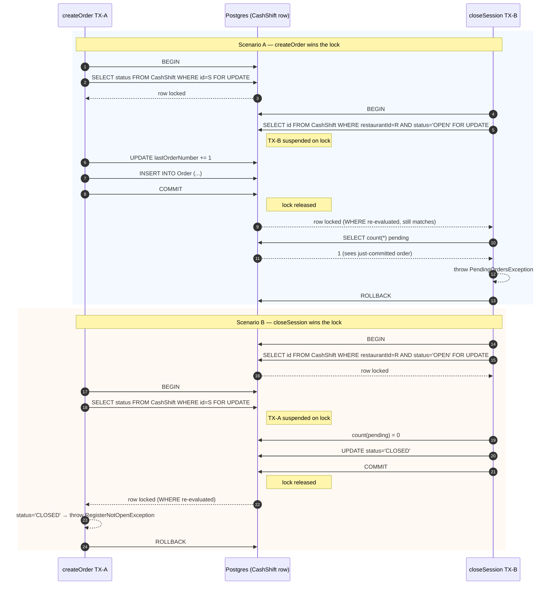

# Race conditions + Kitchen token hardening — Design

**Fecha:** 2026-05-27
**Tipo:** Spec
**Estado:** Aprobado, pendiente de plan de implementación
**Source audit:** `2026-05-24-orders-cash-kitchen-audit-findings.md`
**Hallazgos cubiertos:** H-05, H-06 (oportunista con H-05), H-09, H-13, H-14
**Hallazgos descartados:** H-04 (deferred, anotado en el audit), H-48 (out de scope)

---

## Contexto

La auditoría de 2026-05-24 dejó pendientes 4 race conditions y 1 hardening de auth catalogados como "esta semana". Este spec define la solución para esos 5 hallazgos, agrupados en 2 commits semánticos para facilitar revisión y revert independiente.

El commit 1 (races) es backend-only. El commit 2 (token hardening) sí tiene ripple a UI: la página de dashboard que muestra el kitchen URL debe adaptarse porque `getTokenInfo` ya no entrega el plano; solo `POST generate` lo retorna y solo entonces se muestra al admin. Adicionalmente, `apps/ui/src/pages/kitchen/index.astro` y su `kitchenFetch` pueden migrar opcionalmente a `X-Kitchen-Token` header — pero el guard sigue aceptando query, así que esa migración no es obligatoria en este commit.

---

## Resumen ejecutivo

### Commit 1 — `fix(api): race conditions en order y cash-shift state transitions`

- **H-05** `markAsPaid` se ejecuta en `$transaction` con optimistic locking via `updateMany({ where: { id, status: expectedStatus, isPaid: false }, ... })`. El cambio de status (CREATED→CONFIRMED o SERVED→COMPLETED) y `isPaid=true` ocurren en una sola query.
- **H-06** (bundled) `unmarkAsPaid` agrega validación: rechaza si la orden ya está COMPLETED. Misma TX + optimistic lock pattern.
- **H-09** `closeSession` y `createOrder` coordinan via lock pesimista `FOR UPDATE` sobre la fila del `CashShift`. Implementado con dos helpers nuevos en `CashShiftRepository`: `lockOpenShift` y `lockShiftById`, ambos usan `$queryRaw` con tagged template literal (parametrizado, seguro contra SQL injection).
- **H-13** `kitchenAdvanceStatus` se ejecuta en `$transaction` con optimistic locking via un nuevo helper `OrderRepository.transitionStatusIfMatches`, reutilizable por H-05.

### Commit 2 — `fix(api): hardening kitchen token (hash + timingSafeEqual + header)`

- **H-14** El token del kitchen se hashea (sha256 hex) en BD; el plano solo se entrega una vez al admin. El guard compara hashes en tiempo constante via `crypto.timingSafeEqual`. Acepta header `X-Kitchen-Token` (preferido) o query `?token=` (fallback temporal hasta que H-04 implemente sse-ticket).
- Nuevo servicio `KitchenTokenService` encapsula generación, hashing y comparación.
- Migración Prisma: drop `kitchenToken` (plano), add `kitchenTokenHash` (hex 64 chars). Confirmado con el usuario: no hay restaurantes en producción → no requiere convivencia dual.

---

## Diseño detallado

### 1. H-05 — `markAsPaid` transaccional con optimistic lock

**Archivo:** `apps/api-core/src/orders/orders.service.ts:184-198`

**Problema:** 3 escrituras separadas (`updateStatus` x2, `markAsPaid`) sin transacción. Si `unmarkAsPaid` o `cancelOrder` interleavan, queda estado inconsistente. Dos requests concurrentes pueden disparar dos transiciones.

**Fix:**

```ts
async markAsPaid(id: string, restaurantId: string, paymentMethod?: string) {
  const updated = await this.prisma.$transaction(async (tx) => {
    const order = await tx.order.findFirst({ where: { id, restaurantId } });
    if (!order) throw new OrderNotFoundException(id);
    if (order.status === OrderStatus.CANCELLED) throw new OrderAlreadyCancelledException(id);
    if (order.isPaid) return order; // idempotente

    const nextStatus =
      order.status === OrderStatus.CREATED ? OrderStatus.CONFIRMED :
      order.status === OrderStatus.SERVED  ? OrderStatus.COMPLETED :
      order.status;

    const count = await this.orderRepository.transitionStatusIfMatchesAndUnpaid(
      tx, id, restaurantId, order.status, nextStatus, paymentMethod,
    );
    if (count === 0) {
      // status drifted between findFirst and updateMany — caller raced with
      // another transition (cashier cancel, unmark, etc.)
      throw new InvalidStatusTransitionException(order.status, nextStatus);
    }

    return tx.order.findFirstOrThrow({ where: { id, restaurantId } });
  });

  this.orderEventsService.emitOrderUpdated(restaurantId, updated);
  return updated;
}
```

`OrderRepository.markAsPaid` (método separado actual) se vuelve dead code; se elimina del repo.

### 2. H-06 — `unmarkAsPaid` con validación de transición (bundled)

**Archivo:** `apps/api-core/src/orders/orders.service.ts:210-215`

**Problema:** No valida que la orden sea desmarcable. Permite desmarcar una COMPLETED, dejando estado inconsistente (`COMPLETED + isPaid=false`).

**Fix:**

```ts
async unmarkAsPaid(id: string, restaurantId: string) {
  const updated = await this.prisma.$transaction(async (tx) => {
    const order = await tx.order.findFirst({ where: { id, restaurantId } });
    if (!order) throw new OrderNotFoundException(id);
    if (order.status === OrderStatus.COMPLETED) {
      throw new InvalidStatusTransitionException(order.status, order.status);
    }
    if (!order.isPaid) return order; // idempotente

    const count = await this.orderRepository.unmarkAsPaidIfPaid(tx, id, restaurantId);
    if (count === 0) throw new InvalidStatusTransitionException(order.status, order.status);
    return tx.order.findFirstOrThrow({ where: { id, restaurantId } });
  });

  this.orderEventsService.emitOrderUpdated(restaurantId, updated);
  return updated;
}
```

### 3. H-09 — `closeSession` ↔ `createOrder` coordinación via lock pesimista

**Archivos:**
- `apps/api-core/src/cash-register/cash-register.service.ts:40-82` (closeSession)
- `apps/api-core/src/orders/orders.service.ts:63-85` (createOrder)
- `apps/api-core/src/cash-shift/cash-shift.repository.ts` (nuevos helpers)

**Problema:** `closeSession` está envuelto en `$transaction` pero Postgres en READ COMMITTED no protege contra write-skew. Una nueva orden puede crearse después del `count(*) = 0` y antes del `UPDATE status='CLOSED'`, quedando huérfana en un turno cerrado.

**Estrategia:** convertir la fila del `CashShift` en el punto de coordinación. Toda TX que dependa de `status = 'OPEN'` toma `FOR UPDATE` antes de leer/decidir/escribir.

**Helpers nuevos en `CashShiftRepository`:**

```ts
/**
 * Acquires a pessimistic row-level lock on the OPEN cash shift for a restaurant.
 *
 * Must run inside a Prisma transaction. The lock is held until the surrounding
 * transaction commits or rolls back. Concurrent writers that target the same
 * row block on this lock; when released, they re-evaluate their WHERE clause
 * against the post-commit state (Postgres EvalPlanQual under READ COMMITTED).
 *
 * This is the coordination point that prevents the write-skew race between
 * CashRegisterService.closeSession and OrdersService.createOrder. See audit
 * finding H-09 and cash-register.module.info.md for the full sequence diagram.
 *
 * Security: the query uses Prisma's tagged-template `$queryRaw`, so the
 * restaurantId value is parameterized by the driver. It is never concatenated
 * into the SQL string. Do not change this method to use `$queryRawUnsafe`.
 *
 * @param tx           - active Prisma transaction client (not the root prisma)
 * @param restaurantId - UUID of the restaurant whose OPEN shift to lock
 * @returns the locked shift id, or null when no OPEN shift exists
 */
async lockOpenShift(
  tx: Prisma.TransactionClient,
  restaurantId: string,
): Promise<string | null> {
  const rows = await tx.$queryRaw<{ id: string }[]>`
    SELECT id
    FROM "CashShift"
    WHERE "restaurantId" = ${restaurantId}
      AND status = 'OPEN'
    FOR UPDATE
  `;
  return rows[0]?.id ?? null;
}

/**
 * Acquires a pessimistic row-level lock on a specific cash shift by id and
 * returns its current status. Used by writers that already know which shift
 * they intend to mutate (e.g. createOrder, which receives shiftId from an
 * earlier resolver/guard).
 *
 * Must run inside a Prisma transaction. See lockOpenShift for the semantics
 * of FOR UPDATE under READ COMMITTED.
 *
 * Security: parameterized via Prisma's tagged-template `$queryRaw`. The
 * shiftId value is bound by the driver, not concatenated into SQL. Do not
 * change to `$queryRawUnsafe`.
 *
 * @param tx      - active Prisma transaction client
 * @param shiftId - UUID of the shift to lock
 * @returns the locked shift status, or null if no shift exists with that id
 */
async lockShiftById(
  tx: Prisma.TransactionClient,
  shiftId: string,
): Promise<CashShiftStatus | null> {
  const rows = await tx.$queryRaw<{ status: CashShiftStatus }[]>`
    SELECT status
    FROM "CashShift"
    WHERE id = ${shiftId}
    FOR UPDATE
  `;
  return rows[0]?.status ?? null;
}
```

**Callers después del fix:**

```ts
// cash-register.service.ts — closeSession
const closedSession = await this.prisma.$transaction(async (tx) => {
  const lockedId = await this.cashShiftRepository.lockOpenShift(tx, restaurantId);
  if (!lockedId) throw new NoOpenCashRegisterException();

  // pendingCount, aggregate, update status='CLOSED' — todo dentro del lock
});

// orders.service.ts — createOrder
const order = await this.prisma.$transaction(async (tx) => {
  const status = await this.cashShiftRepository.lockShiftById(tx, cashShiftId);
  if (status === null || status !== CashShiftStatus.OPEN) {
    throw new RegisterNotOpenException();
  }

  // increment lastOrderNumber, validateAndBuildItems, persistOrder — dentro del lock
});
```

### 4. H-13 — `kitchenAdvanceStatus` con optimistic concurrency

**Archivo:** `apps/api-core/src/orders/orders.service.ts:166-182`

**Problema:** `findById` + `updateStatus` separados. Dos cocineros pulsando "Listo" simultáneamente pasan ambos la validación → doble emit SSE. Si el cajero cancela entre lectura y escritura, `CANCELLED` se sobrescribe con `SERVED`.

**Estrategia:** distinto de H-09 — acá la decisión depende solo del status de la propia orden, no de una agregación cross-table. Optimistic concurrency via `updateMany` con filtro de status alcanza. `updateMany` adquiere implícitamente `FOR NO KEY UPDATE` sobre las filas que matchea, serializando writers concurrentes.

**Helper nuevo en `OrderRepository`:**

```ts
/**
 * Atomically transitions an order's status, but only if the row's current
 * status still matches `expectedStatus`. Returns the number of rows updated
 * (0 if another transaction changed the status first, 1 on success).
 *
 * This is the optimistic-concurrency primitive used by kitchen and payment
 * flows. Under READ COMMITTED, `updateMany` implicitly acquires
 * FOR NO KEY UPDATE on each matching row for the duration of the surrounding
 * transaction; concurrent transactions that target the same row block, then
 * re-evaluate their WHERE clause against the post-commit state — yielding
 * count = 0 if the status has already advanced.
 *
 * Used by:
 *   - OrdersService.kitchenAdvanceStatus — prevents double-advance from
 *     multi-screen KDS, and prevents kitchen from overwriting a concurrent
 *     cashier cancellation. See audit finding H-13.
 *
 * @param tx              - active Prisma transaction client
 * @param id              - order UUID
 * @param restaurantId    - tenant guard (defense in depth)
 * @param expectedStatus  - the status the caller observed before deciding
 *                          to transition; the UPDATE is a no-op if the row
 *                          has since drifted away from this value
 * @param newStatus       - the status to transition to
 * @returns 1 if the transition committed, 0 if the status changed concurrently
 */
async transitionStatusIfMatches(
  tx: Prisma.TransactionClient,
  id: string,
  restaurantId: string,
  expectedStatus: OrderStatus,
  newStatus: OrderStatus,
): Promise<number> {
  const result = await tx.order.updateMany({
    where: { id, restaurantId, status: expectedStatus },
    data: { status: newStatus },
  });
  return result.count;
}

/**
 * Variant of `transitionStatusIfMatches` for the markAsPaid flow.
 * Atomically transitions status, sets isPaid=true and paymentMethod, but
 * only if the row's status matches `expectedStatus` AND isPaid is currently
 * false. The latter guard makes the operation idempotent under concurrent
 * payment attempts.
 *
 * See audit finding H-05.
 */
async transitionStatusIfMatchesAndUnpaid(
  tx: Prisma.TransactionClient,
  id: string,
  restaurantId: string,
  expectedStatus: OrderStatus,
  newStatus: OrderStatus,
  paymentMethod: string | undefined,
): Promise<number> {
  const result = await tx.order.updateMany({
    where: { id, restaurantId, status: expectedStatus, isPaid: false },
    data: {
      status: newStatus,
      isPaid: true,
      paymentMethod,
      paidAt: new Date(),
    },
  });
  return result.count;
}

/**
 * Companion to the unmarkAsPaid flow. Atomically clears isPaid only if the
 * row is currently paid; no-op if already unpaid (idempotent).
 *
 * See audit finding H-06.
 */
async unmarkAsPaidIfPaid(
  tx: Prisma.TransactionClient,
  id: string,
  restaurantId: string,
): Promise<number> {
  const result = await tx.order.updateMany({
    where: { id, restaurantId, isPaid: true },
    data: { isPaid: false, paymentMethod: null, paidAt: null },
  });
  return result.count;
}
```

**Caller después del fix:**

```ts
// orders.service.ts — kitchenAdvanceStatus
async kitchenAdvanceStatus(id, restaurantId, newStatus) {
  const updated = await this.prisma.$transaction(async (tx) => {
    const order = await tx.order.findFirst({ where: { id, restaurantId } });
    if (!order) throw new OrderNotFoundException(id);
    if (order.status === OrderStatus.CANCELLED) throw new OrderAlreadyCancelledException(id);

    const currentIdx = STATUS_ORDER.indexOf(order.status);
    const targetIdx = STATUS_ORDER.indexOf(newStatus);
    const KITCHEN_MAX_IDX = STATUS_ORDER.indexOf(OrderStatus.SERVED);
    if (targetIdx === -1 || targetIdx !== currentIdx + 1 || targetIdx > KITCHEN_MAX_IDX) {
      throw new InvalidStatusTransitionException(order.status, newStatus);
    }

    const count = await this.orderRepository.transitionStatusIfMatches(
      tx, id, restaurantId, order.status, newStatus,
    );
    if (count === 0) throw new InvalidStatusTransitionException(order.status, newStatus);

    return tx.order.findFirstOrThrow({ where: { id, restaurantId } });
  });

  this.orderEventsService.emitOrderUpdated(restaurantId, updated);
  return updated;
}
```

### 5. H-14 — Kitchen token hardening

**Archivos:**
- `apps/api-core/src/kitchen/guards/kitchen-token.guard.ts` (rewrite)
- `apps/api-core/src/kitchen/kitchen.service.ts:53-80` (generateToken)
- `apps/api-core/src/kitchen/kitchen.service.ts:38-51` (getTokenInfo — adapta para no exponer plano)
- `apps/api-core/src/kitchen/kitchen-token.service.ts` (nuevo)
- `apps/api-core/src/kitchen/kitchen.module.ts` (provider del nuevo service)
- `apps/api-core/prisma/schema.postgresql.prisma` (rotación de columna)
- Migration

**Problemas:**

| # | Problema | Riesgo | Fix |
|---|---|---|---|
| a | Token plano en BD | Dump → cocinas comprometidas | sha256(token) hex en BD; plano solo se ve una vez al generar |
| b | Comparación con `!==` | Timing oracle | `crypto.timingSafeEqual` |
| c | Solo query string | Token en logs/Referer/historial | Header `X-Kitchen-Token` preferido; query como fallback |

**Modelo:** shared secret per-restaurant. NO se cambia a JWT — el modelo actual es correcto para este caso (sesión persistente de meses, revocación inmediata por overwrite del hash, aislamiento entre tenants via secreto separado por restaurante). Ver discusión en sesión de brainstorming.

**Nuevo `KitchenTokenService`:**

```ts
// apps/api-core/src/kitchen/kitchen-token.service.ts

import { Injectable } from '@nestjs/common';
import * as crypto from 'crypto';

/**
 * Encapsulates the cryptographic primitives for kitchen-token authentication.
 *
 * The plain token is shown to the admin exactly once at generation time and is
 * never persisted; the database only ever stores the sha256 hash. If the admin
 * loses the plain token, the only recovery is regeneration, which invalidates
 * all currently connected kitchen screens for that restaurant.
 *
 * Token format: 32 random bytes encoded as URL-safe base64 without padding
 * (43 chars from [A-Za-z0-9_-]). URL-safe encoding lets the token travel via
 * header or query string without further escaping.
 */
@Injectable()
export class KitchenTokenService {
  /**
   * Generates a new kitchen token. Returns both the plain string — which the
   * caller must surface to the admin exactly once — and the hex-encoded
   * sha256 hash that should be persisted to RestaurantSettings.kitchenTokenHash.
   */
  generate(): { plainToken: string; tokenHash: string } {
    const plainToken = crypto.randomBytes(32).toString('base64url');
    const tokenHash = this.hash(plainToken);
    return { plainToken, tokenHash };
  }

  /**
   * Computes the sha256 hash of a plain token, encoded as lowercase hex.
   *
   * Hex (not base64) is chosen for the stored form because both inputs to
   * `timingSafeEqual` in verifyHash must be byte buffers of equal length;
   * hex strings are always 64 chars for sha256 regardless of input, which
   * makes the length-equality precondition trivially satisfied.
   */
  hash(plainToken: string): string {
    return crypto.createHash('sha256').update(plainToken, 'utf8').digest('hex');
  }

  /**
   * Constant-time comparison of two hex-encoded sha256 hashes. Returns false
   * immediately when buffer lengths differ (defensive; valid hashes are always
   * 64 chars). Otherwise compares all bytes via `crypto.timingSafeEqual` so
   * the response time does not leak which byte mismatched first — closing the
   * iterative byte-guessing oracle that `===` would create.
   */
  verifyHash(storedHash: string, candidateHash: string): boolean {
    if (storedHash.length !== candidateHash.length) return false;
    const stored = Buffer.from(storedHash, 'utf8');
    const candidate = Buffer.from(candidateHash, 'utf8');
    return crypto.timingSafeEqual(stored, candidate);
  }
}
```

**Guard reescrito:**

```ts
// apps/api-core/src/kitchen/guards/kitchen-token.guard.ts

import {
  CanActivate, ExecutionContext, Injectable, UnauthorizedException,
} from '@nestjs/common';
import { Request } from 'express';
import { RestaurantsService } from '../../restaurants/restaurants.service';
import { KitchenTokenService } from '../kitchen-token.service';

export const KITCHEN_RESTAURANT_KEY = 'kitchenRestaurant';

/** Defensive cap before hashing attacker-supplied input. Valid tokens are 43 chars. */
const MAX_TOKEN_LENGTH = 128;

@Injectable()
export class KitchenTokenGuard implements CanActivate {
  constructor(
    private readonly restaurantsService: RestaurantsService,
    private readonly tokenService: KitchenTokenService,
  ) {}

  async canActivate(context: ExecutionContext): Promise<boolean> {
    const req = context.switchToHttp().getRequest<Request>();
    const slug = req.params['slug'] as string;
    const token = this.extractToken(req);

    if (!slug || !token) throw new UnauthorizedException('Kitchen token required');
    if (token.length > MAX_TOKEN_LENGTH) {
      throw new UnauthorizedException('Invalid kitchen token');
    }

    const restaurant = await this.restaurantsService.findBySlugWithSettings(slug);
    const storedHash = restaurant?.settings?.kitchenTokenHash;
    if (!restaurant || !storedHash) {
      throw new UnauthorizedException('Invalid kitchen token');
    }

    const candidateHash = this.tokenService.hash(token);
    if (!this.tokenService.verifyHash(storedHash, candidateHash)) {
      throw new UnauthorizedException('Invalid kitchen token');
    }

    const expiresAt = restaurant.settings?.kitchenTokenExpiresAt;
    if (expiresAt && expiresAt < new Date()) {
      throw new UnauthorizedException('Kitchen token expired');
    }

    (req as any)[KITCHEN_RESTAURANT_KEY] = restaurant;
    return true;
  }

  /**
   * Extracts the kitchen token from the request. Prefers the `X-Kitchen-Token`
   * header — new clients should send it there so the token never appears in
   * URL, Referer, browser history, or upstream proxy logs. Falls back to the
   * legacy `?token=` query for backwards compatibility with browser
   * EventSource calls, which cannot send custom headers. The query path will
   * be removed when H-04 introduces the sse-ticket mechanism.
   */
  private extractToken(req: Request): string | undefined {
    const header = req.headers['x-kitchen-token'];
    if (typeof header === 'string' && header.length > 0) return header;
    const query = req.query['token'];
    if (typeof query === 'string' && query.length > 0) return query;
    return undefined;
  }
}
```

**`KitchenService.generateToken` adaptado:**

```ts
async generateToken(restaurantId: string, expiresAt: string) {
  const restaurant = await this.restaurantsService.findById(restaurantId);
  if (!restaurant) throw new UnauthorizedException();

  const expiresAtDate = new Date(expiresAt);
  const tomorrow = new Date();
  tomorrow.setDate(tomorrow.getDate() + 1);
  tomorrow.setHours(0, 0, 0, 0);
  if (expiresAtDate < tomorrow) {
    throw new BadRequestException('La fecha de vencimiento debe ser al menos mañana');
  }

  const { plainToken, tokenHash } = this.tokenService.generate();

  await this.restaurantsService.upsertSettings(restaurantId, {
    kitchenTokenHash: tokenHash,
    kitchenTokenExpiresAt: expiresAtDate,
  });

  return {
    token: plainToken,           // admin lo ve aquí una sola vez
    expiresAt: expiresAtDate,
    kitchenUrl: `/kitchen?slug=${restaurant.slug}&token=${plainToken}`,
  };
}
```

**`KitchenService.getTokenInfo` adaptado** (no expone el plano, ya que ya no se almacena):

```ts
async getTokenInfo(restaurantId: string) {
  const restaurant = await this.restaurantsService.findByIdWithSettings(restaurantId);
  const settings = restaurant?.settings;
  if (!settings?.kitchenTokenHash || !settings.kitchenTokenExpiresAt) {
    return { hasToken: false, expiresAt: null };
  }
  if (new Date() > settings.kitchenTokenExpiresAt) {
    return { hasToken: false, expiresAt: null };
  }
  return {
    hasToken: true,
    expiresAt: settings.kitchenTokenExpiresAt,
  };
}
```

Cambio en el contrato: ya no se puede devolver `kitchenUrl` desde `getTokenInfo` porque no tenemos el plano. El frontend del dashboard debe ajustarse para no asumir que existe la URL en ese endpoint; el admin obtiene la URL solo al **regenerar**. Esto es propiedad esencial del cambio (lost-once: el admin guarda el plano externamente o regenera). Documentar en el módulo info y en la doc del dashboard.

**Schema y migración:**

```prisma
// prisma/schema.postgresql.prisma — model RestaurantSettings
// kitchenToken             String?    @db.Text  ← REMOVE
kitchenTokenHash            String?    @db.Text
kitchenTokenExpiresAt       DateTime?
```

Migration SQL:

```sql
-- prisma/migrations/20260527_rotate_kitchen_token_to_hash/migration.sql
ALTER TABLE "RestaurantSettings" ADD COLUMN "kitchenTokenHash" TEXT;
ALTER TABLE "RestaurantSettings" DROP COLUMN "kitchenToken";
```

---

## Diagramas (mermaid) en module info docs

### `cash-register.module.info.md` — sección nueva "Concurrency model"



### `orders.module.info.md` — sección nueva "Order status transitions"

```mermaid
sequenceDiagram
    autonumber
    participant K1 as Kitchen screen A
    participant DB as Postgres (Order row)
    participant K2 as Kitchen screen B
    participant C as Cashier (cancel)

    rect rgba(120, 180, 255, 0.08)
    note over K1,K2: Double-advance race — both screens press "Listo"
    K1->>DB: SELECT status FROM Order WHERE id=O → PROCESSING
    K2->>DB: SELECT status FROM Order WHERE id=O → PROCESSING
    K1->>DB: UPDATE ... WHERE id=O AND status='PROCESSING' SET status='SERVED'
    DB-->>K1: 1 row updated, lock held
    K2->>DB: UPDATE ... WHERE id=O AND status='PROCESSING' SET status='SERVED'
    Note right of DB: TX-K2 suspended on lock
    K1->>DB: COMMIT
    DB-->>K2: re-evaluates WHERE; status now 'SERVED', no match
    K2-->>K2: count = 0 → throw InvalidStatusTransitionException
    end

    rect rgba(255, 180, 120, 0.08)
    note over K1,C: Kitchen vs cashier — cancel during kitchen advance
    K1->>DB: SELECT status FROM Order WHERE id=O → PROCESSING
    C->>DB: UPDATE ... WHERE id=O SET status='CANCELLED'
    DB-->>C: 1 row updated, lock held
    C->>DB: COMMIT
    K1->>DB: UPDATE ... WHERE id=O AND status='PROCESSING' SET status='SERVED'
    DB-->>K1: 0 rows (status is now CANCELLED)
    K1-->>K1: throw InvalidStatusTransitionException
    Note over K1: cashier's CANCELLED is preserved
    end
```

### `kitchen.module.info.md` — sección nueva "Token authentication"

(Sin diagrama secuencia; descripción textual de los 3 fixes: hash at-rest, timingSafeEqual, header preferred. Ver sección 5 arriba para el texto exacto.)

---

## Testing

### Unit tests

**`KitchenTokenService` (nuevo)**

- `generate()` produce `plainToken` de exactamente 43 chars URL-safe base64, y `tokenHash` de 64 chars hex.
- `hash(t)` es determinístico: misma entrada → misma salida.
- `hash(t1) !== hash(t2)` cuando `t1 !== t2`.
- `verifyHash(a, b)` retorna true cuando `a === b`, false en otros casos (incluyendo longitudes distintas, no throw).
- `verifyHash('', '')` retorna true (caso edge — ambos vacíos, longitud igual).

**`KitchenTokenGuard` (reescrito)**

- Happy path con header `X-Kitchen-Token` → 200, attaches restaurant.
- Happy path con query `?token=` → 200.
- Header tiene prioridad sobre query si ambos presentes (test: enviar token correcto en header, incorrecto en query → 200; al revés → 401).
- Missing slug → 401.
- Missing token (ni header ni query) → 401.
- Token con length > 128 → 401, sin llamar a `restaurantsService` (mock verifies).
- Slug existe pero sin `kitchenTokenHash` (nunca regeneraron) → 401.
- Token incorrecto → 401, comparación efectivamente constant-time (test que `timingSafeEqual` se invocó).
- Token correcto pero `kitchenTokenExpiresAt < now` → 401 con mensaje "expired".

**`OrderRepository.transitionStatusIfMatches`**

- Retorna 1 cuando status matchea.
- Retorna 0 cuando status no matchea.
- Retorna 0 cuando id no existe.
- Retorna 0 cuando restaurantId no matchea (tenant guard).

**`OrderRepository.transitionStatusIfMatchesAndUnpaid`**

- Retorna 1 cuando status matchea Y `isPaid = false`.
- Retorna 0 cuando `isPaid = true` (idempotent guard).
- Sets `paymentMethod`, `paidAt = now`.

**`OrderRepository.unmarkAsPaidIfPaid`**

- Retorna 1 cuando `isPaid = true`.
- Retorna 0 cuando `isPaid = false` (idempotent).
- Clears `paymentMethod = null`, `paidAt = null`.

**`CashShiftRepository.lockOpenShift` / `lockShiftById`**

- Retorna el id (o status) correcto cuando matchea.
- Retorna null cuando no matchea.
- Unit tests no validan el locking en sí (requiere e2e con dos clientes concurrentes); validan la query y el contrato.

**`OrdersService.markAsPaid` / `unmarkAsPaid` / `kitchenAdvanceStatus`**

- Cubren los nuevos paths de error (race detectado por `updateMany` count=0 → throw `InvalidStatusTransitionException`).
- Idempotencia: llamar dos veces seguidas `markAsPaid` en una orden ya pagada → no throw, retorna la orden tal cual.

**`CashRegisterService.closeSession`**

- Path normal sin contención cubierto.
- Path "no open session" cubierto (lockOpenShift retorna null).

### Integration tests

**E2e race conditions** (nuevo archivo `apps/api-core/test/e2e/race-conditions.e2e-spec.ts`)

- **H-09 close vs create:** abrir caja; insertar order; cerrar caja "lento" (lockOpenShift + sleep antes del count) mientras paralelamente createOrder corre → uno de los dos falla con la excepción correcta, el otro tiene éxito; nunca queda orden en turno cerrado.
- **H-13 double advance:** crear orden en PROCESSING; dos llamadas concurrentes a `kitchenAdvanceStatus(SERVED)` → exactamente una tiene éxito, la otra `InvalidStatusTransitionException`. Solo un evento SSE emitido.
- **H-13 cancel vs advance:** crear orden en PROCESSING; en paralelo cancel + advance → solo uno gana, el ganador determinístico depende del orden de lock pero ambos resultados son consistentes (CANCELLED final si cancel ganó; SERVED final si advance ganó, pero NO ambos).
- **H-05 mark-as-paid idempotent:** llamar dos veces `markAsPaid` → segunda llamada retorna la orden ya pagada, no throw.

**E2e kitchen token** (extensión de `apps/api-core/test/e2e/kitchen.e2e-spec.ts` si existe; si no, nuevo)

- Generar token; usar plain via header → 200.
- Mismo plain via query → 200.
- Token incorrecto → 401.
- Regenerar token; antiguo plain → 401 (revocación inmediata).
- Verificar que `getTokenInfo` ya no expone el plain (response no contiene `kitchenUrl`).

---

## Estructura de commits

### Commit 1

**Mensaje:**
```
fix(api): race conditions en order y cash-shift transitions (H-05, H-06, H-09, H-13)

- markAsPaid: $transaction + optimistic lock via updateMany. Cambio de status
  y isPaid en una sola query. Idempotente si la orden ya está pagada.
- unmarkAsPaid: rechaza si la orden está COMPLETED. Misma TX + optimistic lock.
- closeSession + createOrder: coordinación via FOR UPDATE row-lock sobre
  CashShift, encapsulado en CashShiftRepository.lockOpenShift y lockShiftById.
  Cierra write-skew previo (orden CREATED en turno CLOSED).
- kitchenAdvanceStatus: $transaction + optimistic lock via
  OrderRepository.transitionStatusIfMatches. Cierra double-advance race y
  cancel vs advance race.

Diagramas de secuencia en cash-register.module.info.md y orders.module.info.md.
```

**Files changed:**
- `apps/api-core/src/orders/orders.service.ts` (markAsPaid, unmarkAsPaid, kitchenAdvanceStatus, createOrder reescritos)
- `apps/api-core/src/orders/order.repository.ts` (nuevos helpers; `markAsPaid` viejo eliminado)
- `apps/api-core/src/cash-register/cash-register.service.ts` (closeSession reescrito)
- `apps/api-core/src/cash-shift/cash-shift.repository.ts` (nuevos helpers lockOpenShift, lockShiftById)
- `apps/api-core/src/cash-register/cash-register.module.info.md` (sección Concurrency model)
- `apps/api-core/src/orders/orders.module.info.md` (sección Order status transitions)
- Tests unit + e2e

### Commit 2

**Mensaje:**
```
fix(api): hardening kitchen token (H-14)

- Token almacenado como sha256 hex; el plano se entrega al admin una sola vez.
- Comparación constant-time via crypto.timingSafeEqual.
- Acepta header X-Kitchen-Token (preferido) o query ?token= (fallback hasta H-04).
- Nuevo KitchenTokenService encapsula generate/hash/verifyHash.
- Migration: drop kitchenToken (plano), add kitchenTokenHash. Tokens existentes
  invalidados (confirmado: no hay clientes en producción).
- getTokenInfo ya no expone kitchenUrl; el plano solo aparece en la response
  de POST generate.

BREAKING: clientes que dependan de GET /v1/kitchen/token/info para obtener
kitchenUrl deben adaptarse — ahora solo /generate retorna URL.
```

**Files changed:**
- `apps/api-core/src/kitchen/kitchen-token.service.ts` (nuevo)
- `apps/api-core/src/kitchen/guards/kitchen-token.guard.ts` (rewrite)
- `apps/api-core/src/kitchen/kitchen.service.ts` (generateToken, getTokenInfo)
- `apps/api-core/src/kitchen/kitchen.module.ts` (registra KitchenTokenService como provider)
- `apps/api-core/prisma/schema.postgresql.prisma`
- `apps/api-core/prisma/migrations/20260527_rotate_kitchen_token_to_hash/migration.sql`
- `apps/api-core/src/kitchen/kitchen.module.info.md` (sección Token authentication)
- Frontend dashboard: ajustar la pantalla de gestión de kitchen token (componente exacto a identificar durante el plan — buscar consumidores de `getTokenInfo`) para no asumir que retorna `kitchenUrl`; mostrar el plano solo después de regenerar y permitir que el admin lo copie a un manager externo
- Tests unit + e2e

---

## Defensa en profundidad — convención agregada al repo

Agregar regla ESLint que prohíbe `$queryRawUnsafe`:

```js
// eslint config
'no-restricted-syntax': ['error', {
  selector: "MemberExpression[property.name='$queryRawUnsafe']",
  message: 'Use $queryRaw with tagged template literals to avoid SQL injection.',
}]
```

Justificación: `$queryRaw` con tagged template literal parametriza via driver y es seguro. `$queryRawUnsafe` recibe string concatenado y es vulnerable. Lint rule evita confusión futura.

---

## Cierre — actualización al audit doc

Al **finalizar la implementación de ambos commits y su verificación**, actualizar `2026-05-24-orders-cash-kitchen-audit-findings.md`:

- Marcar H-05, H-06, H-09, H-13, H-14 como ✅ Implementado (con la fecha real del merge, no la del spec) con referencia a este spec.
- Anotar H-04 explícitamente como ⏳ Deferred con razón ("alcance acotado a esta semana; requiere diseño de sse-ticket separado").
- Actualizar la tabla "Progreso" con los nuevos ✅.
- Actualizar la sección "Orden sugerido de remediación" marcando los hallazgos de esta semana.

---

## Hallazgos no abordados (documentar como pendientes)

- **H-04**: requiere endpoint nuevo `/auth/sse-ticket` y rework del cliente SSE (dashboard + cocina). Diseño separado.
- **H-48**: bug menor en `generateToken` (valida `expiresAt` después de generar). Out de scope para mantener foco; queda en backlog.
- Resto de los hallazgos pendientes del audit (H-07, H-08, H-10, H-11, H-12, H-15…H-52): no abordados aquí.
