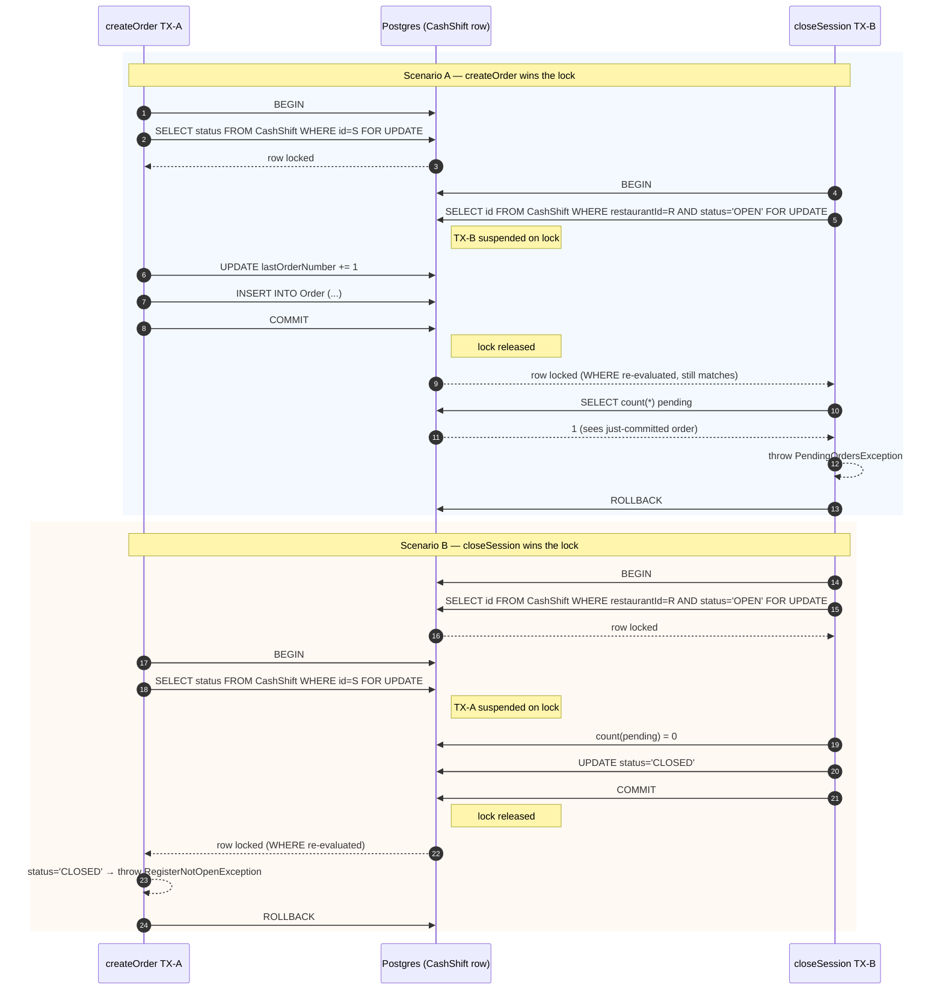

### Cash Register (cash-register)

### Reglas de negocio

- Solo puede existir una sesión `OPEN` por restaurante a la vez. Cualquier ADMIN o MANAGER puede abrir o cerrar la sesión activa, sin importar quién la abrió.
- **No se puede cerrar la caja con pedidos en `CREATED`, `CONFIRMED`, `PROCESSING` o `SERVED`** — el endpoint lanza `PENDING_ORDERS_ON_SHIFT` (409) indicando cuántos pedidos quedan pendientes.
- Al cerrar, solo existen pedidos `COMPLETED` o `CANCELLED` en la sesión:
  - `COMPLETED` = pedido entregado, dinero en caja. Cuenta en el total.
  - `CANCELLED` = devolución realizada. El dinero regresó al cliente. **No cuenta en el total**; el historial conserva el registro como evidencia.
- **Pedido pagado no recogido por el cliente → debe marcarse `COMPLETED`, no cancelarse.** El restaurante cobró y preparó el pedido; el dinero queda en caja. Esta distinción se refuerza con confirmaciones claras en la UI de cocina.
- El `restaurantId` viene del JWT — toda operación está aislada por restaurante.
- `byPaymentMethod` siempre refleja solo órdenes `COMPLETED`.

---

### Respuestas serializadas

**`CashShiftDto`** — usado en `POST /open`, `GET /current`, `GET /history`, embebido en `POST /close` y `GET /summary/:sessionId`:

```json
{
  "id": "string",
  "status": "OPEN | CLOSED",
  "displayOpenedAt": "7 may 2026, 22:44",
  "displayClosedAt": "7 may 2026, 23:30 | null",
  "closedBy": "string | null",
  "openedByEmail": "string | null",
  "_count": { "orders": 12 }
}
```

- `displayOpenedAt` / `displayClosedAt` están formateadas en el timezone del restaurante (transformación en el backend vía `TimezoneService`). Formato: `d MMM yyyy, HH:mm` en locale `es`.
- `_count` solo está presente en `GET /current` e `GET /history`.
- Campos **eliminados del response**: `restaurantId`, `userId`, `lastOrderNumber`, `openingBalance`, `totalSales`, `totalOrders`, `openedAt` (UTC), `closedAt` (UTC).

---

### Contrato unificado `ShiftSummary`

Los endpoints `POST /close`, `GET /summary/:sessionId` y `GET /stats` devuelven todos el mismo shape `summary` (envuelto, dependiendo del endpoint, en `{ session, summary }` o solo `{ summary }`). El status de la caja (open/closed) no cambia la forma — solo qué campos pueden estar en cero.

```json
{
  "summary": {
    "counts": {
      "total": 12,
      "pending": 5,
      "created": 1,
      "confirmed": 2,
      "processing": 1,
      "served": 1,
      "completed": 6,
      "cancelled": 1
    },
    "revenue": {
      "completed": 120.50,
      "pending": 45.00,
      "averageTicket": 20.08
    },
    "byPaymentMethod": [
      { "method": "CASH", "count": 3, "total": 60.00 },
      { "method": "CARD", "count": 3, "total": 60.50 }
    ],
    "byOrderType": [
      { "type": "PICKUP", "count": 8 },
      { "type": "DELIVERY", "count": 4 }
    ],
    "byOrderSource": [
      { "source": "STAFF", "count": 7 },
      { "source": "KIOSK", "count": 5 }
    ],
    "topProducts": [
      { "id": "uuid", "name": "Burger Clásica", "quantity": 15, "total": 75.00 }
    ]
  }
}
```

**Reglas de naming (importante):**

- `count` siempre es número de órdenes (entero).
- `total` dentro de `byPaymentMethod[].total` y `topProducts[].total` siempre es **dinero en pesos** (decimal).
- `counts` es un objeto plano con una key por status + `total` + `pending` (todos enteros, ninguno es dinero).
- `revenue` es un objeto con todos los valores **monetarios** en pesos.

**Reglas de cálculo:**

- `counts.total` = suma de todos los `counts` por status (CREATED + CONFIRMED + PROCESSING + SERVED + COMPLETED + CANCELLED).
- `counts.pending` = `counts.total` − `counts.completed` − `counts.cancelled` (incluye CREATED, CONFIRMED, PROCESSING, SERVED).
- `revenue.completed` = sum(totalAmount) donde status = COMPLETED.
- `revenue.pending` = sum(totalAmount) donde status NOT IN [COMPLETED, CANCELLED].
- `revenue.averageTicket` = `revenue.completed` / `counts.completed`; `0` si `counts.completed = 0`.
- `byPaymentMethod` = solo órdenes COMPLETED (dinero real en caja).
- `byOrderType` / `byOrderSource` = todas las órdenes (incluye CANCELLED — refleja intención original del pedido).
- `topProducts` = top 5 por quantity; excluye items de órdenes CANCELLED; máx 5 elementos.

---

### Wrappers de respuesta por endpoint

**`POST /close` → `CloseSessionResponseDto`:**
```json
{ "session": { "...": "CashShiftDto" }, "summary": { "...": "ShiftSummary" } }
```

**`GET /summary/:sessionId` → `SessionSummaryResponseDto`:**
```json
{ "session": { "...": "CashShiftDto" }, "summary": { "...": "ShiftSummary" } }
```

**`GET /stats` → `LiveStatsResponseDto`:**
```json
{ "summary": { "...": "ShiftSummary" } }
```

Sin sesión abierta, `/stats` devuelve `summary` con todos los valores en cero (no lanza error).

**`GET /top-products/:sessionId` → `TopProductsResponseDto`:**
```json
{
  "topProducts": [
    { "id": "uuid", "name": "Burger", "quantity": 15, "total": 75.0 }
  ]
}
```

---

**Historial paginado** — `GET /history`:

```json
{
  "data": [ /* CashShiftDto[] */ ],
  "meta": {
    "total": 30,
    "page": 1,
    "limit": 10,
    "totalPages": 3
  }
}
```

---

### Endpoints

| Método | Ruta | Roles | Respuesta | Descripción |
|--------|------|-------|-----------|-------------|
| `POST` | `/v1/cash-register/open` | ADMIN, MANAGER | `CashShiftDto` (201) | Abrir sesión de caja |
| `POST` | `/v1/cash-register/close` | ADMIN, MANAGER | `CloseSessionResponseDto` (200) | Cerrar sesión activa |
| `GET` | `/v1/cash-register/stats` | ADMIN, MANAGER, BASIC | `LiveStatsResponseDto` | Resumen en vivo de la sesión activa |
| `GET` | `/v1/cash-register/current` | ADMIN, MANAGER, BASIC | `CashShiftDto` o `{}` | Sesión actualmente abierta |
| `GET` | `/v1/cash-register/history` | ADMIN, MANAGER | `{ data: CashShiftDto[], meta }` | Historial paginado |
| `GET` | `/v1/cash-register/summary/:sessionId` | ADMIN, MANAGER | `SessionSummaryResponseDto` | Resumen detallado de sesión cerrada |
| `GET` | `/v1/cash-register/top-products/:sessionId` | ADMIN, MANAGER | `TopProductsResponseDto` | Top 5 productos de la sesión |

---

#### Open — `POST /v1/cash-register/open`

E2E: ✅ `test/cash-register/openSession.e2e-spec.ts`

| Caso | Status | Detalle |
|------|--------|---------|
| Sin token | 401 | Unauthenticated |
| BASIC intenta abrir | 403 | Solo ADMIN o MANAGER |
| ADMIN abre sesión | 201 | Retorna `CashShiftDto` con `status = OPEN` |
| MANAGER abre sesión | 201 | Retorna `CashShiftDto` con `status = OPEN` |
| Ya existe sesión abierta | 409 | `CASH_REGISTER_ALREADY_OPEN` |

---

#### Close — `POST /v1/cash-register/close`

E2E: ✅ `test/cash-register/closeSession.e2e-spec.ts`

| Caso | Status | Detalle |
|------|--------|---------|
| Sin token | 401 | Unauthenticated |
| BASIC intenta cerrar | 403 | Solo ADMIN o MANAGER |
| ADMIN cierra sesión | 200 | Retorna `CloseSessionResponseDto` |
| MANAGER cierra sesión | 200 | Retorna `CloseSessionResponseDto` |
| No hay sesión abierta | 409 | `NO_OPEN_CASH_REGISTER` |
| Hay pedidos en `CREATED`, `CONFIRMED`, `PROCESSING` o `SERVED` | 409 | `PENDING_ORDERS_ON_SHIFT` — `details.pendingCount` indica cuántos quedan |
| `summary.revenue.completed` solo refleja `COMPLETED` | 200 | `CANCELLED` excluidas del total |
| `summary.byPaymentMethod` como array | 200 | `[{ method, count, total }]` |

---

#### Current — `GET /v1/cash-register/current`

E2E: ✅ `test/cash-register/currentSession.e2e-spec.ts`

| Caso | Status | Detalle |
|------|--------|---------|
| Sin token | 401 | Unauthenticated |
| BASIC consulta sesión activa | 200 | Acceso abierto a todos los roles |
| Con sesión abierta | 200 | Retorna `CashShiftDto` con `status = OPEN` |
| Sin sesión abierta | 200 | Retorna `{}` (objeto vacío) |
| Incluye conteo de órdenes | 200 | `_count.orders` incluido |

---

#### History — `GET /v1/cash-register/history`

E2E: ✅ `test/cash-register/sessionHistory.e2e-spec.ts`

| Caso | Status | Detalle |
|------|--------|---------|
| Sin token | 401 | Unauthenticated |
| BASIC intenta consultar | 403 | Solo ADMIN o MANAGER |
| ADMIN consulta historial | 200 | Retorna `{ data, meta }` paginado |
| Con `?page=1&limit=5` | 200 | `meta.limit = 5`, paginación correcta |
| Solo sesiones del propio restaurante | 200 | Aislamiento por `restaurantId` del JWT |
| Fechas en timezone del restaurante | 200 | `displayOpenedAt` / `displayClosedAt` formateadas en backend |

---

#### Stats — `GET /v1/cash-register/stats`

E2E: ✅ `test/cash-register/cashRegisterStats.e2e-spec.ts`

| Caso | Status | Detalle |
|------|--------|---------|
| Sin token | 401 | Unauthenticated |
| BASIC puede ver stats | 200 | Acceso abierto a todos los roles |
| MANAGER puede ver stats | 200 | |
| ADMIN puede ver stats | 200 | |
| Sin caja abierta | 200 | Retorna `{ summary }` con todos los valores en cero |
| Con sesión activa y órdenes mixtas | 200 | Counts correctos por status |
| `counts.pending` correcto | 200 | `total − completed − cancelled` |
| `revenue.completed` correcto | 200 | Suma solo órdenes COMPLETED |
| `revenue.pending` correcto | 200 | Suma excluye COMPLETED y CANCELLED |
| `revenue.averageTicket` con 0 completados | 200 | Retorna 0, sin dividir por cero |
| `byPaymentMethod` solo COMPLETED | 200 | Método de pago de canceladas no aparece |
| Top 5 productos, ordenados por quantity | 200 | CANCELLED excluidas |
| Aislamiento por restaurante | 200 | `restaurantId` del JWT — no ve stats de otro restaurante |

---

#### Summary — `GET /v1/cash-register/summary/:sessionId`

E2E: ✅ `test/cash-register/sessionSummary.e2e-spec.ts`

| Caso | Status | Detalle |
|------|--------|---------|
| Sin token | 401 | Unauthenticated |
| BASIC intenta consultar | 403 | Solo ADMIN o MANAGER |
| Sesión cerrada | 200 | Retorna `SessionSummaryResponseDto` |
| `summary.counts` es objeto con keys por status | 200 | `{total, pending, created, ..., completed, cancelled}` |
| `summary.revenue.completed` refleja solo `COMPLETED` | 200 | Convertido a pesos vía `fromCents` |
| `summary.byPaymentMethod` como array | 200 | Solo de `COMPLETED`, `[{ method, count, total }]` |
| Sesión no encontrada | 404 | `CASH_REGISTER_NOT_FOUND` |

---

#### Top-products — `GET /v1/cash-register/top-products/:sessionId`

E2E: ✅ `test/cash-register/topProducts.e2e-spec.ts`

| Caso | Status | Detalle |
|------|--------|---------|
| Sin token | 401 | Unauthenticated |
| BASIC intenta consultar | 403 | Solo ADMIN o MANAGER |
| Sesión válida | 200 | `topProducts` array, máx 5 elementos |
| Órdenes `CANCELLED` excluidas | 200 | Solo items de órdenes no canceladas |
| Sesión no encontrada | 404 | `CASH_REGISTER_NOT_FOUND` |

---

### Notas de implementación

- Solo puede existir una sesión `OPEN` por restaurante. Reforzado con partial index en PostgreSQL: `CREATE UNIQUE INDEX "one_open_shift_per_restaurant" ON "CashShift"("restaurantId") WHERE status = 'OPEN';` (debe crearse manualmente al hacer deploy — Prisma no lo gestiona automáticamente).
- El cierre de sesión es atómico via `$transaction` de Prisma: verifica pedidos pendientes, actualiza la sesión. El summary se calcula fuera de la transacción via `CashRegisterStatsService.getSummary()`.

#### `closeSession(restaurantId, closedBy)`

Cierra el turno abierto del restaurante. **`closedBy` es requerido** (audit H-10) — todos los callers deben identificarse:
- En flujos HTTP: `user.id` del JWT autenticado.
- En jobs/CLI internos: un identificador único de proceso (ej. `"system:reconciliation"`).

Garantiza `cashShift.closedById` non-null para auditoría financiera.
- `totalSales` se almacena como `BigInt` en la BD (centavos). Se convierte con `fromCents()` antes de enviar al cliente.
- `GET /current` retorna `{}` cuando no hay sesión abierta — no lanza 404.
- `GET /stats` retorna `{ summary }` con valores en cero cuando no hay sesión abierta — no lanza error.
- `displayOpenedAt` / `displayClosedAt` se calculan en el constructor de `CashShiftSerializer` usando `Intl.DateTimeFormat` con el timezone del restaurante, obtenido via `TimezoneService` (con caché en Redis/memory).
- **`CashRegisterStatsService.getSummary(restaurantId, sessionId)`** centraliza toda la lógica de agregación de métricas. Usa 2 queries en paralelo: (1) `Order.groupBy(['status','paymentMethod','orderType','orderSource'])` para todos los counts y totales; (2) `OrderItem.groupBy(['productId'])` para top products. Ambas queries filtran por `cashShift.restaurantId` (audit H-08, H-12) — defensa en profundidad sobre `CashShiftGuard`. Si el `sessionId` no pertenece al `restaurantId`, las agregaciones devuelven 0/[] sin throw.
- **`CashRegisterService.getSessionSummary(restaurantId, sessionId)`** valida explícitamente que la sesión pertenezca al `restaurantId` antes de calcular el summary (audit H-12). Si la sesión no existe o pertenece a otro restaurante, lanza `CashRegisterNotFoundException` (404 `CASH_REGISTER_NOT_FOUND`). El chequeo es secuencial (no `Promise.all`) — el costo extra es despreciable y evita ejecutar agregaciones caras sobre input rechazado.

### Caché de summary para turnos CLOSED (H-31)

`CashRegisterService` mantiene un `Map<sessionId, ShiftSummary>` con cap de 200
entradas (LRU-ish). Justificación:

- Las órdenes de un turno CLOSED son inmutables (garantía de H-09 via
  `lockOpenShift`), así que el summary nunca cambia después del cierre.
- El history de la UI puede abrir el modal del mismo turno cerrado N veces;
  sin caché cada apertura ejecuta groupBy + topProducts.
- Por proceso, no compartido — aceptable porque la data subyacente es inmutable.

Para invalidar manualmente (no debería hacer falta), reiniciar el proceso.
- **Contrato unificado**: los 3 endpoints que exponen métricas (`/close`, `/summary/:id`, `/stats`) usan el mismo shape `ShiftSummary`. El estado de la caja (open/closed) no cambia la forma — solo qué campos pueden estar en cero. Esto evita drift entre frontend y backend (problema previo: existían 3 shapes distintos documentados pero el código unificaba todo en un cuarto shape divergente).
- `OrderItem` requiere `@@index([orderId])` — sin este índice el join para top products hace seq scan. Ver spec: `docs/superpowers/specs/2026-05-21-cash-register-stats-design.md`.

---

### `lastOrderNumber` — contador de órdenes por turno

`CashShift.lastOrderNumber` es un contador que se incrementa con cada orden creada. Su valor se asigna como `orderNumber` en la orden. El constraint `@@unique([cashShiftId, orderNumber])` garantiza unicidad por turno. Es solo un número de display para el ticket físico — no se expone en el `CashShiftDto` de respuesta.

**Gaps:** La secuencia puede tener huecos si una orden falla después del increment. Aceptable dado el uso únicamente visual.

#### Contención bajo carga concurrente (ERR-05)

**Estado actual (post-H-09):** El increment de `lastOrderNumber` corre dentro
de la `$transaction` principal de `createOrder`, después de adquirir el
`FOR UPDATE` lock sobre la fila de `CashShift`. La contención queda acotada
por la duración del lock (que de todos modos serializa creates concurrentes
contra el mismo turno) y la consistencia transaccional es ahora atómica:
si la inserción de la orden falla, el contador se rollback automáticamente.

| Opción | Descripción | Estado |
|--------|-------------|--------|
| **A — Increment dentro de la TX principal** | Una sola transacción con `FOR UPDATE` lock + increment + INSERT | ✅ Actual (post-H-09) |
| **B — PostgreSQL SEQUENCE** | `nextval()` fuera de cualquier tx; contención prácticamente cero | Reservada para alta escala |
| **C — Increment en TX separada** | Tx1 corta solo para increment; Tx2 para stock + INSERT | Descartada (pre-H-09, generaba huecos no transaccionales) |

Ver spec completo de la fix de H-09: `docs/superpowers/specs/2026-05-27-orders-cashshift-kitchen-token-hardening-design.md`.

---

### Concurrency model — cashShift row lock (audit H-09)

Both `closeSession` and `createOrder` acquire a pessimistic `FOR UPDATE` lock
on the target `cashShift` row at the start of their `$transaction`. The row
acts as the coordination point: any transition that depends on
`status = 'OPEN'` must take the lock first. This prevents the write-skew race
where a new order could be created in a shift that was concurrently being
closed.



Implementation lives in `CashShiftRepository.lockOpenShift` and
`CashShiftRepository.lockShiftById`. Both use Prisma's tagged-template
`$queryRaw`, which parameterizes the interpolated value via the driver and is
safe against SQL injection. Do not change either to `$queryRawUnsafe` (the
ESLint config flags this).
